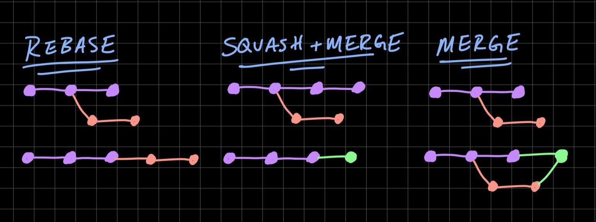
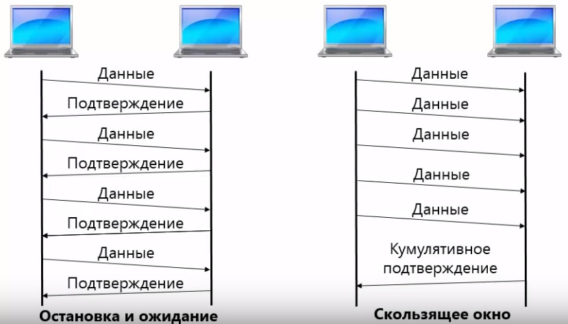
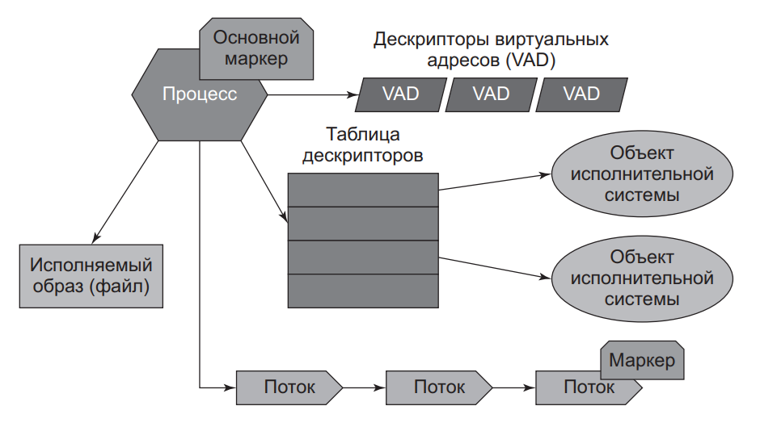
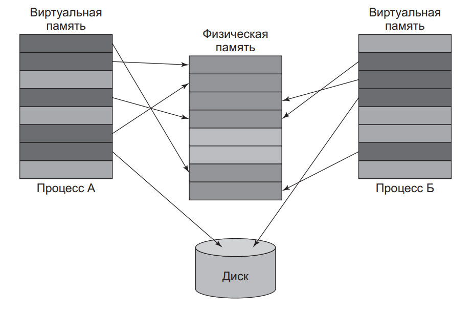
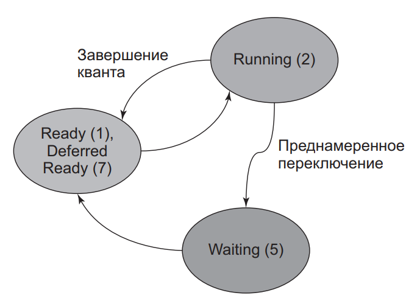
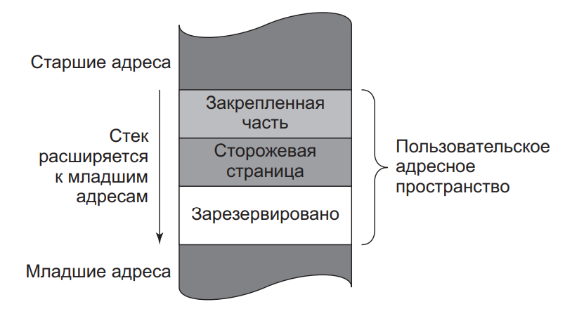
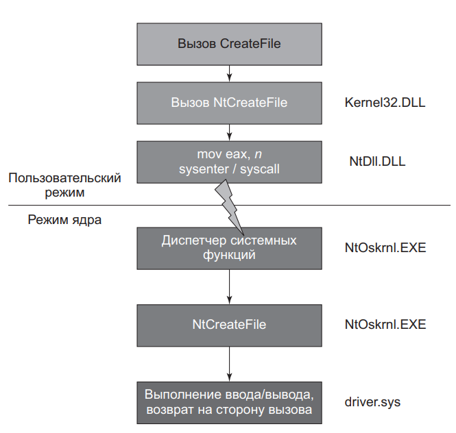
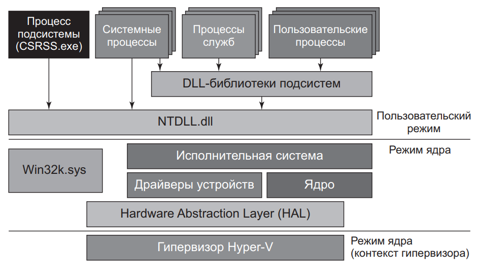

# С++

Этот репозиторий представляет мою базу знаний по С++

В качестве его основы я взял эти карты:  
- [roadmap](https://github.com/salmer/CppDeveloperRoadmap)
- [карта ЛР](https://habr.com/ru/specials/726724/)

Актуальные рекомендации по плюсам:
[C++ Core Guidelines](https://isocpp.github.io/CppCoreGuidelines/CppCoreGuidelines)

ОЧЕНЬ полезные штуки:
[Cpp Insights](https://cppinsights.io/)
[Compiler explorer](https://compiler-explorer.com/)
[Quiz](https://cppquiz.org/quiz/question/1)

# Содержание:

- [Синтаксис](#синтаксис)
    - [Базовые операции](#базовые-операции)
        - [Арифметические операции](#арифметические-операции)
        - [Логические операции](#логические-операции)
        - [Циклы](#циклы)
        - [Приведение типов](#приведение-типов)
        - [По битовые операции](#по-битовые-операции)
        - [Функтор](#функтор) 
        - [Пользовательские литералы](#пользовательские-литералы)
        - [sizeof](#sizeof)
        - [Интроспекция](#интроспекция)
    - [Области видимости](#области-видимости)
    - [Инициализация объектов](#инициализация-объектов)
    - [Работа с памятью](#работа-с-памятью)
        - [Стэк и Куча](#стэк-и-куча)
        - [Выравнивание](#выравнивание)
    - [Перечисления](#перечисления)
    - [Идиомы](#идиомы)
        - [RAII](#raii)
        - [pimpl](#pimpl)
        - [Non-Copyable/Non-Moveable](#non-copyablenon-moveable)
    - [Указатели и ссылки](#указатели-и-ссылки)
        - [Ссылки](#ссылки)
        - [Умные казатели](#умные-казатели)
            - [std::auto_ptr](#stdаutо_ptr)
            - [std::unique_ptr](#stdunique_ptr)
            - [std::shared_ptr](#stdshared_ptr)
            - [Make функции](#make-функции)
        - [Row указатели](#row-указатели-сырые-или-обычные)
    - [Семантика перемещения](#семантика-перемещения)
        - [rvalue и lvalue](#rvalue-и-lvalue)
        - [std::move и std::forward](#stdmove-и-stdforward)
    - [Лямбда функции](#лямбда-функции)
    - [Концепции языка]()
    - [Стандарты](#стандарты)
        - [C++98](#c98)
        - [C++11](#c11)
        - [C++14](#c14)
        - [C++17](#c17)
        - [C++20](#c20)
- [Компиляция]
    - [Единицы трансляции и компоновка](#единицы-трансляции-и-компоновка)
- [ООП](#ооп)
- [Патерны](#патерны)
    - [Порождающие](#порождающие)
        - [Фабричный метод](#фабричный-метод)
    - [Структурные](#структурные)
- [По битовые операции](#по-битовые-операции)
- [STL](#STL)
    - [Контейнеры](#контейнеры)
    - [Контейнеры последовательности](#контейнеры-последовательности)
        - [Array](#array)
        - [Vector](#vector)
    - [initializer_list](initializer_list)
    - [Часы](#часы)
- [Системы сборки](#системы-сборки)
    - [Make](#make)
    - [CMake](#cmake)
- [Контроль версий (Git)](#контроль-версий-git)
- [Многопоточность](#многопоточность)
- [Сети](#сети)
    - [OSI](#osi)
    - [TCP](#tcpip)
    - [UDP](#udp)
    - [Win socket](#win-socket)
- [ОС](#ос)
    - [Windows](#windows)
        -[Обзор внутреннего устройства Windows](#обзор-внутреннего-устройства-windows)
            -[Процессы (Windows)](#процессы-windows)
    - [Жизнь программы](#жизнь-программы)
- [Библиотеки и фреймворки](#библиотеки-и-фреймворки)
    - [Boost](#boost)
    - [Qt](#qt)
        - [Модули](#модули)
            - [QtCore](#qtcore)
            - [QtGui](#qtgui)
            - [QtWidget](#qtwidget)
        - [Философия объектной модели](#философия-объектной-модели)
            - [сигналы-и-слоты](#сигналы-и-слоты)
            - [соединение-объектов](#соединение-объектов)
            - [разъединение-объектов](#разъединение-объектов)
            - [переопределение-сигналов](#переопределение-сигналов)
        - [организация-объектных-иерархий](#организация-объектных-иерархий)
        - [метаобъектная-информация](#метаобъектная-информация)
    - [gtest/gmoch](#gtestgmoch)

  


# Синтаксис

## Базовые операции 

### Арифметические операции

#### Инкремент и декремент

Префиксный - увеличивает значение до выполенения кода в строке где его вызвали.  
Постфиксный - после выполнения кода в строке в которой его вызвали.
```diff
! Постфиксный немного медленее т.к. возвращает копию переменой которую инкрементировал.
```
[Источник](https://www.cyberforum.ru/cpp-beginners/thread1297462.html)

Операторы могут быть *левоассоциативными* - выполняются слева направо и *правоассоциативными* - выполняются справа налево.  
Большинство операторов левоассоциативны.   
Правоассоциативными операторами являются все унарные операторы, различные операторы присваивания и условный оператор.
  
---

### Логические операции 

---

### Циклы

---

### Приведение типов

[type casting](#type-casting)

---

### По битовые операции 

\<< сдвиг влево  
\>> сдвиг вправо  
\~ поразрядная инверсия  
\| поразрядное ИЛИ  
\& поразрядное И  
\^ поразрядное исключающее ИЛИ  

Если нужно записывать определенные биты, не стирая другие:

Чтобы записать единицу в бит n:
```c++
x |= (1 << n);  
```

Чтобы записать ноль в бит n:
```c++
x &= ~(1 << n);
```

Если нужно инвертировать состояние бита:
```c++
x ^= (1 << n);
```

Если нужно прочитать отдельный бит:
```c++
unsigned char x = (1 << 2) | (1 << 3) | (1 << 7);  
if (x & (1 << 2)) {  /* во второй бит вписана единица */ }  
if (x & (1 << 3)) {  /* в третий бит вписана единица */ }  
if (x & (1 << 7)) {  /* в седьмой бит вписана единица */ }  
```

Если нужно определить, что в X на N-й позиции:
```c++
bool b = (bool((1 << n)  &  x))
```

Если нужно обнулить один или несколько битов:
```c++
int x = 58;       // 00111010
int y = x & 0x0F; // 00001010

//или

x = x & (~((1<<3)|(1<<5)|(1<<6))); //обнуляем третий, пятый и шестой биты
```

Если нужно установить заданные биты в единицу. Используют оператор |
```c++
int x = 155
x = x | 4;     //устанавливаем в единицу второй бит переменной x
```

Сдвигает число на n разрядов влево
```c++
unsigned char x = 3;  //0b00000011
x = x << 3;           //0b00011000 (24)
```

Сдвиг вправо >>
```c++
unsigned char x = 255;  //0b11111111
x = x >> 3;             //0b00011111 (31)
```

[Источник](https://volstr.ru/?p=36)

---

### Функтор

### Пользовательские литералы

[Пользовательские литералы в C++11](https://habr.com/ru/articles/140357/)

Литерал — это некоторое выражение, создающее объект. Литералы появились не только в C++11, они были и в C++03. Например, есть литералы для создания символа, строки, вещественных чисел, и т.д.
Примеры литералов:

```c++
    'x';      // character
    "some";   // c-style string
    7.2f;     // float
    74u;      // unsigned int
    74l;      // long
    0xF8;     // hexadecimal number
    1;        // то же литерал (литеральная константа)
```

Существует две категории пользовательских литералов: сырые литералы (raw) и литералы для встроенных типов (cooked).

Стоит, однако, заметить, что C++ позволяет создавать только литералы-суфиксы. Иными словами, создать литералы префиксы (как, например, 0x), или префиксо-суфиксные (как "") — не получится.

#### Системные литералы

[Литералы](http://mycpp.ru/cpp/book/c03_1.html)

true и false являются литералами типа bool.
записываются как escape-последовательности - тоже литералы
Фактически строковый литерал представляет собой массив символьных констант, где по соглашению 
языков С и С++ последним элементом всегда является специальный символ с кодом 0 (\0).

|Символ         | Описание      |
| -             | -             |
| *u или *U     | unsigned int  |
| *UL или *LU   | unsigned long |
| *.*f или *.*F | float         |
| *.*L или *.*I | long double   |
| L*            | wchar_t       |

#### Литералы для численных типов

литерал для целых чисел в качестве аргумента принимает unsigned long long
литерал для вещественных чисел в качестве аргумента принимает long double
Данные типы обязательнымы и утверждены стандартом языка.

```c++
    // сигнатура литерала для целочисленных типов
    OutputType operator "" _suffix(unsigned long long);

    // сигнатура литерала для вещественных типов
    OutputType operator "" _suffix(long double);

    42_suffix;      // OutputType operator "" _suffix(unsigned long long);
    42.24_suffix;   // OutputType operator "" _suffix(long double);
```

#### Литералы для строковых типов

```c++
    OutputType operator "" _suffix(const char* str, size_t size);
    OutputType operator "" _suffix(const wchar_t* str, size_t size);
    OutputType operator "" _suffix(const char16_t* str, size_t size);
    OutputType operator "" _suffix(const char32_t* str, size_t size);

    "1234"_suffix;   // operator "" _suffix(const char* str, size_t size);
    u8"1234"_suffix; // operator "" _suffix(const char* str, size_t size);
    L"1234"_suffix;  // operator "" _suffix(const wchar_t* str, size_t size);
    u"1234"_suffix;  // operator "" _suffix(const char16_t* str, size_t size);
    U"1234"_suffix;  // operator "" _suffix(const char32_t* str, size_t size);
```

#### Сырые литералы

Сигнатура сырого литерала выглядит следующим образом:

```c++
    OutputType operator "" _suffix(const char* literalString);
```

Он принимает число ввиде строки (не 1 а "1").
Используя данный тип литералов, можно написать литерал преобразующий двоичное число в десятичное. 


Существует еще одна сигнатура для сырых литералов. Основана она на применении Variadic Template:
```c++
    template <char...>
        OutputType operator "" _b();
```
Преимущества литералов на базе Variadic Template заключается в том, что они могут вычисляться на этапе компиляции.


#### Порядок вызова литералов

1. operator "" _x (unsigned long long) или operator "" _x (long double)`
2. operator "" _x (const char* raw)
3. operator "" _x <'c1', 'c2', ... 'cn'>

Если пользовательский литерал совпадает с системным, то выполняется системный


### sizeof

Этот пункт я создал в связи с вопросом о размерах экземляров классов в памяти.

[Сколько в памяти занимает произвольная структура?](https://habr.com/ru/articles/117996/)

Ответ: sizeof всех членов + остаток для выравнивания (по умолчанию выравнивание 4 байта) + sizeof указателя на vtable (если есть виртуальные функции) + указатели на классы предков, от которых было сделано виртуальное наследование (размер указателя * количество классов)
Пример:

[Сколько в памяти занимает структура без членов?](https://habr.com/ru/articles/117996/)
sizeof пустого класса не определён, но должен быть > 0.
Это нужно чтобы не получить ошибку division by zero в таких случаях  
```c++
struct Foo{};
```

### Интроспекция

### type punning

[Страничка википедии](https://en.wikipedia.org/wiki/Type_punning)

Любой метод обхода системы типов в языке программирования 

#### Использование указателей 

```c++
uint64_t protocol_id = 0x41727101980;
const uint8_t* protocol_id_bytes = reinterpret_cast<const uint8_t *>(&protocol_id);
msg.insert(msg.end(), protocol_id_bytes, protocol_id_bytes + sizeof(protocol_id));
```


#### Использование union

Это только для С

```c++
bool is_negative ( float x ) 
{ 
    union 
    { 
        int i ; 
        float d ; 
    } my_union;

    my_union.d = x; 
    return my_union.i < 0;  // Сравнение int быстрее чем double 
}   
```

#### Использование bit_cast

```c++
constexpr bool is_negative ( float x ) noexcept 
{ 
    static_assert (std::numeric_limits <float>:: is_iec559 ); // (включено только в IEEE 754) 
    auto i = std::bit_cast<std::int32_t> (x); 
    return i < 0; 
} 
```

## Области видимости

## Инициализация объектов

[Эффективный и современныи С++: 42 рекомендации по использованию С++ 11 и С++ 14 - Скотт Мейерс](https://github.com/CapSmoIIett/cplusplus/blob/main/Books/%D0%AD%D1%84%D1%84%D0%B5%D0%BA%D1%82%D0%B8%D0%B2%D0%BD%D1%8B%D0%B9_%D0%B8_%D1%81%D0%BE%D0%B2%D1%80%D0%B5%D0%BC%D0%B5%D0%BD%D0%BD%D1%8B%D0%B9_%D0%A1_%D0%A1%D0%BA%D0%BE%D1%82%D1%82_%D0%9C%D0%B5%D0%B9%D0%B5%D1%80%D1%81.pdf) - Глава 3.1


Как правило, инициализирующие значения указываются с помощью круглых скобок, знака равенства или
фигурных скобок:

```c++
    int х (0);     // Инициализатор в круглых скобках
    int у = 0;     // Инициализатор после "="
    int z { 0 };   // Инициализатор в фигурных скобках 
    int z = { 0 }; // Инициализатор использует "=" и фигурные скобки (обычно эквивалентен обычным {})
```
[Подробнее о фигурных скобках](initializer_list)

Разница между способами инициализации проявляется в случае пользовательских типов данных
```c++
    Widget wl ;     // Вызов конструктора по умолчанию
    Widget w2 wl; // Не присваивание, а копирующий конструктор
    wl = w2 ;   // Присваивание ; вызов оператора operator= () 
```

Унифицированная инициализация(uniform initialization) - это идея. Фигурная инициализация - это синтаксическая конструкция.

С помощью фигурных скобок легко указать начальное содержимое контейнера:
```c++
std::vector<int> v{ 1, 3, 5 }; // v иэначально содержит 1, 3, 5
```

Фигурные скобки могут также использоваться для указания значений инициализации
по умолчанию для нестатических членов-данных
```c++
class Widget
{
private:
    int х{ 0 }; // ОК, эначение х по умолчанию равно 0
    int у = 0;  // Тоже ОК
    int z(0) ;  // Ошибка !
}
```

С другой стороны, некопируемые объекты (например, std::atomic - см. раздел 7.6)
могут быть инициализированы с помощью фигурных или круглых скобок, но не с помощью знака равенства: 
```c++
std::atomic<int> ai1 { 0 }; // ОК
std::atomic<int> ai2 (0); // ОК
std::atomic<int> ai3 = 0; // Ошибка! 
```

Фигурная инициализация запрещает неявные сужающие преобразования.
Инициализация с использованием круглых скобок и знака равенства не выполняет проверку сужающего преобразования.
Если значение выражения в фигурном инициализаторе не может быть гарантированно 
выражено типом инициализируемого объекта, код не компилируется: 
```c++
double х, у, z;
int suml { х + у + z }; // Ошибка! Сумма double может
                        // не выражаться с помощью int

int sum2 (x + y + z); // ОК ( значение выражения усекается до int )
int sumЗ = x + y + z; //
```

Все, что в ходе синтаксического анализа может рассматриваться как
объявление, должно рассматриваться как таковое

Вызов конструктора без аргументов фактически является объявлением функции (фиксим это {}):
```c++
Widget w1(); // Есть вопросы
Widget w2{}; // Вопросов нет
```

Минусы использования везде {} -  [initializer_list](#initializer_list)

#### Тут начинаются приколы:
#### Прикол №1:

```c++
class Widget
{
    Widget (int i, int b);      // 1
    Widget (int i, bool b);     // 2
    Widget (std::initializer_list<int> il);  // 3
}

    Widget{1, true};    // вызов 3
    Widget(1, true);    // вызов 2
	Widget{1, 1};       // вызов 3
    Widget(1, 1);       // вызов 1
```

Объявление объекта фигурными скобками, всегда будет предпочитать конструктор 
с initializer_list

#### Прикол №2
```c++
void func(vector<string> v) { }

void func(vector<wstring> v) { }

int main() {
  func({"apple", "banana"});
}
```

резульато будет call of overloaded 'func(brace-enclosed initializer list>)' is ambiguous
Это получается т.к. вызов подходит для первой перегрузки (initializer_list to vector),
а со второй перегрузкой, приведение к вектору строк не походит, но у vector есть конструктро принимающий
два итератора который подхоит.
```c++
template<typename InputIterator>
vector(InputIterator first, InputIterator last, 
const allocator_type& a = allocator_type());
```

#### Прикол №3

```c++
class Widget
{
    encode (std::string);      // 1
    encode (std::vector<string>);     // 2
}

    encode({" "});  // ambiguous call to overloaded function
```

## Работа с памятью

### Стэк и куча


### Выравнивание


## Перечисления


## Типы данных
## Указатели и ссылки
### Ссылки
### Умные казатели 

[Эффективный и современныи С++: 42 рекомендации по использованию С++ 11 и С++ 14 - Скотт Мейерс](https://github.com/CapSmoIIett/cplusplus/blob/main/Books/%D0%AD%D1%84%D1%84%D0%B5%D0%BA%D1%82%D0%B8%D0%B2%D0%BD%D1%8B%D0%B9_%D0%B8_%D1%81%D0%BE%D0%B2%D1%80%D0%B5%D0%BC%D0%B5%D0%BD%D0%BD%D1%8B%D0%B9_%D0%A1_%D0%A1%D0%BA%D0%BE%D1%82%D1%82_%D0%9C%D0%B5%D0%B9%D0%B5%D1%80%D1%81.pdf) - Глава 4


### std::unique_ptr


---

### std::shared_ptr


**std::shared_ptr и this**


---

### std::weak_ptr


---

### Make функции


---

### Row указатели (сырые или обычные)


## Семантика перемещения


### rvalue и lvalue


**Тип выражения не зависит от того rvalue и lvalue оно.**

rvalue похволяет реализовать семантику перемещения и прямую передачу

Семантика перемещения позволяет 
- заменить конструктор копирования более дешевы перемещением
- создавть объекты как [std::unique_ptr](#stdunique_ptr), std::future, std:: thread

прямая передача
- шаблонные функции, принимающее произвольные аргументы и передающие другим функциям (котороые получают *точно такие же* аргументы)

Для понимания следующего важно помнить что:  
параметр всегда lvalue, даже если его тип rvalue
```c++
void fun(Widget&& w);   // w - lavalue, его тип rvalue ссылка на Widget
```

### std::move и std::forward

**std::move - ничего не перемещает**  
**std::forward - ничего не передает**

std::move и std::forward - шаблоны функций  
std::move - приводит входной аргумент к rvalue  
std::forward - выполняет приведение при определенных условий  

пример реализации std::move (близкий к стандарту)
```c++
// C++11
// В пространстве имен std
template<typename Т> 
typename remove_reference<T>::type&& move (T&& param)
{
    using ReturnType = // Объявление псевдонима
        typename remove_reference<T>::type&&;

    return static_cast<Return'l'ype>(param) ;
}
```

- std::move получает [универсальную ссылку]() на объект и возвращает тот же объект
- && в возвращаемом типе говорит что будет возвращен rvalue 

В с++14
```c++
```
[псевдонимы]()

## Лямбда функции

*Замыкание (closure)* - объект времени выполнения, создаваемый лямбдой.
В зависимости от режима захвата замыкания хранят копии ссылок на захваченные данные.

*Класс замыкания (closure class)* - представляет собой класс, из котороrо инстанцируется замыкание. 
Каждое лямбда-выражение заставляет компиляторы генерировать уникальный класс замыкания.

### Избеrайте режимов захвата по умопчанию 

[Эффективный и современныи С++: 42 рекомендации по использованию С++ 11 и С++ 14 - Скотт Мейерс](https://github.com/CapSmoIIett/cplusplus/blob/main/Books/%D0%AD%D1%84%D1%84%D0%B5%D0%BA%D1%82%D0%B8%D0%B2%D0%BD%D1%8B%D0%B9_%D0%B8_%D1%81%D0%BE%D0%B2%D1%80%D0%B5%D0%BC%D0%B5%D0%BD%D0%BD%D1%8B%D0%B9_%D0%A1_%D0%A1%D0%BA%D0%BE%D1%82%D1%82_%D0%9C%D0%B5%D0%B9%D0%B5%D1%80%D1%81.pdf) - Глава 6.1

В С++ 11 имеются два режима захвата: по ссылке и по значению.
Захваты по умолчанию могут привести к висячим ссылкам.

Если время жизни замыкания больше времени жизни объекта на который он ссылается, то ссылка
в замыкании станет висячей. 
Захват по умолчанию по значению не является лекарством от висящих ссылок (Например захват указателя по значению).

[=] внутри  метода класс захватит всеполя класса, а точнее указатель на this.

```c++
void Widget : : addFi lter () const
{
    filters.emplace_back (
        [=](int value ) { return value % divisor == 0; }
    );
}

// эквивалентно этмоу:

void Widget : : addFi lter () const
{
    auto currentObjectptr = this;
    filters.emplace_back(
            [currentObjectptr] ( int value )
        { return value % currentObjectptr->divisor == 0; } 
    );
}
```

Что бы этого исзбежать - захватывайте данные
```c++
void Widget::addFilter () const
{
    auto divisorCopy = divisor; // Копирование
    filters. emplace_back (     // члена-данных
        [divisorCopy] ( int value)           // Захват копии
        { return value % divisorCopy == 0; } //  Ее использование
    ) ;
}

или

void Widget::addFilter () const
{
    filters.emplace_back (    // С++14:
        [divisor = divisor] ( int value )   // Копирование divisor
                                            // в замыкание
        { return value % divisor == 0; }    // Использование копии
    );                                     
}

```


> [!IMPORTANT]
> Замыкания не захватывают статические переменные а обращаются к ним на прямую

### Испопьзуйте инициапизирующий захват дпя перемещения объектов в замыкания

В с++11 в замыкание нельзя передать только перемещаемые объекты.

*Инициализирующим захватом (init capture)* - (или обобщенный захват лямбда-выражения (generalized lambda capture).)
делает возможным указать:
1. имя члена-данных в классе замыкания  
2. выражение инициализации этого члена-данных.

```c++
auto pw = std::make_unique<Widget>();

auto fuпc = 
    [pw = std::move(pw)]    // Инициализирующий захват
    { return pw->isValidated(); };

```
Слева от знака = находится имя члена-данных в классе замыкания, а справа - инициализирующее выражение.
Так же можно:
```c++
auto func = [pw = std::make_unique<Widget>() ]
    {...}
```

Если нужно добиться этого в c++11 можно:
1. написать класс аналог замыкания дл этого случая
2. перемещения захватываемого объекта в функциональный объект с помощью std::bind
3. передачи лямбда-выражению ссылки на захватываемый объект

Пример второго случая:
```c++
auto func =
    std::bind (                         // Эмуляция в С++ 11
        [] ( const std::vector<double>&)  // инициализирующего
        { /* Использование данных */ } ,
    std::move(data)
    );
```

При вызове bind все сохраненные им аргументы передаются в функциюф.


###

Обобщенные лямбда-выражения - лямбда-выражения, в спецификации параметров которых используется ключевое слово auto.
Реализуется это: в классе замыкания operator() указывается как шаблон

Чтобы реализовать передачу rvalue и lvalue: 
- нужно указать параметр как универсальную ссылку
- он должен передаваться в функции методом std::forward

```c++
    auto f = [] (auto&& х)
    { return normalize(std::forward<decltype (x)>(x));  }:   // normalize - функция принимающая rvalue и lvalue
```

### Рекурсивные лямбда фукции

Пример рекурсии с лямбда функцией:

```c++
    std::function<int(int, int)> sum;

    sum = [term, next, &sum](int a, int b) -> int {
        if (a > b)
            return 0;
        else
            return term(a) + sum(next(a), b);
    };
```

Ключевое слово auto выводит свой тип из того, чем оно инициализируется, но то, чем вы его инициализируете, должно знать свой тип (и замыкание) =>
лямбда функция которую вы хотите сделать рекурсивной не должна быть auto.


## Концепции языка

### type casting


#### C-style
    
Приведение типов в стиле языка C может привести выражение любого типа к любому другому типу данных.  
Общий вид приведения:  
(new_type)exp

C-style cast по сути самое медленное преобразование, так как в этом случае последовательно перебираются следующие вызовы:
- const_cast
- static_cast
- static_cast + const_cast
- reinterpret_cast
- reinterpret_cast + const_cast

#### const-cast

Оператор приведения const_cast удаляет или добавляет квалификаторы 
const и volatile с исходного типа данных 
(простые типы, пользовательские типы, указатели, ссылки).  
Общий вид приведения:  
const_cast<new_type>(exp)

#### reinterpret_cast

Оператор приведения reinterpret_cast используется для приведения несовместимых типов.
Может приводить целое число к указателю, указатель к целому числу,
указатель к указателю (это же касается и ссылок).
Является функционально усеченным аналогом приведения типов в стиле языка С.
Отличие состоит в том, что reinterpret_cast не может снимать квалификаторы const и volatile,
а также не может делать небезопасное приведение типов не через указатели, а напрямую по значению.
Например, переменную типа int к переменной типа double привести при помощи reinterpret_cast нельзя.  
Общий вид приведения:  
reinterpret_cast<new_type>(exp)

#### static_cast

Оператор приведения static_cast применяется для неполиморфного приведения типов на этапе компиляции программы.
Отличие static_cast от приведения типов в стиле языка C состоит в том,
что данный оператор приведения может отслеживать недопустимые преобразования,
такие как приведение указателя к значению или наоборот.  
При множественном наследовании static_cast может вернуть указатель не на исходный объект, а на его подобъект.  
Общий вид приведения:  
static _cast<new_type>(exp)

#### dynamic_cast

Оператор приведения dynamic_cast применяется для полиморфного приведения типов
на этапе выполнения программы (класс считается полиморфным, если в нем есть хотя бы одна виртуальная функция).

Если приведение указателей невозможно, то на этапе выполнения программы будет возвращен (0).
Если приведение производится над ссылками, то будет сгенерировано исключение std::bad_cast.
Может быть использован и для обычных неполиморфных типов вверх по иерархии.
Использует систему RTTI (Runtime Type Information).  
При множественном наследовании dynamic_cast может вернуть указатель не на исходный объект, а на его подобъект.  
Общий вид приведения:  
dynamic_cast <new_type>(exp)  

## Организация кодовой базы
## Структуры и классы

Главное различие между классом и структурой в с++, по умолчанию область видимости полей в структуре - public, а у класса - private.

## Библиотеки и взаимодействие с ними
## Обработка ошибок

## Концепции языка

## Шаблоны


### Концепт
```c++
template<class T>
//concept Sumable = std::is_arithmetic_v<T>;    // тоже можно
concept Sumable = requires(T t)     // Если это не вызывает ошибку
{
    return a + b;
} 

template<Sumbale T>
T Sum (T a, T b)
{
    return a + b;
}
```

Концепт проверяет подходят ли передаваемые в шаблон типы условию концепта. Если они не подходят это вызовет понятную ошибку компиляции

```c++

template<class T>
concept Printable = requires(T t)
{
    std::cout << t;
}

template<Printable T, Printable TArgs>
void Print(T a, TArgs... args)
{
    std::cout << a << " ";
    Print(args...);
} 

...

Print(1, "hello");
```

### CRTP
The Curiously Recurring Template Pattern - Странно повторяющийся шаблон

Пример этого: std::enable_shared_from_this<T>

## Функции


### Параметры и аргументы

При вызове функции выражения переданные в источник вызова называют - **аргуметнами**
Эти аргументы используют для инициализации **параметров** функции.

параметры функции всегда [lvalue]. но могут быть инициальзированны и [rvalue] и [lvalue]

### Передача параметров в функции

```C++
void fun(Widget w); // передача по значению

Widget wid;
fun(wid);       // вызов копиркующего конструктора
fun(std::move); // вызов конструктора перемещения
```

## Идиомы


#### Правило 3-х 
(актуально до [C++11](#c11))  
Eсли вам нужно определить что-либо из конструктора копирования, оператора присваивания копированием или деструктора, то скорее всего вам нужно определить “все три”

#### Правило 5-х

Eсли вам нужно определить что-либо из пятерки конструкторов или деструтктор, то вам, скорее всего, нужно определить или удалить (или, по крайней мере, рассмотреть такую возможность) все пять.

(если вы не определите операции перемещения, они не будут генерироваться, и вызовы будут обрабатываться через операции копирования. И это не будет ошибкой, но, возможно, это будет вашим большим упущением с точки зрения оптимизации.))

```c++
// Инициализация и уничтожение
   explicit IndirectValue(T* ptr );
   ~IndirectValue() noexcept ;

   // Копирование (вместе с деструктором дает нам Правило Трех)
   IndirectValue(IndirectValue const& other) ;

   IndirectValue& operator=(IndirectValue const& other);

   // Перемещение (добавление этих элементов уже дает нам Правило Пяти)
   IndirectValue(IndirectValue&& other) noexcept;

   IndirectValue& operator=(IndirectValue&& other) noexcept ;
```

#### Правило 0-ля

Если ничего из специальных функций-членов не определено пользователем, то (с учетом переменных-членов) компилятор предоставит реализации по умолчанию для каждой из них.  
*Правило Ноля заключается в том, что тот сценарий, когда не нужно определять ничего из специальных функций-членов, должен быть предпочтительным.*

Самый лучший подход — по умолчанию следовать Правилу Ноля, прибегая к Правилу Пяти, если обнаружили, что вам нужно написать какие-либо специализированные классы, управляющие ресурсами (что само по себе должно происходить  достаточно редко).

[Источник](https://habr.com/ru/companies/otus/articles/704492/)

---

### pimpl


### Non-Copyable/

### Erase-Remove


---

### Copy and swap


---

### Copy on write


### CRTP


---

## Стандарты

### C++98
### C++11
std::make_shared

[scoped enum](#перечисления)

std::tuple
### C++14
std::make_unique
### C++17
### c++20

# Компиляция

## Единицы трансляции и компоновка

Cимвол, например имя переменной или функции, можно объявить любое количество раз в пределах области. Однако его можно определить только один раз.

Это правило является правилом "Одно правило определения" (ODR). 

Программа состоит из одного или нескольких единиц перевода. Единица перевода состоит из файла реализации и всех заголовков, которые он включает прямо или косвенно. 

### extern

Ключевое extern слово может применяться к глобальной переменной, функции или объявлению шаблона. Он указывает, что символ имеет externал-компоновку. 

Ключевое extern слово имеет четыре значения в зависимости от контекста:
 - В объявлении, отличномconst от глобальной переменной, указывает, extern что переменная или функция определена в другом модуле перевода. Он extern должен применяться во всех файлах, кроме тех, где определена переменная.
 - В объявлении переменной const указывается, что переменная имеет externсвязь. Он extern должен применяться ко всем объявлениям во всех файлах. (Глобальные const переменные имеют внутреннюю компоновку по умолчанию.)
 - extern "C" указывает, что функция определена в другом месте и использует соглашение о вызовах на языке C. extern "C" Модификатор также может применяться к нескольким объявлениям функций в блоке.
 - В объявлении шаблона указывает, extern что шаблон уже создан в другом месте. extern сообщает компилятору, что он может повторно использовать другой экземпляр, а не создать новый в текущем расположении. Дополнительные сведения об этом использовании см. в разделе "Явное создание экземпляровextern".

# ООП


[Источник](https://www.youtube.com/watch?v=BHNt1fcg8iw)

---

# Патерны

[Сайт с патернами](https://refactoring.guru/ru/design-patterns/catalo)

### Наблюдатель


## Порождающие

### Фабричный метод

## Структурные

### Адаптер
*Wrapper, Обёртка, AdapterI*

**Адаптер** — это структурный паттерн проектирования, который позволяет объектам с несовместимыми интерфейсами работать вместе.  
Это объект-переводчик, который трансформирует интерфейс или данные одного объекта в такой вид, чтобы он стал понятен другому объекту.

Применение:  
- Когда вы хотите использовать сторонний класс, но его интерфейс не соответствует остальному коду приложения.

---

### Мост
*Bridge*

Пример:  
У вас есть класс геометрических Фигур, который имеет подклассы Круг и Квадрат. Вы хотите расширить иерархию фигур по цвету, то есть иметь Красные и Синие фигуры. Но чтобы всё это объединить, вам придётся создать 4 комбинации подклассов, вроде СиниеКруги и КрасныеКвадраты.  
Паттерн Мост предлагает заменить наследование агрегацией или композицией. Для этого нужно выделить одну из таких «плоскостей» в отдельную иерархию и ссылаться на объект этой иерархии, вместо хранения его состояния и поведения внутри одного класса.

**Мост** — это структурный паттерн проектирования, который разделяет один или несколько классов на две отдельные иерархии — абстракцию и реализацию, позволяя изменять их независимо друг от друга.

---

## Структурные 

## Поведеньческие

Singleton Мэйерса

---

# Алгоритмы и структуры данных

# STL

## Контейнеры


### Stack


### Queue


### priority_queue


### ассоциативные контейнеры

### Set


### Multiset


### Map


### Multimap


### Unordered set

### Unordered_multiset


### Unordered map


### Unordered multimap


### Битовые контейнеры

Битовые контейнеры нужны для управления последовательностью из N битов.
Cпециальный контейнер для битов в 8 раз эффективнее по памяти.

В std::bitset<N>, который лежит на стеке, количество битов нужно знать "заранее".
Изначально все биты заполняются нулями. 
В контейнере есть несколько разнообразных методов для управления битами (всеми битами или конкретным битом)

Групповые операции, например .count() работают намного быстрее, чем если бы они совершались в обычном цикле for.
Процессоры умеют производить все битовые операции над числом в одну инструкцию.

operator[] (size_t pos) переопределен так, чтобы на его вызов возвращался "легкий" объект
std::bitset::reference, в котором находится указатель на число и "маска" бита.
И в свою очередь у этого объекта переопределен operator=(bool x), который производит запись в нужный бит.

если использовать vector<bool> вместо bitset:
- нельзя использовать укащатели на объект
- отсутствуют элементарные групповые операции над битами

---

## Строки

В STL строки представляются как в формате ASCII, так и Unicode:  
**string** — коллекция однобайтных символов в формате ASCII;  
**wstring** — коллекция двухбайтных символов в формате Unicode;  

## Строковые потоки

strstream — используются для организации STL-строкового сохранения простых типов данных.

Следующий пример берет строку из общего потока ввода и разбивает его на слова (для обработки введенных команд):
```c++
std::getline(std::cin, msg);        // Берем строку из стандартного ввода
std::istringstream iSStream(msg);   // Строкой иницируем поток

std::transform(msg.begin(), msg.end(), msg.begin(),
    [](unsigned char c) { return std::tolower(c); });   // Все символы в нижний регистр

std::string word;
while (iSStream >> word)            // Цикл по словам потока
    commands.push_back(word);       // Сохраняем сллова в вектор команд
```

## Итераторы

Итераторы обеспечивают доступ к элементам контейнера и представляют реализацию распространенного паттерна объектно-ориентированного программирования "Iterator".
С помощью итераторов очень удобно перебирать элементы.
В C++ итераторы реализуют общий интерфейс для различных типов контейнеров, что позволяет использовать единой подход для обращения к элементам разных типов контейнеров.

Стоит отметить, что итераторы имеют только контейнеры, адаптеры контейнеров — типы std::stack, std::queue и std::priority_queue итераторов не имеют.

Существуют три типа итераторов:  
1. (forward) iterator — для обхода коллекции от меньшего индекса к большему;  
2. reverse iterator — для обхода коллекции от большего индекс к меньшему;  
3. random access iterator — для обхода коллекции в любом направлении.  

Важно понимать, что при получении итератора на какой-то элемент коллекции и последующем изменении коллекции итератор может стать непригоден для использования.


## initializer_list

[Эта тема очень связана с инициализацией объектов](#инициализация-объектов)

[Эффективный и современныи С++: 42 рекомендации по использованию С++ 11 и С++ 14 - Скотт Мейерс](https://github.com/CapSmoIIett/cplusplus/blob/main/Books/%D0%AD%D1%84%D1%84%D0%B5%D0%BA%D1%82%D0%B8%D0%B2%D0%BD%D1%8B%D0%B9_%D0%B8_%D1%81%D0%BE%D0%B2%D1%80%D0%B5%D0%BC%D0%B5%D0%BD%D0%BD%D1%8B%D0%B9_%D0%A1_%D0%A1%D0%BA%D0%BE%D1%82%D1%82_%D0%9C%D0%B5%D0%B9%D0%B5%D1%80%D1%81.pdf) - Глава 3.1


### Временные интервалы


# Bind

Bind - это адаптер функциональных объектов, который позволяет адаптировать функциональные объекты под заданное число параметров.

```c++

```

## Алгоритмы

Методы перебора всех элементов коллекции и их обработки:  
[count](https://cplusplus.com/reference/algorithm/count/) - Возвращает количество элементов в диапазоне [first,last), которые равны val ;  
[count_if](https://cplusplus.com/reference/algorithm/count_if/)- Возвращает количество элементов в диапазоне, [first,last)для которых значение *pred* истинно.;  
[find](https://cplusplus.com/reference/algorithm/find/) - Возвращает итератор к первому элементу в диапазоне [first,last), который сравнивается с равным *val* . Если такой элемент не найден, функция возвращает *last* .;  
[find_if](https://cplusplus.com/reference/algorithm/find/) - Возвращает итератор к первому элементу в диапазоне, [first,last)для которого *pred* возвращает *true*. Если такой элемент не найден, функция возвращает *last*.;  
[adjacent_find](https://en.cppreference.com/w/cpp/algorithm/adjacent_find) - Ищет диапазон[первый, последний)для двух последовательных равных элементов;  
[for_each](https://en.cppreference.com/w/cpp/algorithm/for_each) - если тип итератора ( InputIt/ ForwardIt) является изменяемым,фможет изменять элементы диапазона через разыменованный итератор;  
mismatch;  
equal;  
search copy;  
copy_backward;  
swap;  
iter_swap;  
swap_ranges;  
fill;  
fill_n;  
generate;  
generate_n;  
replace;  
replace_if;  
transform;  
remove;  
remove_if;  
remove_copy;  
remove_copy_if;  
unique;  
unique_copy;  
reverse;  
reverse_copy;  
rotate;  
rotate_copy;  
random_shuffle;  
partition;  
stable_partition;  

Методы сортировки коллекции:  
[sort](https://cplusplus.com/reference/algorithm/sort/) - Сортирует элементы диапазона [first,last)в порядке возрастания. Элементы сравниваются с использованием operator для первой версии и комп для второй.;  
stable_sort;  
partial_sort;  
partial_sort_copy;  
nth_element;  
binary_search;  
lower_bound;  
upper_bound;  
equal_range;  
merge;  
inplace_merge;  
includes;  
set_union;  
set_intersection;  
set_difference;  
set_symmetric_difference;  
make_heap;  
push_heap;  
pop_heap;  
sort_heap;  
min;  
max;  
min_element;  
max_element;  
lexographical_compare;  
next_permutation;  
prev_permutation;  

Методы выполнения определенных арифметических операций над членами коллекций:  
[Accumulate](https://cplusplus.com/reference/numeric/accumulate/) - Возвращает результат накопления всех значений в диапазоне [first,last) для *init* .;  
inner_product;  
partial_sum;  
adjacent_difference;  

### Предикаты
Для многих алгоритмов STL можно задать условие, посредством которого алгоритм определит, что ему делать с тем или иным членом коллекции.
Предикат — это функция, которая принимает несколько параметров и возвращает логическое значение (истина/ложь). 
Существует и набор стандартных предикатов.

## Потокобезопасность
Важно понимать, что STL — не потокобезопасная библиотека. Но решить эту проблему очень просто: если два потока используют одну коллекцию, просто реализуйте критическую секцию и Mutex.

---

# Системы сборки


## Make


### Инкрементная компиляция


## Переменные 


# Автоматические переменные


---

## CMake


### Библиотеки


### Подпроекты


### Поиск библиотек


### Внешние библиотеки и объектные файлы:


### Генераторы


[Введение в CMake](https://habr.com/ru/articles/155467/)

---

## Ninja

## Bazel

## Premake  


# Пакетные менеджеры

# Контроль версий (Git)

```bash
# Установим пользователя
# Кавычки оставляем
git config --global user.name "<ваше_имя>"

# Теперь установим email. 
git config --global user.email "<адрес_почты@email.com>"

# Инициализация/создание репозитория
git init

# Добавим все файлы проекта в нам будующий commit
git add *
git add .
git add --all

# Если хотим добавить конкретный файл то можно так
git add <имя_файла> 

# Создание коммита
# И не забываем про кавычки
git commit -m "<комментарий>"

git clone https://github.com/CapSmoIIett/cplusplus.git
# клонирует репозиторий в новый каталог

git status
# показывает состояния файлов в рабочем каталоге и индексе: какие файлы изменены, 
# но не добавлены в индекс; какие ожидают коммита в индексе.

git diff
# используется для вычисления разницы между любыми двумя Git деревьями. 
# Это может быть разница между вашей рабочей копией и индексом (собственно 
# git diff), разница между индексом и последним коммитом (git diff --staged), 
# или между любыми двумя коммитами (git diff master branchB).

git reset 
# используется в основном для отмены изменений. 
# Она изменяет указатель HEAD и, опционально, состояние индекса

git branch
# это своего рода "менеджер веток". Она умеет перечислять 
# ваши ветки, создавать новые, удалять и переименовывать их.

git checkout
# Команда git checkout используется для переключения веток 
# и выгрузки их содержимого в рабочий каталог.
```

```bash
git merge
# Команда git merge используется для слияния одной или 
# нескольких веток в текущую. Затем она устанавливает указатель 
# текущей ветки на результирующий комми
```



git squash - сжатие комитов для rebase (не знаю почему на фото с squash merge) 


```bash
git log
# используется для просмотра истории коммитов, начиная с 
# самого свежего и уходя к истокам проекта.

git stash
git stash pop
git stash show
git stash drop
# используется для временного сохранения всех незафиксированных 
# изменений с целью очистки рабочего каталога без необходимости 
# фиксировать незавершённую работу в текущей ветке.

git tag 
# используется для задания постоянной метки на какой-либо 
# момент в истории проекта. Обычно она используется для релизов.

git fetch
# связывается с удалённым репозиторием и забирает из него 
# все изменения, которых у вас пока нет и сохраняет их локально.

git pull
# работает как комбинация команд git fetch и git merge, т. е. G
# it вначале забирает изменения из указанного удалённого репозитория, 
# а затем пытается слить их с текущей веткой.

git push
# используется для установления связи с удалённым репозиторием, 
# вычисления локальных изменений отсутствующих в нём, и 
# собственно их передачи в вышеупомянутый репозиторий

git remote
# служит для управления списком удалённых репозиториев. 
# Она позволяет сохранять длинные URL репозиториев в виде 
# понятных коротких строк, например «origin», так что вам 
# не придётся забивать голову всякой ерундой и набирать её 
# каждый раз для связи с сервером 

git help # справка по всем командам

```

[Git для новичков](https://habr.com/ru/articles/541258/)
---

## stash фрагмета файла

[Stack overflow](https://stackoverflow.com/questions/1085162/commit-only-part-of-a-files-changes-in-git)

```bash
git add --patch <filename>

# Git разобьет ваш файл на, по его мнению, разумные «куски» (части файла). Затем он задаст вам такой вопрос:

Stage this hunk [y,n,q,a,d,/,j,J,g,s,e,?]?
```

Вот описание каждого варианта:

 - y - добавить этот кусок в stash
 - n - не добавлять этот кусок
 - q - выход; недобавлять ничего
 - a - добавить этот и все последующие куски
 - d - не добавлять этот и все последующие 
 - g - выберите кусок, к которому нужно перейти
 - / - поиск фрагмента, соответствующего заданному регулярному выражению
 - j - оставить этот кусок нерешенным, посмотреть следующий нерешенный кусок
 - J - оставить этот кусок нерешенным, посмотреть следующий кусок
 - k - оставить этот кусок нерешенным, посмотреть предыдущий нерешенный кусок
 - K - оставьте этот кусок нерешенным, см. предыдущий кусок
 - s - разделить текущий фрагмент на более мелкие фрагменты
 - e - вручную отредактировать текущий кусок
    Затем вы можете отредактировать кусок вручную, заменив +/- на #
 - ? - помощь

git reset -p для отмены ошибочно добавленных кусков

# CI/CD

# Многопоточность

[Источник](https://radioprog.ru/post/1402)

[Эффективный и современныи С++: 42 рекомендации по использованию С++ 11 и С++ 14 - Скотт Мейерс](https://github.com/CapSmoIIett/cplusplus/blob/main/Books/%D0%AD%D1%84%D1%84%D0%B5%D0%BA%D1%82%D0%B8%D0%B2%D0%BD%D1%8B%D0%B9_%D0%B8_%D1%81%D0%BE%D0%B2%D1%80%D0%B5%D0%BC%D0%B5%D0%BD%D0%BD%D1%8B%D0%B9_%D0%A1_%D0%A1%D0%BA%D0%BE%D1%82%D1%82_%D0%9C%D0%B5%D0%B9%D0%B5%D1%80%D1%81.pdf) - Глава 7


## Определение


## Проблемы многопоточности


Эти проблемы возникают при работе с std::threat.
У std::async их нет. 


. 
 
Если условия не выполняются стоит прибегнуть к стратегии async.


### Dead lock


Пример выше показывает ситуацию с взаимной блокировакой

### Live lock


### Starvation


### Lock guard


### unique_lock 


### std::condition_variable (условные переменные)


# Процессы 

## Межпроцессное взаимодействие


Для сложных типов, к примеру, имеющих виртуальные функции и указатели/ссылки
в качестве членов, нельзя просто выгрузить память, поскольку она содержат
адреса (указатели, виртуальные указатели), которые действительны только в этом процессе. 

**Методы последовательного представления данных:**


### Shared memmory

### Pipes

### Сериализация

# Сети 

## OSI


## TCP/IP
*Transmission Control Protocol (TCP) и Internet Protocol (IP)*

TCP/IP — сетевая модель передачи данных, представленных в цифровом виде. 
Модель описывает способ передачи данных от источника информации к получателю. 
В модели предполагается прохождение информации через четыре уровня, каждый из которых протоколом передачи.

Надежная передача потоков байт.  
Гарантия доставки данных.  
Сохранения порядка следования сообщений.  

Транспортная подсистема получает поток байт. 
Поток байт разбивается на сегменты, которые по отдельности отправляются.

| Уровни        | Протоколы             |
| ------------- |:---------------------:|
| Прикладной    | HTTP, RTSP, FTP, DNS  |
| Транспортный  | TCP, UDP, SCTP, DCCP  |
| Сетевой       | IP                    |
| Канальный     |Ethernet, IEEE 802.11, WLAN, SLIP, Token Ring, ATM и MPLS |



В протоколе подтверждается не каждый сегмент, а несколько отправленных друг за другом(скользящее окно)

все сегменты нумеруются(номер байт).

[Протокол TCP](https://www.youtube.com/watch?v=CKUOb4htnB4)

## UDP
*User Datagram Protocol*

На транспортном уровне.

Особенности:
- Нет соединения
- нет гарантий доставки данных
- нет гарантий сохранения порядка

Преимущество UDP - скорость работы


[Протокол UDP](https://www.youtube.com/watch?v=CKUOb4htnB4)

### ICMP
*Internet Control Message Protocol — протокол межсетевых управляющих сообщений*
Cетевой протокол, входящий в стек протоколов TCP/IP. В основном ICMP используется для передачи сообщений об ошибках и других исключительных ситуациях, возникших при передаче данных, например, запрашиваемая услуга недоступна или хост, или маршрутизатор не отвечают. 
Также на ICMP возлагаются некоторые сервисные функции (services).

## Сокеты

### Win Socket

заголовки

```c++
#include "winsock.h" 
#include "winsock2.h"
```

инициализация

```c++
int WSAStartup( WORD wVersionRequested, (in) LPWSADATA lpWSAData (out) ); 

WSADATA ws;
//...
if (FAILED (WSAStartup (MAKEWORD( 1, 1 ), &ws) ) ) 
{
    // Error...
    error = WSAGetLastError();
    //...
}
```

создание сокета

```c++
SOCKET s;

SOCKET socket ( int af (in),          // протокол (TCP/IP, IPX...)
                int type (in),        // тип сокета (SOCK_STREAM/SOCK_DGRAM)
                int protocol (in)     // для Windows приложений может быть 0
              );

if (INVALID_SOCKET == (s = socket (AF_INET, SOCK_STREAM, 0) ) )
{
    // Error...
    error = WSAGetLastError();
    // ... 
}

устанавливаем соединение

int connect(SOCKET s,                             // сокет (наш сокет)
            const struct sockaddr FAR *name,  // адрес 
               int namelen                    // длинна адреса
           );

// Объявим переменную для хранения адреса 
sockaddr_in s_addr;

// Заполним ее:
ZeorMemory (&s_addr, sizeof (s_addr));
// тип адреса (TCP/IP)
s_addr.sin_family = AF_INET;
//адрес сервера. Т.к. TCP/IP представляет адреса в числовом виде, то для перевода 
// адреса используем функцию inet_addr.
s_addr.sin_addr.S_un.S_addr = inet_addr ("193.108.128.226"); 
// Порт. Используем функцию htons для перевода номера порта из обычного в //TCP/IP представление.
s_addr.sin_port = htons (1234);

// Дальше выполняем соединение:
if (SOCKET_ERROR == ( connect (s, (sockaddr *) &s_addr, sizeof (s_addr) ) ) )
{
    // Error...
    error = WSAGetLastError();
    // ... 
}
```

посылаем данные
```c++
int send(SOCKET s,              // сокет- отправитель
         const char FAR *buf,   // указатель на буффер с данными
         int len,               // длинна данных
         int flags              // флаги (может быть 0)
        );

if (SOCKET_ERROR == ( send (s, (char* ) & buff), 512, 0 ) ) 
{
    // Error...
    error = WSAGetLastError();
    // ... 
}
```
Флаги:
- MSG_DONTROUTE - указывает на то, что в отправляемое сообщение, не включатся информация о маршрутизации. 
Однако Winsock service provider может игнорировать этот флаг при доставке сообщения. Используется для отладки. 
Адрес назначения - локальный. То есть данные могут быть доставлены только на машины, соединенные напрямую.

- MSG_OOB (Out Of Band) - Сообщение является OOB данными.  
То есть, такое сообщение передаётся вне потока. Это значит, что при отправке сообщения, транспортный протокол не ждёт полного заполнения буфера, а отсылает сообщение немедленно.
Данный флаг можно использовать при передаче приоритетных данных. 
При использовании MSG_OOB, Winsock-приложения поддерживающие связь, должны заранее "договориться" об использовании этого флага.

принимаем данные
```c++
int recv(SOCKET s,         // сокет- получатель
         char FAR *buf,    // адрес буфера для приёма данных 
         int len,          // длинна буфера для приёма данных
         int flags         // флаги (может быть 0)
        );

int actual_len = 0;

if (SOCKET_ERROR == (actual_len = recv (s, (char* ) & buff), max_packet_size, 0 ) ) 
{
    // Error...
    error = WSAGetLastError();
    // ... 
}
```
Флаги:
- MSG_PEEK - Данные копируются в принимающий буфер, но из очереди сообщений не изымаются. Функция возвращает количество принятых на данный момент байт данных.

- MSG_OOB - Сообщение является OOB данными. (Out Of Band) То есть, такое сообщение передаётся вне потока. Это значит, что при отправке такого сообщения, транспортный протокол не ждёт полного заполнения TCP-буфера, а отсылает сообщение немедленно. Данный флаг можно использовать при передаче приоритетных данных. При использовании MSG_OOB, Winsock-приложения поддерживающие связь, должны заранее "договориться" о использовании этого флага.

закрываем соединение
```c++
int shutdown(SOCKET s,     // Закрываемый сокет
             int how       // Способ закрытия
           );

int closesocket(SOCKET s   // Закрываемый сокет
    );

closesocket (s);
```

Для того, что бы узнать IP адрес машины зная ёё имя, существует функция gethostbyname.

```c++
struct hostent FAR *gethostbyname(const char FAR *name );

hostent* d_addr; // Структура, в которую будет помещен IP адрес, // при возврате.
hostent* hn = gethostbyname ("www.Shelek.com");
//...

struct hostent {
   char FAR * h_name;               // Официальное имя машины
   char FAR * FAR * h_aliases;      // Массив альтернативных имен машины // (заканчивающийся 0)
   short h_addrtype;                // Тип адреса (AF_INET...)
   short h_length;                  // Длина адреса в байтах
   char FAR * FAR * h_addr_list;    // Список адресов (заканчивающийся 0)
};


sockaddr_in adr;
// ...
hostent* d_addr = gethostbyname ("www.Shelek.com");
adr.sin_addr.S_un.S_addr = *(DWORD* ) hn-h_addr_list[0];
// ...

struct HOSTENT FAR * gethostbyaddr(
    const char FAR *addr,     // Адрес машины (в сетевом виде)
    int len,                  // Длинна адреса
    int type                  // Тип адреса
);

DWORD a = inet_addr ("192.168.0.4"); // Адрес машины в сетевом формате
   hn = gethostbyaddr ((char* )&a, 4, AF_INET);
```

Функция ioctlsocket.
Функция ioctlsocket позволяет менять/получать режим ввода/вывода конкретного сокета.
```c++
int ioctlsocket(SOCKET s,              // Сокет [in]
                long cmd,              // Комманда [in]
                u_long FAR *argp       // Параметр/значение [in/out]
               );

BOOL l = TRUE;
if (SOCKET_ERROR == ioctlsocket (s, FIONBIO, (unsigned long* ) &l) )
{
    // Error
   int res = WSAGetLastError ();
   return -1;
}
```

Функция select
Функция slect позволяет определить текущее состояние одного или более сокетов. 
То есть, из какого-то входящего множества сокетов, она формирует выходящее множество сокетов, готовых к операциям чтения/записи/....

```c++
int select(int nfds,                         // Не используется (оставлен для совместимости)
           fd_set FAR *readfds,              // множество сокетов, проверяемых на готовность к чтению
           fd_set FAR *writefds,             // множество сокетов, проверяемых на готовность к отсылке
           fd_set FAR *exceptfds,            // множество сокетов, проверяемых на ошибку/OOB данные
           const struct timeval FAR *timeout // Таймаут проверки
);

FD_CLR (s, *set) -Удаляет дескриптор s из set.
FD_ISSET(s, *set) - Возвращает ненулевое значение, если s присутствует в set. Иначе, возвращает ноль.
FD_SET(s, *set) - добавляет s к set.
FD_ZERO(*set) - Очищает множество set

struct timeval {
   long tv_sec;  // секунды
   long tv_usec; // микросекунды
};
```

С помощью функции select и этого набора макросов, мы можем проверять конечное множество сокетов на готовность к считыванию/отсылке данных, выполнения connect, на предмет входящих соединений, наличия OOB сообщений и т.п. 
На данном этапе нас интересует проверка сокета на возможность считывания данных, поэтому пока ограничимся самым простым вызовом select. 
Для этого нам необходимо поместить наш сокет в множество на которое будет указывать readfds (в примере это read_s), задать timeout и выполнить select.

```c++
// ...

fd_set read_s; // Множество
timeval time_out; // Таймаут

FD_ZERO (&read_s); // Обнуляем мнодество
FD_SET (s, &read_s); // Заносим в него наш сокет
time_out.tv_sec = 0;time_out.tv_usec = 500000; //Таймаут 0.5 секунды.
if (SOCKET_ERROR == (res = select (0, &read_s, NULL, NULL, &time_out) ) ) return -1;

if ((res!=0) && (FD_ISSET (s, &read_s)) ) // Использую FD_ISSET только для примера! :)
{
    // Получаю данные
}
// ...
```

[Winsock для всех (часть 1)](https://club.shelek.ru/viewart.php?id=35)
[Winsock для всех (часть 2)](https://club.shelek.ru/viewart.php?id=36)
[Winsock для всех (часть 3)](https://club.shelek.ru/viewart.php?id=37)

---

# ОС

# Windows

## Обзор внутреннего устройства Windows

[Работа с ядром Windows (2021) - Павел Исифович](books/Работа_с_ядром_Windows_2021_Павел_Йосифович.pdf) - Глава 1

### Процессы (Windows)

[многопоточность](#многопоточность)

Процесс - управляющий объект.
Обеспечивающий изолированное адресное пространство.
И предоставляет рабочий экземпляр программы.

Процессы не выполняются, они управляют. Потоки выполняются с технической точки зрения.

Процессу (на высоком уровне абстракции) принадлежат:
 - исполняемая программа (код и данные необходимые для выполнения кода в процессе) 
 - приватное адресное пространство (для выделения памяти)
 - *Основной маркер (primary token)* объект для хранения стандартного контекста 
 безопасности процесса. Маркер используется потоками, выполняющими код внутри процесса 
 (если только поток не переключится на использование другого маркера при помощи 
 механизма олицетворения (impersonation)).
 - Приватная таблица дескрипторов, для обхектов исполнительной системы (семафоры, файлы и т.п.)
 - Один и более потоков исполнения (польщовательский процесс без потоков - бесполезен и
 скорее всего будет убит ядром)

  

Процесс однозначно определяется своим идентификатором процесса, который
остается уникальным на все время существования объекта процесса в ядре.

### Виртуальная память

Каждый процесс обладает собственным виртуальным приватным линейным адресным пространством.
Это адресное пространство в исходном состоянии пусто (или почти пусто, потому что сначала в него отображается исполняемый
образ и NtDll.Dll, а за ними следуют DLL-библиотеки других подсистем).
Как только начинается выполнение основного (первого) потока, в адресном пространстве с большой вероятностью будет выделяться память, загружаться другие DLL-библиотеки и т. д.

Это пространство приватное, изолированно от других процессов.
Диапазон адресов адресного пространства начинается с нуля (кроме первых 64 Кбайт)
и следует до максимума, который зависит от разрядности (32 или 64 бита) процесса 
и разрядности операционной системы следующим образом:

| Разраядность процессора | Разраядность WIN| размер адресного пространства процесса по умолчанию | коментарий |
| -                       | -               | -                                                   | - |
| 32 | 32 | 2 Гбайт | - |
| 32 | 32 | 3 Гбайт | флаг LARGEADDRESSAWARE в заголовке Portable Executable |
| 64 | 64 | 8 Тбайт (до Windows 8.1) и 128 Тбайт (с Windows 8.1) | - |
| 32 | 64 | 4 Гбайт (c  LARGEADDRESSAWARE) 2 Гбайт (без)         | - |

Сама память называется виртуальной; это означает, что между диапазоном
адресов и его точным расположением в физической памяти (ОЗУ) существует
косвенная связь. Виртуальная память может быть в оперативной памяти или в файле 
(при необходимости подгружает в оперативную)



Единица управления памятью называется страницей (page).

Размер страницы определяется типом процессора (и на некоторых процессорах может настраиваться);
в любом случае диспетчер памяти должен использовать именно этот размер. 
Нормальный размер страницы (иногда называемый малым) — 4 Кбайт во всех архитектурах, 
поддерживаемых Windows.

Для отображения большой
страницы без использования таблицы страниц используется элемент PDE
(Page Directory Entry). Этот механизм ускоряет преобразование, но что
еще важнее, он позволяет более эффективно использовать TLB (Translation
Lookaside Buffer) — кэш недавно преобразованных страниц, содержимое которого 
поддерживается процессором. В случае большой страницы один элемент
TLB позволяет отображать объем памяти, значительно превышающий размер
малой страницы.

#### Состояние страниц
 
 - Свободная - в ней нет поленой информации, обращение к ней приведет к ошибке
 - Закрепленная (committed) - обратно свободной, обычно отражаются в физическую память или файл
 - Зарезервированная (reserved) - страница не закрелена, но диапазон адресов зарезервирован для возможного выделения в будущем.
 С точки зрения процессора зарезервированная страница не отличается от свободной. ВЫделение памяти (по умолчанию) не затрагивает эту память


#### Системная память 

Операционная система располложенна в верхнем диапазоне адресов.  

В 32-разрядных системах, работающих без параметра расширения пользовательского виртуального адресного пространства, операционная система
размещается в верхних 2 гигабайтах виртуального адресного пространства, в диапазоне адресов от 0x8000000 до 0xFFFFFFFF.

Системные адреса абсолютны. Попытки обращения из пользовательского режима в системное пространство 
приводят к исключению нарушения прав доступа.

В системном пространстве находится само ядро, уровень абстрагирования
оборудования (HAL, Hardware Abstraction Layer) и загруженные драйверы ядра.

Если в драйвере ядра происходит утечка памяти, эта память не будет освобождена даже после выгрузки
драйверов. 
Ядро отвечает за закрытие и освобождение всех ресурсов, приватных для
уничтожаемого процесса (все дескрипторы закрываются, а вся приватная
память освобождается).

### Потоки Windows

[многопоточность](#многопоточность)

Фактическое выполнение кода осуществляется потоками (threads). Поток содержится в процессе и использует ресурсы, предоставляемые процессом.

Самая важная информация, принадлежащая потоку:
 - Текущий режим доступа (пользовательский режим или режим ядра).
 - Контекст выполнения, включающий значения регистров процессора и состояние выполнения.
 - Один или два стека, используемые для выделения памяти локальных переменных и управления вызовами.
 - Массив локальной памяти потоков (TLS, Thread Local Storage), предоставляющий средства для хранения приватных данных потока с унифицированной
 семантикой доступа.
 - Базовый приоритет и текущий (динамический) приоритет.
 - Привязка к процессору, указывающая, на каких процессорах разрешено выполнение потока.

Наиболее распространенные состояния, в которых может находиться поток:
 - Выполнение (Running) — поток выполняет код на (логическом) процессоре.
 - Готовность (Ready) — поток ожидает планирования на выполнение, потому
 что все нужные процессоры либо заняты, либо недоступны.
 - Ожидание (Waiting) — поток ожидает наступления некоторого события,
 прежде чем продолжить выполнение. После того как событие произойдет,
 поток переходит в состояние готовности.



У состояния готовности (Ready) имеется парное состояние отложенной готовности (Deferred Ready),
сходное с ним и существующее в основном для минимизации внутренних блокировок.

### Стеки потоков

У каждого потока есть стек, нужный для создания переменных, передачи параметров функциям и хранения адресов 
возврата при вызове функций. У потока имеется как минимум один стек, находящийся в системном пространстве (пространстве ядра).
он относительно мал (по умолчанию 12 Кбайт в 32-разрядных системах и 24 Кбайт в 64-разрядных системах)

У потоков пользовательского режима существует второй стек в диапазоне адресов пользовательского режима 
соответствующего процесса, этот стек имеет намного больший размер (по умолчанию он может увеличиваться до 1 Мбайт)

Стек ядра всегда находится в физической памяти, пока поток находится в состоянии выполнения или готовности.
Стек пользовательского режима может выгружаться, как и все содержимое памяти пользовательского режима.

Поведение стека пользовательского режима отличается от стека режима ядра. Он начинается с закрепления небольшого объема памяти
(вплоть до одной страницы), при этом остаток адресного пространства стека составляет зарезервированная память.
 Идея состоит в том, чтобы иметь возможность расширять стек в том случае, если коду потока потребуется использовать больший объем
памяти стека. 
Для этого следующая страница (иногда несколько страниц) непосредственно после закрепленной части помечается специальным защитным
атрибутом PAGE_GUARD — признаком сторожевой страницы. Если потоку понадобится больше памяти, он выполняет запись в сторожевую страницу; 
возникает исключение, которое обрабатывается диспетчером памяти. Затем диспетчер памяти снимает атрибут сторожевой страницы, закрепляет 
страницу и помечает следующую страницу как сторожевую. Таким образом, стек растет по мере
надобности, а вся память стека не закрепляется заранее.



Размер стека пользовательского режима для потока определяется следующим образом:
 - Величины закрепленной и зарезервированной части стека хранятся в заголовке PE (Portable Executable) исполняемого файла. 
 Они используются по умолчанию, если поток не укажет альтернативные значения.
 - При создании потока функцией CreateThread вызывающая сторона может указать требуемый размер 
 стека — либо размер изначально закрепленной части, либо размер зарезервированной части (но не оба сразу) 
 в зависимости от флага, переданного функции; при передаче нуля используются значения по умолчанию из предыдущего пункта.


### Системные сервисные функции

Выделение памяти, создание потоков, открытие файлов. Пример ззадач которые можно выполнить только из режима ядра
Как выполнить это из пользовательского режима? 
Возьмем классический пример: пользователь, запустивший процесс Notepad,
выполняет запрос на открытие файла командой меню File:
    - Код Notepad реагирует вызовом документированной функции Windows API CreateFile (kernel32.dll).
    - после проверки ошибок, эта функция вызывает NtCreateFile (NTDLL.dll - фундаментальной DLL-библиотеке, реализующей так называемый платформенный API;
по сути, это код самого низкого уровня, который все еще работает в пользовательском режиме). 
    - Эта (официально недокументированная) функция API переходит в режим ядра
        - Непосредственно перед переходом она помещает число, называемое номером системной сервисной функции, в регистр
процессора (EAX в архитектурах Intel/AMD)
        - Затем выполняется специальная команда процессора (syscall для x64, sysenter для x86), которая осуществляет
фактический переход в режим ядра с переходом в заранее определенную функцию, называемую диспетчером системных функций.
    - В свою очередь, диспетчер системных функций использует значение из регистра
EAX как индекс в таблице SSDT (System Service Dispatch Table). По адресу, содержащемуся в таблице, код осуществляет переход непосредственно к системной функции
    - Для нашего примера с Notepad элемент SSDT содержит указатель на функцию NtCreateFile диспетчера ввода/вывода. Обратите внимание: имя
этой функции совпадает с именем функции из NTDLL.dll; более того, она получает те же аргументы.
    - После того как вызов системной функции будет завершен, поток возвращается в пользовательский режим для выполнения команды,
следующей за sysenter/syscall.




### Общая архитектура системы




 - Пользовательские процессы. Обычные процессы, созданные на базе файлов образов и выполняемые в системе
 - DLL-библиотеки подсистем. DLL-библиотеки подсистем представляют собой библиотеки динамической компоновки (DLL, Dynamic Link Libraries),
 реализующие API подсистем. Подсистема является неким представлением функциональности, предоставляемым ядром. С технической точки зрения,
 начиная с Windows 8.1 существует только одна подсистема — подсистема Windows. К числу DLL-библиотек подсистем принадлежат такие известные 
 файлы, как kernel32.dll, user32.dll, gdi32.dll, advapi32.dll, combase.dll и др. В основном DLL-библиотеки содержат официально документированный
 Windows API.
 - NTDLL.DLL. DLL-библиотека системного уровня, реализующая платформенный Windows API. Она содержит код самого низкого уровня, выполняемый в 
 пользовательском режиме. Самая важная ее роль — переход в режим ядра для вызова системных функций. NTDLL также реализует диспетчер
 кучи (Heap Manager), загрузчик образов (Image Loader) и некоторые части пула потоков пользовательского режима.
 - Процессы служб. Процессы служб — нормальные процессы Windows, которые взаимодействуют с диспетчером служб (SCM, Service Control
 Manager — реализуется в services.exe) и позволяют до определенной степени управлять своим сроком жизни. Диспетчер служб может запускать,
 останавливать, приостанавливать, возобновлять работу служб и отправлять службам другие сообщения. Службы обычно выполняются под одной из
 специальных учетных записей Windows — локальной системы, сетевых или локальных служб.
 - Исполнительная система. Исполнительная система является верхним
 уровнем NtOskrnl.exe («ядра»). В ней содержится большая часть кода, работающего в режиме ядра. Прежде всего это различные диспетчеры: диспетчер
 объектов, диспетчер памяти, диспетчер ввода/вывода, диспетчер Plug & Play, диспетчер электропитания, диспетчер конфигурации и т. д. По своим
 размерам она значительно больше нижнего уровня ядра.
 - Ядро. Уровень ядра реализует самые фундаментальные и критичные по времени части кода ОС режима ядра. К их числу относятся планирование
 потоков, обработка прерываний и диспетчеризация исключений, а также реализация различных примитивов ядра, таких как мьютексы и семафоры.
 Часть кода ядра написана на машинном языке конкретного процессора для эффективности и для получения прямого доступа к специфическим возможностям 
 процессора.
 - Драйверы устройств. Драйверы устройств представляют собой загружаемые модули ядра. Их код выполняется в режиме ядра и может распоряжаться
 всей мощью ядра. 
 - Win32k.sys. Компонент режима ядра подсистемы Windows. По сути, это модуль ядра (драйвер), который обеспечивает часть Windows API и 
 классического интерфейса графических устройств GDI (Graphic Device Interface), относящуюся к пользовательскому интерфейсу. Это означает, 
 что все операции оконной системы (CreateWindowEx, GetMessage, PostMessage и т. д.) обеспечиваются этим компонентом. Остальные компоненты 
 системы практически ничего не знают о пользовательском интерфейсе.
 - Системные процессы. Общим термином «системные процессы» обозначаются процессы, которые обычно просто «находятся на своем месте» и делают
 то, что положено; обычно эти процессы не предназначены для прямого взаимодействия. Тем не менее они важны, а некоторые даже необходимы для
 благополучного существования системы. Завершение некоторых из этих процессов приводит к фатальным последствиям вплоть до полного сбоя
 системы. Некоторые из системных процессов относятся к платформенным; это означает, что они используют только платформенный API (API, 
 реализуемый NTDLL). Примеры с системных процессов — Smss.exe, Lsass.exe, Winlogon.exe, Services.exe и др.
 - Процесс подсистемы. Процесс подсистемы Windows, в котором выполняется образ Csrss.exe, может рассматриваться как помощник ядра
 для управления процессами, работающими в системе Windows. Этот процесс является критическим, то есть в случае его уничтожения происходит 
 полный сбой системы. Обычно создается только один экземпляр Csrss.exe для каждого сеанса, поэтому в стандартной системе существуют два 
 экземпляра — для сеанса 0 и для сеанса текущего пользователя (обычно 1). Хотя Csrss.exe является «диспетчером» подсистемы Windows
 (единственным из оставшихся в наши дни), его важность выходит далеко за рамки этой роли.
 - Гипервизор Hyper-V. Гипервизор Hyper-V существует в Windows 10 и Server 2016 (и последующих системах), если они поддерживают механизм VBS
 (Virtualization Based Security). VBS предоставляет дополнительный уровень безопасности, где реальная машина в действительности представлена 
 виртуальной машиной, находящейся под управлением Hyper-V. 

### Дескрипторы и объекты

Ядро Windows предоставляет различные типы объектов, которые могут использоваться процессами. Экземпляры этих типов представляют собой структуры 
данных в системном пространстве, создаваемые диспетчером объектов (часть исполнительной системы) по требованию кода пользовательского режима или 
режима ядра. Для объектов ведется подсчет ссылок — только после освобождения последней ссылки объект будет уничтожен и удален из памяти.

Так как экземпляры объектов находятся в системном пространстве, код пользовательского режима не может обращаться к ним напрямую. Он должен 
использовать механизм косвенного обращения — так называемые дескрипторы (handles). Дескриптор представляет собой индекс в таблице, хранимой на
уровне отдельных процессов, которая содержит логические указатели на объект ядра, находящийся в системном пространстве.
Существуют различные функции Create* и Open* для создания/открытия объектов и получения дескрипторов этих объектов.

Код режима ядра (и драйверов) может использовать как дескриптор, так и прямой указатель на объект. Выбор обычно зависит от функции API, которую код
хочет вызвать.

Значения дескрипторов кратны 4, при этом первый допустимый дескриптор равен 4; нулевое значение дескриптора ни при каких условиях действительным
быть не может

Код ядра может получить указатель на объект по действительному дескриптору при помощи функции ObReferenceObjectByHandle.
В случае успеха счетчик ссылок объекта увеличивается; это делается для предотвращения риска того, что клиент пользовательского режима, 
удерживающий дескриптор, решит закрыть его. В этом случае указатель на объект, хранящийся у кода ядра, будет указывать на несуществующий объект.
К объекту можно безопасно обращаться независимо от того, где именно он удерживается, пока код ядра не вызовет функцию ObDerefenceObject, которая 
уменьшает счетчик ссылок. Если код ядра пропустит этот вызов, в системе возникнет утечка ресурсов, которая будет устранена только при следующей 
загрузке системы.

Для всех объектов ведутся счетчики ссылок. Диспетчер объектов хранит для объектов количество дескрипторов и общий счетчик ссылок.
После того, как объект станет ненужным, его клиент должен закрыть дескриптор (если он использовался для обращения к объекту) или разыменовать 
объект (если клиент режима ядра использовал указатель). В дальнейшем код должен считать свой дескриптор/указатель недействительным. Диспетчер 
объектов уничтожает объект в том случае, если его счетчик ссылок упал до нуля.

Каждый объект содержит указатель на тип объекта, в котором хранится информация о самом типе; это означает, что для каждой разновидности объектов
существует один объект типа. Они также предоставляются в форме экспортируемых глобальных переменных ядра; некоторые из них определяются в 
заголовках ядра и могут пригодиться в определенных ситуациях, как будет показано в следующих главах.

### Имена объектов

Некоторые разновидности объектов могут обладать именами. Зная имя объекта, вы можете открыть объект по имени соответствующей функцией Open.

Обратите внимание: не все объекты обладают именами; например, у процессов и потоков имен нет — есть только идентификаторы.
Другой довольно странный пример объекта, не обладающего именем, — файл. Имя файла не является именем объекта — это
совершенно разные концепции.

В коде пользовательского режима вызов функции Create с передачей имени создает объект с этим именем, если такой объект не существует, но если объект
существует, то функция просто открывает существующий объект. В последнем случае вызов GetLastError вернет значение ERROR_ALREADY_EXISTS, которое
означает, что новый объект не создается, а функция возвращает просто еще один дескриптор для существующего объекта.

Имя, передаваемое функции Create, на самом деле не является окончательным именем объекта. К нему присоединяется префикс \Sessions\x\
BaseNamedObjects\, где x — идентификатор сеанса вызывающей стороны. Если идентификатор сеанса равен 0, то к имени присоединяется префикс
\BaseNamedObjects\. Если же вызывающая сторона работает в контейнере AppContainer (обычно это процесс Universal Windows Platform), то 
присоединяемая строка становится более сложной и содержит уникальный идентификатор SID контейнера \Sessions\x\AppContainerNamedObjects\
{AppContainerSID}.

Из всего сказанного следует, что имена объектов относительны по отношению к сеансу (а в случае AppContainer — относительны по отношению к пакету).
Если объект должен совместно использоваться разными сеансами, он может быть создан в сеансе 0, для чего к имени объекта присоединяется Global\;
например, при создании функцией CreateMutex мьютекса с именем Global\ MyMutex объект будет создан в иерархии\BaseNamedObjects. Следует заметить,
что контейнеры AppContainer не обладают полномочиями для использования пространства имен объектов сеанса 0. Для просмотра этой иерархии можно 
воспользоваться программой WinObj из пакета Sysinternals (должна запускаться с повышенными привилегиями)

### Обращение к существующим объектам

У дескрипторов есть маска доступа. Маска доступа определяет, какие операции могут выполняться с конкретным дескриптором.


### _tmain

Для не-Unicode-программ используется соответствующее стандарту имя main и список параметров int argc, char* argv[].
Для Unicode-программ список параметров в MSVC выглядит как int argc, wchar_t* argv[], и во избежание конфликтов с исходниками и компиляторами, соответствующими стандарту, функция называется wmain.

https://ru.stackoverflow.com/questions/213830/tmain-%D0%BF%D0%BE%D1%87%D0%B5%D0%BC%D1%83-%D1%82%D0%B0%D0%BA%D0%BE%D0%B5-%D0%BD%D0%B0%D0%B7%D0%B2%D0%B0%D0%BD%D0%B8%D0%B5

### SAL

[SAL — это язык заметок исходного кода Майкрософт](https://learn.microsoft.com/ru-ru/cpp/code-quality/using-sal-annotations-to-reduce-c-cpp-code-defects?view=msvc-170). С помощью заметок исходного кода можно сделать намерение явного кода. Эти заметки также позволяют автоматизированным статическим средствам анализа анализировать код более точно, что значительно меньше ложных срабатываний и ложных отрицательных значений.

## Жизнь программы

Выполнение любого процесса жизненного цикла предполагает наличие результата, в явном или неявном виде.

#### Design-time

Программа появляется в голове программиста. 
Но так как это время абстрактно, примем за время появления программы - момент создания минимального запускаемого кода.

#### Compile-time

В результате выполнения процесса компиляции мы получаем компилят (то есть непосредственный результат обработки нашего исходного кода).

#### Load-time

После получения компилята, над ним, сразу или отложенно должен быть исполнен процесс связывания или линковки. Так как компилят обычно хранится в файле, то возникает время загрузки

#### Link-time

Обычно, линковка необходима, так как компилятор всегда производит компилят для одного модуля для непосредственного исполнения на целевой машине. 
Однако в реальной модульной системе на машине одновременно будут исполнены несколько модулей.

#### Init, Run, Close-time

Запуск и дальнейшая работа. Наиболее известные широкой публике этапы. Представлены временем инициализации (init-time) и временем исполнения (run-time). 
В сущности, результат работы этого этапа жизненного цикла и является обычно непосредственной целью написания программы.

Можно дополнительно выделить время завершения работы программы (close-time). 
Однако сейчас все три времени работы обычно принято называть run-time, а логическое деление на три этапа реализовывать уже в рамках клиентского программного кода.

#### Death-time

Отдельным важным временем жизни программы является посмертное время (death-time), в которое, вопреки распространенным представлениям тоже является частью жизненного цикла программы. 
Целью работы программы обычно является некий результат, обычно зависящий от входных данных, программы строятся с применением методов, позволяющих итеративно обрабатывать входные данные и производить выходные данные, которые могут быть поданы на вход следующей итерации. 
Например записывать итоги работы в бд

[Концепция жизни программы](https://habr.com/ru/articles/313934/)

---

## WSL

[Работа с ядром Windows (2021) - Павел Исифович](books/Работа_с_ядром_Windows_2021_Павел_Йосифович.pdf) - Глава 1 стр 25

В Windows 10 версии 1607 появилась поддержка подсистемы Windows для Linux
(WSL, Windows Subsystem for Linux). И хотя на первый взгляд это всего лишь
очередная подсистема вроде старых подсистем POSIX и OS/2, поддерживаемых
Windows, на самом деле это совсем не так. Старые подсистемы могли выполнять
приложения POSIX и OS/2, если они были откомпилированы компилятором
для Windows. С другой стороны, в WSL такое требование отсутствует. Существующие исполняемые файлы для Linux (в формате ELF) могут запускаться
в Windows без перекомпиляции.
Чтобы такая схема работала, был создан новый тип процессов — процесс Pico
в сочетании с провайдером Pico. Вкратце процесс Pico представляет собой пустое
адресное пространство (минимальный процесс), используемое для процессов
WSL, где каждый системный вызов (вызов системной функции Linux) должен
быть перехвачен и преобразован в эквивалентный вызов(-ы) системной функции
Windows при помощи провайдера Pico. Таким образом, на Windows-машине
фактически устанавливается полноценная система Linux (часть пользовательского режима).

# Библиотеки и фреймворки


# Qt

## Модули

| Имя | Описание |
|--|--|
| [QtCore](#qtcore) | базовый модуль |
| [QtGui](#qtgui) | Интеграция с оконной системой (OpenGL) |
| [QtWidget](#qtwidget) | Дополняет qtGui |
| [QtQuick](#qtquick) | технология для быстрой разработки гуи на основе qml |
| [QtQML](#qtqml) | |
| [QtNetwork](#) | модуль для работы с сокетами |
| [QtXml](#) | нужен для работы с xml |
| ... |


### QtCore

QCoreApplication - содержит объекты, подсоединенные к контексту оперрационной системы. Срок жизни 
QCoreApplication соответсвует времени жизни всего приложения. Создается только один раз

### QtGui

Класс приложения этого модуля - QGuiApplication. Он содержит механизм
цикла событий и обладает доступом к буферу обмена, и инструментам для настроек приложения (палитра)
(есть еще доступ к форме курсора)

### QtWidget

базовый класс для всех элементов управления Qt. По своему виду - четырех угольник

QApplication - наслежник QCoreApplication.

## Философия объектной модели 

> [!IMPORTANT]
> При множественном наследовании, наследование от QObject должен быть первым, чтобы
> MOC (Meta Object Compiler) мог его правильно распознать. Другой порядок приведет к ошибке
> class MyClass : public QObject, public AnotherClass { ...};

> [!IMPORTANT]
> При множественном наследовании так же важно, чтобы от QObject наследовался только 
> один родительский класс


В Qt все построенно на объектах. QObject - основной, базовый класс. Большинство классов в Qt его
наследники

### Сигналы и слоты

Callback function - старая концепция в основе X Windows System, основана на использовании 
обычных фунций, которые вызываются в результате действий пользователя. 
Минусы:
    - отсутвует возможность проверки возврщаемых значений (все передается через void*) 
    - гуи плотно связан с логикой - что усложняет их параллельную разработку

MFC - Надстройка над функциями Windows, реализованных на C. Для обеспечения связей сообщений и 
методов обработки задействуются специальные макросы - крты сообщений.

```c++
class CPhotoStylerApp : public CWinApp 
{
public:
    CPhotoStylerApp();

    virtual BOOL Initinstance();
    afx_msg void OnAppAЬout();
    afx_msg void OnFileNew();
    DECLARE_МESSAGE_МАР ()
};

BEGIN_МESSAGE_МAP(CPhotoStylerApp, CWinApp)
    ON_COММAND(ID_APP_AВOUT, OnAppAЬout)
    ON_COММAND(ID_FILE_NEW, OnFileNew)
    ON_COММAND(ID_FILE_NEW, CWinApp::OnFileNew)
    ON_COММAND(ID_FILE_OPEN, CWinApp::OnFileOpen)
    ON_COММAND(ID_FILE_PRINT_SETUP, CWinApp::OnFilePrintSetup)
END_МESSAGE_МАР () 
```

QT расширяет с++ добавлением в него специального препроцессора MOC (Meta Object Сompiler).
Он анализирует класы на наличие в их определении специального макроса Q_OBJECT и внедреяет в 
отдельный файл всю необходимую дополнительную информацию. Это происходит автоматически. То же 
делает препроцессор с++ (запускается перед компиляцией и создает доп файлы).

Механизм сигналов ислотов замещает модуель функций обратного вызова. Каждый QObject класс
способен отправлять и получать сигналы.
- каждый класс унаследованный от QObject может иметь любое количество сигналов и слотов 
- сообщения, посылаемые сигналами, могут иметь множество аргументов любого типа
- сигнал можно соеденить со множеством слотов. ОТправленный сигнал поступает ко всем подключенным слотам
- слот может получть сообщения от многих сигналов, принадлежащим разным объектам
- соединение сигналов и слотов можно производить в любом месте приложения
- сигналы и слоты связывают объекты (даже в различных потоках)
- при уничтожении обхекта происходит автоматическое разъединение всех сигнало-слотовых связей

минусы сигналов и слотов: 
- сигналы и слоты не часть С++, поэтому требуют доп. препроцессор
- отправка сигналов просизодит медленнее, чем вызов функций при использовании callback
- в процессе компиляции нет проверок существования сигналов и слотов или подходят ли они друг другу.
Ошибка станет известна только при запуске приложения 

[Существует альтернативная форма сигнало-слотовых соединений]()

Сигнал - метод для отправки сообщений. Они не возвращают значений, пользователь не реализует их,
только обхявляет. Сигнал не объязан быть свзязанным со слотом. ОБъявление нового сигнала:
```c++
class Test : public QObject
{
    Q_OBJECT

signals:
    void mySignal();
};
```

Вызов сигнала проходит через команду emit:
```c++
emit mySignal();
```

вызвыть сигнал напрямую вне класс нельзя, только через другой публичный метод

Слот - метод присоединяемый к сигналам. По сути, обычные методы, но с возмжоность принимать сигналы (И без возможности использовать параметры поумолчанию).

> [!IMPORTANT]
> Соединение сигнала с витуальным слотом. Соеденение сигнала с виртуальным слотом примерно в десять
> раз медленнее, чем с не виртуальным

Реализация слота:
```c++
class Test: public QObject
{
    Q_OBJECT
public slots:
    void mySlot()
    {
        ...
    }
};
```

Внутри слота можно узнать от какого объекта был выслан сигнал используя метод sender().

#### Соединение объектов 

соединение объектов осуществляется с помощью метода connect. В общем виде его вызов:  
```c++
QObject::connect(const QObject* sender, // указатель на объект отправляющий сигналы
        const char* signal,             // сигнал, с которым осуществляется соединение
        const QObject* receiver,        // указатель, у которогу находится необходимый слот
        const char* slot,               // слот вызываемый при получении сигнала
        Qt::ConnectionType type = Qt::AutoConnection    // тип
); 

QObject::connect(pSender, SIGNAL(signalMethod()),
        pReceiver, SLOT(slotMethod())
);
```

Немного о типах соединения, они управляют режимом обработки. Имеют три возможных значения:
- Qt::DirectConnection - сигнал обрабатывается сразу вызовом соответствующего метода слота;
- Qt::QueuedConnection - сигнал преобразуется в событие (об этом позже) и ставится в общую очередь 
для обработки;
- Qt::AutoConnection - это автоматический режим. Если отправлюяющий и получающий сигнал объекты 
находятся в одном потоке, то ставится режим Qt::DirectionConnection. Если они в разных - Qt::QueuedConnection.


Существует альтернативный вариант метода connect(). Его приемущество - что все ошибки соединения он выявляет на этапе компиляции программы, а не при ее исполнении. Его прототип выглядит так:
```c++
QObject::connect(const QObject* sender,
        const QMetaMethod& signal,
        const QObject* receiver,
        const QMetaMethod& slot,
        Qt::ConnectionType type = Qt::AutoConnection
);

QObject::connect(pSender, &SenderClass::signalMethod,
        pReceiver, &ReceiverClass::slotMethod
) ;
```

Параметры этого метода анологичны предыдущему, кроме параметров которые были const char*. Теперь
вместо них используются указатели на методы сигналов и слотов классов

Если connect проходит в классе получателе, то его можно в комманде не указывать.
```c++
conect(pSender, SIGNAL(signalMethod()), SLOT(slot()));
```
Метод connect () после вызова возвращает объект класса Connection, спомощью которого можно определить произошло ли соединение. Класс имеет неявное преобразование к bool

Иногда возникают ситуации, когда объект не обрабатывает сигнал, а просто передает его 
дальше. Для этого необязательно определять слот, который в ответ на получение сигнала 
(при помощи emit) отсылает свой собственный. Можно просто соединить сигналы друг 
с другом. Отправляемый сигнал должен содержаться в определении класса:
```c++
MyClass::MyClass() : QObject ()
{
    connect(pSender, SIGNAL(signalMethod() ), SIGNAL(mySignal()) );
}
```

Отправку сигналов можно на некоторое время заблокировать, вызвав метод blockSignals() 
с параметром true. ОБъект будет "молчать" до момента снятия запрета тем же методом.
SignalsBlocked() - этим методом можно проверить состояние блокировки сигналов.

> [!IMPORTANT]
> соединение сигнала с лямбда-функцией напрямую
> Если ваш компилятор поддерживает стандарт С++11, то вы можете соединить сигнал
> напрямую с лямбда-функцией. Пример:
> connect (pcmd, &QPushButton::clicked, \[=\]()(pwgt->hide();));


> [!IMPORTANT]
> следите за совnадением типов сигналов со слотами
> При соединении сигналов со слотами, передающими значения, важно следить за совпадением их типов.
> Например: 
> connect(pobj1, SIGNAL(sig(int)), pobj2, SLOT(slt(int)));      // ПРАВИЛЬНО!
> connect(pobj1, SIGNAL(sig(int)), pobj2, SLOT(slt(QString));   // Неправильно

> [!IMPORTANT]
> Можно игнорировать в слоте значения, передаваемые сигналом. 
> Но нельзя сделать наоборот и соединить сигнал, который не высылает никаких значений, 
> со слотом, который принимает параметры:
> connect(pobj1, SIGNAL(sig(int)), pobj2, SLOT(slt()) ); //МОЖНО!
> connect(pobj1, SIGNAL(sig()), pobj2, SLOT(slt(int))); // НЕЛЬЗЯ! 

> [!IMPORTANT]
> НЕ УКАЗЫВАЙТЕ ВМЕСТЕ С ТИПОМ ИМЯ ПЕРЕМЕННОЙ!
> Нужно указать только тип аргумента, указание имени приведт к ошибке 
> connect(pobjl, SIGNAL(sig(int n)), pobj2, SLOT(slt(int n))); //ОШИБКА

#### Разъединение объектов 

Уничтожение объекта все связанные с ним соединения уничтожаются автоматически.
Для уничтожения соединения вручную есть метод disconnect:
```c++
QObject::disconnect(sender, signal, receiver, slot); 
```

Существуют два сокращенных, не статических варианта:
```c++
disconnect (signal, receiver, slot);
disconnect (receiver, slot);
```

#### Переопределение сигналов

QSignalMapper - класс с помощью которого можно переопределить сигналы и сделать так чтобы 
в слот отправлялись значения типов int, QString или QWidget. Пример:
```c++

// две кнопки нужно подключить к одному сигналу
// при нажатии на первую выводить один текст
// при нажатии на вторую другой текст

QSignalMapper* psigMapper = new QSignalMapper(this);
connect(psigMapper, 
        SIGNAL(mapped(const QString&)),
        this, 
        SLOT(slotShowAction(const QString&))
);

QPushButton* pcmdl = new QPushButton("Buttonl");
connect(pcmdl, SIGNAL(clicked()), psigMapper, SLOT(map())) ;
psigMapper->setMapping(pcmdl, "Buttonl Action");

QPushButton* pcmd2 = new QPushВutton("Button2");
connect(pcmd2, SIGNAL(clicked()), psigMapper, SLOT(map()));
psigMapper->setMapping(pcmdl, "Button2 Action");
``` 

Это круто, но этим не стоит злоупотреблять - это усложняет код.

### Организация объектных иерархий

Организация объектов в иерархии снимает с разработчика необходимость самому заботиться об 
освобождении памяти от созданных объектов. 
Конструктор класса QObject выглядит следующим образом:
```c++
QObject(QObject* pobj = 0);
```

Передаваемый укзатель - указатель на объект предок. Если у объекта нет предка - то это объект 
верхнего уровняобъектной иерархии. ОБъект предок задается в конструкторе при создании объекта, 
но его можно изменить при помощи метода setParent();

Созданные объекты по умолчанию не имеют имени. При помощи метода setObjectName() 
можно присвоить объекту имя.

При уничтожении созданного объекта (при вызове его деструктора) все присоединенные
к нему объекты-потомки уничтожаются автоматически. 


> [!IMPORTANT]
> ВСЕ ОБЪЕКТЫ ДОЛЖНЫ СОЗДАВАТЬСЯ В ПАМЯТИ ДИНАМИЧЕСКИ!
> Одна из самых распространенных ошибок программистов, пишущих на языке С++, при программировании 
> с использованием библиотеки Qt - это самостоятельный контроль процесса выделения/освобождения 
> памяти для объекта и нединамическое создание элементов управления. При программировании с Qt 
> важно помнить, что все объекты должны создаваться в памяти динамически, с помощью оператора new. 
> Исключение из этого правила могут составлять только объекты, не имеющие предков.

Для получения информации об объектной иерархии существуют два метода: parent()) и
children(). 
parent() - возвращает указатель на родителя.  
children() - возвращает список указателей на наследников.  
findChild(). Возвращает наследника которого можно привести к типу T с совпадающем именем. 
Если аргумент имени null - сопостовляем все объекты. Если есть более одного совпадение 
выбирается с наибольшим количеством связей. Если и так есть несколько выриантов, возвращается 
первый результат children().  
Для расширенного поиска существует метод findChildren(), возвращающий список указателей на 
наследников подходящих под условие (имя / рег. выражение)

dumpObjectinfo () - возвращает: 
- имя объекта;
- класс, от которого был создан объект;
- сигнально-слотовые соединения.

### Метаобъектная информация 

каждый объект QObject располагает структурой данных, называемой метаобъектной информацией 
(класс QMetaObject). В ней хранится информация о сигналах, слотах (включая указатели на них),
о самом классе и о наследовании. Получить эту структуро - metaObject().

Метод inherits(const char*) определяет унаследованн этот класс от указанного:
```c++
pobj->inherits("QWidget");  // вернет true если унаследован от QWidget
```

метаобъектную информацию использует и qobject_cast<T>

## Метаобъектный препроцессор MOC

MOC - создает дополнительный код, для реализации логики Qt.

## Компилятор ресурсов RCC

Файлы ресурсов в Qt имеют расширение qrc. Его описание выполненов в формате xml.
```c++
<!DOCTYPE RCC><RCC version="l.0">
<qresource>
    <file>images/open.png</file>
    <file>images/quit.png</file>
    <file alias="some.png"> .. / .. / .. /very/long/path/images/some.png</file> // alias - боъявляет синоним, более короткое имя
</qresource>
</RCC> 
```

rcc добавлет указанные файлы в итоговый файл проекта.
Чтобы воспользоваться файлом из ресурсов нужно:
```c++
pobj->setPixmap(QPixmap(":/images/open.png")); 
pobj->setPixmap(QPixmap(":/some.png")); 
```

## Компиляция проекта Qt

- из файла .pro с помощью qmake собирается make-файл (в make содержится вызов MOC)
~ создание из файла ресурсов c++ файла
- компиляцияя с++ компилятором

## Контейнеры 

### Регулярные выражения

Для работы с регулярными выражениями есть класс QRegExp.

|Символ | Описание | Пример |
| -     | -     | - |
| .     | Любой символ | а.Ь |
| $     | Должен быть конец строки | АЬс$ | 
| [ ]   | Любой символ из заданного набора | [аЬс] |
| -     | Определяет диапазон символов в группе [] | [0-9A-Za-z] | 
| ^     | В начале набора символов означает любой символ, не вошедший в набор | [^def] |
| *     | Символ должен встретиться в строке ни разу или несколько раз       | А*b |
| +     | Символ должен встретиться в строке минимум 1 раз                   | А+b | 
| ?     | Символ должен встретиться в строке 1 раз или не встретиться вообще |А?b|
| {n}   | Символ должен встретиться в строке указанное число раз            | А{3}b |
| {n,}  | Допускается минимум n совпадений      | а{З,}b |
| {,n}  | Допускается до n совпадений           | а{, З}b |
| {n,m} | Допускается от n до m совпадений      | а{2,З}b |
| \|    | Ищет один ИЗ двух символов             | ac\|bc | 
| \b    | В этом месте присутствует граница слова | а\b |
| \В    | Границы слова нет в этом месте        | a\Bd | 
| ( )   | Ищет и сохраняет в памяти группу найденных символов | (аb\|ас)ad |
| \d    | Любое число        | |
| \D    | Все, кроме числа   | |
| \s    | Любой тип пробелов | | 
| \S    | Все, кроме пробелов| |
| \w    | Любая буква, цифра или знак подчеркивания | |
| \W    | Все, кроме букв | |
| \А    | Начало строки | |
| \b    | Целое слово | |
| \В    | Не слово  | |
| \Z    | Конец строки (совпадает с символом конца строки или перед символом перевода каретки) | |
| \z    | Конец строки (совпадает только с концом строки) | |

Для того чтобы найти один из нескольких символов, нужно поместить их в квадратные 
скобки. Например, [ab]. [a-z] - указание диапазоона символов.  
^ - знак исключения. Пример: [^0-9] - все символы кроме цифр.  
{} - для указания предела. a{4,5} - а встречается 4 - 5 раз.

```c++
QRegExp reg ("[ 0-9]{1,3}\\.[0-9]{1,3}\\.[0-9]{1,3}\\.[0-9]{1,3}") ;
QString str("this is an ip-address 123.222.63.1 lets check it");
qDebug() << (str.contains(reg) > 0); // true
```
Для указания символа точки в регулярном выражении перед ним
стоит обратная косая черта (\), а в правлих C++ для ее задания ее нужно удвоить

| - нужен для комбинации выражений:
```c++
QRegExp rxp("(.com|.ru)");
int nl = rxp.indexin("www.bhv.ru"); // nl = 7 (совпадение на 7-й позиции)
int n2 = rxp.indexin("www.bhv.de"); // n2 = -1
```

### QVariant

Частое применение этого типа плохо влияет на скорость работы и используемую память программы

метод type() - взвращает численное значение типа.
Для приведения QVariant к нужному типу используются методы toT() (toInt, ...) или value<T>()

### модель общего использования даннных 

чтобы не копировать данные Qt старается использовать ссылки на нужные данные. 
Этот принцип называется - shared data. 
В такой модели вызов конструктора копирования или оператора присваивания не приведет 
к копированию данных, а только увеличит счетчик ссылок на эти данные на 1. При удалении 
счетчик ссылок уменьшается. Если счетчик становится равным нулю, то данные уничтожаются.


## События

События механизм оповещения приложения о каком-либо происшествии.
События имеют больше информации чем сигналы. События обрабатываются одним методом.
Сигналы могут высылаться из событий. Но события из сигналов - НИКАК.

QEvent - базовый класс для всех событий. Он содержит информацию о типе события. У каждого события есть целочисленный идентификатор, который создается в конструкторе. Его можно получить type().

ignore() - метод обозначающий что при возварщении из метода обработки события событие будет 
передано дальше на обработку объекту-предку.
accept() - событие считается полностью отработанным и дальше передаваться объекту предку не будет

Методы обработки событий определены как virtual protected. поэтому при их переопределении 
желательно указывать их как protected.

Обработка событий начинается с момента вызова в вашей основной программе метода
QCoreApplication::ехес(). События доставляются всем объектам, созданным от классов,
которые унаследованы от класса QCbject. Некоторые события могут быть доставлены сразу,
а некоторые попадают в очередь и могут быть обработаны только при возвращении управления циклу обработки события QCoreApplication::ехес().

Qt оптимизирует некоторые типы событий. Пример: серия событий перерисовки QPaintEvent 
может быть объеденнена в одно событие.

Для создания своего события:
- унаследовать базовый класс QEvent
- в конструкторе QEvent передать идентификационный номер для типа события, который должен
быть больше чем QEvent::User (чтобы не было конфликтов)
- реализовать все необходимые методы для передачи доп. информации

Свои собственные события можно высылать с помощью методов QCoreApplication::SendEvent() или
QCoreApplication::postEvent(). А получать QObject::event() или QObject::customEvent().


## Процессы и Потоки

QProcess - нужен для запуска процессов. Им можно считывать информацию, выводимую этим процессом. 
Работа с элементами этого класса проходит в асинхронном режиме. При появлении данных QProcess
отправлдяют сигналы.

процессы запускаются командой start - ассинхронно и waitForStarted() - синхроно.
Считывать и записывать данные в процесс можно с помощью методов класса QIODevice:
write(), read(), readLine() и getChar().Для чтения также можно воспользоваться методами,
привязанными к конкретным каналам: reac!AllStandardOutput () и reac!AllStandardError ().
Эти методы считывают данные в объекты класса QByteArray. 

### Потоки 

QThread - класс для [потоков](#многопоточность). А точнее класс для управления потоком. 
В неостновных потоках нельзя:
- создавать объекты от класс QWidget и вызывать их методы
- создавать бобъекты класса QPixmap (в качестве замены можно исопльзовать QImage)
- QCoreApplication::ехес() и QApplication::ехес();
- блокировать основной поток приложения (иначе интерфейс зависнет)

Програмирование потка начинается с создания наследника QThread и реализации метода run():
```c++
class MyThread : public QThread 
{
public:
    void run()
    {
        // Код выполняемый в потоке
    }
}
```

Далее создается объект этого класса и у него вызывается метод start();


> [!IMPORTANT]
> Слоты класса унаследованного от QThread обрабатываются НЕ в потоке которым он управляет
> а в потоке в котором он создан (потоком которому пренадлежит объект этого класса).

Это объясняется тем что QThread унаследован от QObject

чтобы слоты обрабатывались в другом потоке, объкт нужно создавать внутри класса наследника 
QThread или перенести их туда методом moveToThred

### Пул потоков

QThreadPool - управляет отдельными Qthread объектами, для оптимизации использования потоков.
Каждое приложение Qt имеет один глобальный объект QThreadPool, доступ к которому можно получить, вызвавglobalInstance().
Чтобы использовать поток QThreadPool, нужно создать класс унаследованный от QRunnable и реализовать в  нем run().
Затем создайте объект этого класса и передайте егоQThreadPool::start().
QthreadPool сам удалит объект по зварешению процесса.

#### Приоритеты

У каждого потока есть приоритет. Он указывает как должно протекать выполнение потока по отношению
к другим потокам. Пироритет перадется параметром в команду start(). Можно установить с помощью 
setPriority, а узнать priority(). Группы приоритетов:
- Первая группа - для задач, которые будут работать иногда
    - IdlePriority
    - LowestPriority
    - LowPriority 
    - NormalPriority
- Вторая 
    - HighPriority
    - HighestPriority
- Третья - этот приоритет нужен для программ напрямую общающихся с аппаратурой или выполняющие 
операции которые в никоем случае не должны прерваться 
    - TimeCriticalPriority

> [!IMPORTANT]
> LINUX VS WINDOWS
> В Linux ядро системы запустит nоток даже в том случае, если в нем уже запущены более
> сотни nотоков с максимальным nриоритетом. Ядро системы не потеряет работоспособность, а вы
>  сможете запускать и другие nотоки. Но в Windows все обстоит иначе: если вы
> запустите nоток с самым высоким nриоритетом, то nоток с самым низким nриоритетом,
> возможно, будет nросто nроигнорирован, и зто может nривести к плачевному результату
> в тех случаях, когда используются nотоки с самым низким nриоритетом для проведения каких-либо
> вспомогательных операций, например загрузки данных с диска.

#### Обмен сообщениями

Связь потоков возможна двумя способами: сигнал-слот соединение или обмен событиями.

> [!IMPORTANT]
> ПРЕОБРАЗОВАНИЕ СИГНАЛЬНО-СЛОТОВОГО СОЕДИНЕНИЯ в СОБЫТИЕ
> Если сигнально-слотовое соединение осуществляется между объектами разных потоков, то
> внутри оно преобразуется в событие.

Классы управления потоками имеют собственные циклы обработки событий. Для запуска собственного 
цикла обработки событий в потоке, нужно вызвать метод exec(). Этот метод может быть вызван неявно.
Для завершения - quit() или exit().

Каждый объект QObject имеет ссылку на поток в котором он создан.
QObject::thread() - ссылка на поток  
QThread::currentThreadid() - id потока  
QObject::moveToThread() - переместить объект в другой поток

Сигнало-слотовые соединением можно соеденить обхекты различных потоков.  
Если в одном потоке: сигнал сразу вызывает слот  
Если в разных: сигнал будет преобразованн в событие

Отправка событий - это еще одна из возможностей для осуществления связи между
объектами. 


Вопросы на собеседовании


- Можно ли переназначить связь сигнала(-лов) со слотом(-ами) в рантайм? если да, то как. если нет, то почему?  

- Можно ли с помощью сигнала передать данные размером ~2GB? если да, то зачем?  

- каким образом должны обрабатываться ошибки и исключительные ситуации в приложении, использующем Qt? есть ли вообще какая-то специфика в данном ключе, или можно воспользовать общими для C++ соглашениями?


# Boost

# gtest/gmoch

[документация](https://google.github.io/googletest/)

# Практики разработки()

# SQL


# ML
