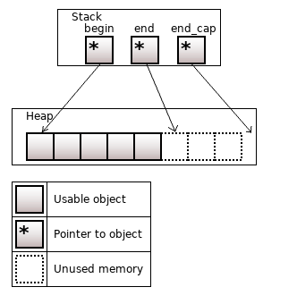
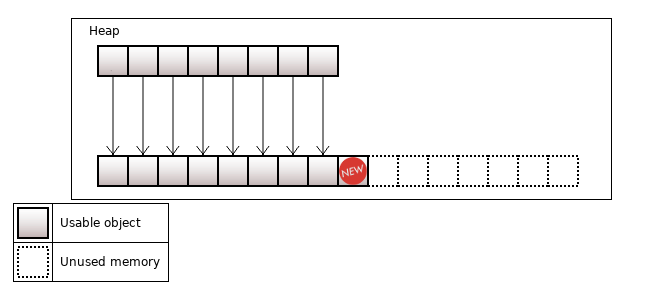
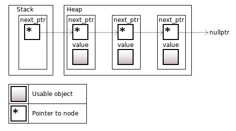
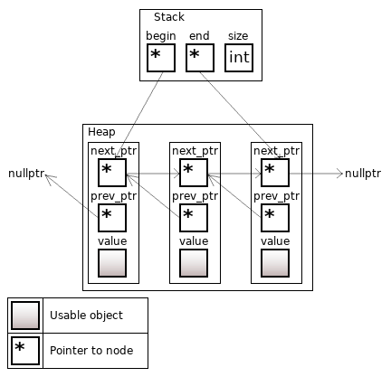

# С++

Этот репозиторий представляет мою базу знаний по С++

В качестве его основы я взял эти карты:  
- [roadmap](https://github.com/salmer/CppDeveloperRoadmap)
- [карта ЛР](https://habr.com/ru/specials/726724/)

Актуальные рекомендации по плюсам:
[C++ Core Guidelines](https://isocpp.github.io/CppCoreGuidelines/CppCoreGuidelines)

ОЧЕНЬ полезные штуки:
[Cpp Insights](https://cppinsights.io/)
[Compiler explorer](https://compiler-explorer.com/)
[Quiz](https://cppquiz.org/quiz/question/1)

# Содержание:

- [Синтаксис](#синтаксис)
    - [Базовые операции](#базовые-операции)
        - [Арифметические операции](#арифметические-операции)
        - [Логические операции](#логические-операции)
        - [Циклы](#циклы)
        - [Приведение типов](#приведение-типов)
        - [По битовые операции](#по-битовые-операции)
        - [Функтор](#функтор) 
        - [Пользовательские литералы](#пользовательские-литералы)
        - [sizeof](#sizeof)
        - [Интроспекция](#интроспекция)
    - [Области видимости](#области-видимости)
    - [Инициализация объектов](#инициализация-объектов)
    - [Работа с памятью](#работа-с-памятью)
        - [Выравнивание](#выравнивание)
    - [Перечисления](#перечисления)
    - [Идиомы](#идиомы)
        - [RAII](#raii)
        - [pimpl](#pimpl)
        - [Non-Copyable/Non-Moveable](#non-copyablenon-moveable)
    - [Указатели и ссылки](#указатели-и-ссылки)
        - [Ссылки](#ссылки)
        - [Умные казатели](#умные-казатели)
            - [std::auto_ptr](#stdаutо_ptr)
            - [std::unique_ptr](#stdunique_ptr)
            - [std::shared_ptr](#stdshared_ptr)
            - [Make функции](#make-функции)
        - [Row указатели](#row-указатели-сырые-или-обычные)
    - [Семантика перемещения] ()
    - [Лямбда функции](#лямбда-функции)
    - [Концепции языка]()
    - [Стандарты](#стандарты)
        - [C++98](#c98)
        - [C++11](#c11)
        - [C++14](#c14)
        - [C++17](#c17)
        - [C++20](#c20)
- [ООП](#ооп)
- [Патерны](#патерны)
    - [Порождающие](#порождающие)
        - [Фабричный метод](#фабричный-метод)
    - [Структурные](#структурные)
- [По битовые операции](#по-битовые-операции)
- [STL](#STL)
    - [Контейнеры](#контейнеры)
    - [Контейнеры последовательности](#контейнеры-последовательности)
        - [Array](#array)
        - [Vector](#vector)
    - [initializer_list](initializer_list)
- [Системы сборки](#системы-сборки)
    - [Make](#make)
    - [CMake](#cmake)
- [Контроль версий (Git)](#контроль-версий-git)
- [Многопоточность](#многопоточность)
- [Сети](#сети)
    - [OSI](#osi)
    - [TCP](#tcpip)
    - [UDP](#udp)
    - [Win socket](#win-socket)
- [ОС](#ос)
    - [Windows](#windows)
        -[Обзор внутреннего устройства Windows](#обзор-внутреннего-устройства-windows)
            -[Процессы (Windows)](#процессы-windows)
    - [Жизнь программы](#жизнь-программы)
- [Библиотеки и фреймворки](#библиотеки-и-фреймворки)
    - [Boost](#boost)
    - [Qt](#qt)
        - [Модули](#модули)
            - [QtCore](#qtcore)
            - [QtGui](#qtgui)
            - [QtWidget](#qtwidget)
        - [Философия объектной модели](#философия-объектной-модели)
            - [сигналы-и-слоты](#сигналы-и-слоты)
            - [соединение-объектов](#соединение-объектов)
            - [разъединение-объектов](#разъединение-объектов)
            - [переопределение-сигналов](#переопределение-сигналов)
        - [организация-объектных-иерархий](#организация-объектных-иерархий)
        - [метаобъектная-информация](#метаобъектная-информация)
    - [gtest/gmoch](#gtestgmoch)

  


# Синтаксис

## Базовые операции 

### Арифметические операции

#### Инкремент и декремент

Префиксный - увеличивает значение до выполенения кода в строке где его вызвали.  
Постфиксный - после выполнения кода в строке в которой его вызвали.
```diff
! Постфиксный немного медленее т.к. возвращает копию переменой которую инкрементировал.
```
[Источник](https://www.cyberforum.ru/cpp-beginners/thread1297462.html)

Операторы могут быть *левоассоциативными* - выполняются слева направо и *правоассоциативными* - выполняются справа налево.  
Большинство операторов левоассоциативны.   
Правоассоциативными операторами являются все унарные операторы, различные операторы присваивания и условный оператор.
  
---

### Логические операции 

---

### Циклы

---

### Приведение типов

[type casting](#type-casting)

---

### По битовые операции 

\<< сдвиг влево  
\>> сдвиг вправо  
\~ поразрядная инверсия  
\| поразрядное ИЛИ  
\& поразрядное И  
\^ поразрядное исключающее ИЛИ  

Если нужно записывать определенные биты, не стирая другие:

Чтобы записать единицу в бит n:
```c++
x |= (1 << n);  
```

Чтобы записать ноль в бит n:
```c++
x &= ~(1 << n);
```

Если нужно инвертировать состояние бита:
```c++
x ^= (1 << n);
```

Если нужно прочитать отдельный бит:
```c++
unsigned char x = (1 << 2) | (1 << 3) | (1 << 7);  
if (x & (1 << 2)) {  /* во второй бит вписана единица */ }  
if (x & (1 << 3)) {  /* в третий бит вписана единица */ }  
if (x & (1 << 7)) {  /* в седьмой бит вписана единица */ }  
```

Если нужно определить, что в X на N-й позиции:
```c++
bool b = (bool((1 << n)  &  x))
```

Если нужно обнулить один или несколько битов:
```c++
int x = 58;       // 00111010
int y = x & 0x0F; // 00001010

//или

x = x & (~((1<<3)|(1<<5)|(1<<6))); //обнуляем третий, пятый и шестой биты
```

Если нужно установить заданные биты в единицу. Используют оператор |
```c++
int x = 155
x = x | 4;     //устанавливаем в единицу второй бит переменной x
```

Сдвигает число на n разрядов влево
```c++
unsigned char x = 3;  //0b00000011
x = x << 3;           //0b00011000 (24)
```

Сдвиг вправо >>
```c++
unsigned char x = 255;  //0b11111111
x = x >> 3;             //0b00011111 (31)
```

[Источник](https://volstr.ru/?p=36)

---

### Функтор

### Пользовательские литералы

[Пользовательские литералы в C++11](https://habr.com/ru/articles/140357/)

Литерал — это некоторое выражение, создающее объект. Литералы появились не только в C++11, они были и в C++03. Например, есть литералы для создания символа, строки, вещественных чисел, и т.д.
Примеры литералов:

```c++
    'x';      // character
    "some";   // c-style string
    7.2f;     // float
    74u;      // unsigned int
    74l;      // long
    0xF8;     // hexadecimal number
    1;        // то же литерал (литеральная константа)
```

Существует две категории пользовательских литералов: сырые литералы (raw) и литералы для встроенных типов (cooked).

Стоит, однако, заметить, что C++ позволяет создавать только литералы-суфиксы. Иными словами, создать литералы префиксы (как, например, 0x), или префиксо-суфиксные (как "") — не получится.

#### Системные литералы

[Литералы](http://mycpp.ru/cpp/book/c03_1.html)

true и false являются литералами типа bool.
записываются как escape-последовательности - тоже литералы
Фактически строковый литерал представляет собой массив символьных констант, где по соглашению 
языков С и С++ последним элементом всегда является специальный символ с кодом 0 (\0).

|Символ         | Описание      |
| -             | -             |
| *u или *U     | unsigned int  |
| *UL или *LU   | unsigned long |
| *.*f или *.*F | float         |
| *.*L или *.*I | long double   |
| L*            | wchar_t       |

#### Литералы для численных типов

литерал для целых чисел в качестве аргумента принимает unsigned long long
литерал для вещественных чисел в качестве аргумента принимает long double
Данные типы обязательнымы и утверждены стандартом языка.

```c++
    // сигнатура литерала для целочисленных типов
    OutputType operator "" _suffix(unsigned long long);

    // сигнатура литерала для вещественных типов
    OutputType operator "" _suffix(long double);

    42_suffix;      // OutputType operator "" _suffix(unsigned long long);
    42.24_suffix;   // OutputType operator "" _suffix(long double);
```

#### Литералы для строковых типов

```c++
    OutputType operator "" _suffix(const char* str, size_t size);
    OutputType operator "" _suffix(const wchar_t* str, size_t size);
    OutputType operator "" _suffix(const char16_t* str, size_t size);
    OutputType operator "" _suffix(const char32_t* str, size_t size);

    "1234"_suffix;   // operator "" _suffix(const char* str, size_t size);
    u8"1234"_suffix; // operator "" _suffix(const char* str, size_t size);
    L"1234"_suffix;  // operator "" _suffix(const wchar_t* str, size_t size);
    u"1234"_suffix;  // operator "" _suffix(const char16_t* str, size_t size);
    U"1234"_suffix;  // operator "" _suffix(const char32_t* str, size_t size);
```

#### Сырые литералы

Сигнатура сырого литерала выглядит следующим образом:

```c++
    OutputType operator "" _suffix(const char* literalString);
```

Он принимает число ввиде строки (не 1 а "1").
Используя данный тип литералов, можно написать литерал преобразующий двоичное число в десятичное. 


Существует еще одна сигнатура для сырых литералов. Основана она на применении Variadic Template:
```c++
    template <char...>
        OutputType operator "" _b();
```
Преимущества литералов на базе Variadic Template заключается в том, что они могут вычисляться на этапе компиляции.


#### Порядок вызова литералов

1. operator "" _x (unsigned long long) или operator "" _x (long double)`
2. operator "" _x (const char* raw)
3. operator "" _x <'c1', 'c2', ... 'cn'>

Если пользовательский литерал совпадает с системным, то выполняется системный


### sizeof

Этот пункт я создал в связи с вопросом о размерах экземляров классов в памяти.

[Сколько в памяти занимает произвольная структура?](https://habr.com/ru/articles/117996/)

Ответ: sizeof всех членов + остаток для выравнивания (по умолчанию выравнивание 4 байта) + sizeof указателя на vtable (если есть виртуальные функции) + указатели на классы предков, от которых было сделано виртуальное наследование (размер указателя * количество классов)
Пример:

[Сколько в памяти занимает структура без членов?](https://habr.com/ru/articles/117996/)
sizeof пустого класса не определён, но должен быть > 0.
Это нужно чтобы не получить ошибку division by zero в таких случаях  
```c++
struct Foo{};
```

### Интроспекция


## Области видимости

## Инициализация объектов

[Эффективный и современныи С++: 42 рекомендации по использованию С++ 11 и С++ 14 - Скотт Мейерс](https://github.com/CapSmoIIett/cplusplus/blob/main/Books/%D0%AD%D1%84%D1%84%D0%B5%D0%BA%D1%82%D0%B8%D0%B2%D0%BD%D1%8B%D0%B9_%D0%B8_%D1%81%D0%BE%D0%B2%D1%80%D0%B5%D0%BC%D0%B5%D0%BD%D0%BD%D1%8B%D0%B9_%D0%A1_%D0%A1%D0%BA%D0%BE%D1%82%D1%82_%D0%9C%D0%B5%D0%B9%D0%B5%D1%80%D1%81.pdf) - Глава 3.1


Как правило, инициализирующие значения указываются с помощью круглых скобок, знака равенства или
фигурных скобок:

```c++
    int х (0);     // Инициализатор в круглых скобках
    int у = 0;     // Инициализатор после "="
    int z { 0 };   // Инициализатор в фигурных скобках 
    int z = { 0 }; // Инициализатор использует "=" и фигурные скобки (обычно эквивалентен обычным {})
```
[Подробнее о фигурных скобках](initializer_list)

Разница между способами инициализации проявляется в случае пользовательских типов данных
```c++
    Widget wl ;     // Вызов конструктора по умолчанию
    Widget w2 wl; // Не присваивание, а копирующий конструктор
    wl = w2 ;   // Присваивание ; вызов оператора operator= () 
```

Унифицированная инициализация(uniform initialization) - это идея. Фигурная инициализация - это синтаксическая конструкция.

С помощью фигурных скобок легко указать начальное содержимое контейнера:
```c++
std::vector<int> v{ 1, 3, 5 }; // v иэначально содержит 1, 3, 5
```

Фигурные скобки могут также использоваться для указания значений инициализации
по умолчанию для нестатических членов-данных
```c++
class Widget
{
private:
    int х{ 0 }; // ОК, эначение х по умолчанию равно 0
    int у = 0;  // Тоже ОК
    int z(0) ;  // Ошибка !
}
```

С другой стороны, некопируемые объекты (например, std::atomic - см. раздел 7.6)
могут быть инициализированы с помощью фигурных или круглых скобок, но не с помощью знака равенства: 
```c++
std::atomic<int> ai1 { 0 }; // ОК
std::atomic<int> ai2 (0); // ОК
std::atomic<int> ai3 = 0; // Ошибка! 
```

Фигурная инициализация запрещает неявные сужающие преобразования.
Инициализация с использованием круглых скобок и знака равенства не выполняет проверку сужающего преобразования.
Если значение выражения в фигурном инициализаторе не может быть гарантированно 
выражено типом инициализируемого объекта, код не компилируется: 
```c++
double х, у, z;
int suml { х + у + z }; // Ошибка! Сумма double может
                        // не выражаться с помощью int

int sum2 (x + y + z); // ОК ( значение выражения усекается до int )
int sumЗ = x + y + z; //
```

Все, что в ходе синтаксического анализа может рассматриваться как
объявление, должно рассматриваться как таковое

Вызов конструктора без аргументов фактически является объявлением функции (фиксим это {}):
```c++
Widget w1(); // Есть вопросы
Widget w2{}; // Вопросов нет
```

Минусы использования везде {} -  [initializer_list](#initializer_list)

#### Тут начинаются приколы:
#### Прикол №1:

```c++
class Widget
{
    Widget (int i, int b);      // 1
    Widget (int i, bool b);     // 2
    Widget (std::initializer_list<int> il);  // 3
}

    Widget{1, true};    // вызов 3
    Widget(1, true);    // вызов 2
	Widget{1, 1};       // вызов 3
    Widget(1, 1);       // вызов 1
```

Объявление объекта фигурными скобками, всегда будет предпочитать конструктор 
с initializer_list

#### Прикол №2
```c++
void func(vector<string> v) { }

void func(vector<wstring> v) { }

int main() {
  func({"apple", "banana"});
}
```

резульато будет call of overloaded 'func(<brace-enclosed initializer list>)' is ambiguous
Это получается т.к. вызов подходит для первой перегрузки (initializer_list to vector),
а со второй перегрузкой, приведение к вектору строк не походит, но у vector есть конструктро принимающий
два итератора который подхоит.
```c++
template<typename InputIterator>
vector(InputIterator first, InputIterator last, 
const allocator_type& a = allocator_type());
```

#### Прикол №3

```c++
class Widget
{
    encode (std::string);      // 1
    encode (std::vector<string>);     // 2
}

    encode({" "});  // ambiguous call to overloaded function
```

## Работа с памятью

[В чем отличие malloc от new?](https://habr.com/ru/articles/117996/)
Ответ: malloc — выделение блока памяти в стиле Си, опасное с точки зрения приведения типов (non-typesafe), т.к. возвращает void * и требует обязательного приведения. new — выделение блока памяти и последующий вызов конструктора, безопасное с точки зрения приведения типов (typesafe), т.к. тип возвращаемого значения определен заранее.
(new вызывает конструктор)

[В чем различия между delete[] и delete](https://habr.com/ru/articles/117996/)[]?

Ответ: delete предназначен для уничтожения объектов, память под которые выделена при помощи new(). delete[] для объектов выделенных при помощи оператора new[]().

### Выравнивание


## Перечисления

[Эффективный и современныи С++: 42 рекомендации по использованию С++ 11 и С++ 14 - Скотт Мейерс](https://github.com/CapSmoIIett/cplusplus/blob/main/Books/%D0%AD%D1%84%D1%84%D0%B5%D0%BA%D1%82%D0%B8%D0%B2%D0%BD%D1%8B%D0%B9_%D0%B8_%D1%81%D0%BE%D0%B2%D1%80%D0%B5%D0%BC%D0%B5%D0%BD%D0%BD%D1%8B%D0%B9_%D0%A1_%D0%A1%D0%BA%D0%BE%D1%82%D1%82_%D0%9C%D0%B5%D0%B9%D0%B5%D1%80%D1%81.pdf) - Глава 3.4

**Предпочитайте перечисления с областью видимости перечислениям без таковой**

Обычно фигуные скобки огрничивают [область видимости](#области-видимости) для всех объявленных внутри них.  
С Enum-ами все иначе.

```c++
enum Color {black, white, red};     // blсk, white, red находятся
                                    // в той же области видимости,
                                    // что и Color 
``` 

Из-за этого есть ввели два типа enum-ов:
- Без области видимости (*unscoped*)
- С областью видимости (*scoped enum*)(с [C++11](#c11)) (*Или классы перечислений*)

Перечисления с областью видимостиб не допускают указанной выше утечки имен:
```c++
enum class Color { blасk, white, red }; // blасk, white, red принадлежат
                                        // области видимости Color

Color с = white;            // Ошибка ' Нет имени перечисления
                            // "white" в этой области видимости
Color с = Color::white;     // Это ок
auto с = Color::white;      // Это хорошо 
```
[auto](#auto)

Приемущества scoped enum:
- Снижение загрязнения пространства имен
- Строго типизированны 

#### Про типизацию enum-ов:

unscoped enum - неякно преобразуются в int (а потом и double)

```c++
eпum Color { Ьlack, white, red };   // Перечисление без
                                    //области видимости

std::vector<std::size_t>  primeFactors (std::size_t х ) ; 
                    // Функция, возвращающая
                    // простые делители х

Color с = red;

if (с < 14.5)   // Сравнение Color и double (!)
{
    auto factors = primeFactors(c); // Вычисление простых делителей
                                    // значения Color (!)
}
```

С scoped enum - другая история. НИкаких неявных преобразований

```c++
enum class Color { black, white, red};  // Перечисление с областью видимости

Color с = Color::red;   // Как и ранее, но с квалификатором
                        // области видимости

if (с < 14.5)   // Ошибка ! Нельзя сравнивать
                // Color и double
{
    auto factors = primeFactors(c);  //Ошибка ! Нельзя передавать Color в
                                    // функцию, ожидающую std::size_t
}
```

Если нужно привести class enum к другому типу - нужно использовать приведение типов

```c++
if (static_cast<double>(c) < 14.5)  // Странный, но
                                    // корректный код
auto factors =                      // Сомнительно, но компилируется
    primeFactors (static_cast<std::size_t>(c));
```

#### Предварительное объявление без указания перечислителй

(Польза этого проявляется когда нужно будет добавить элемент в перечисление. 
Если не использовать предварительное объявление будут пересобраны все места где эти enum-ы используют)

```c++
enum Color;         // Ошибка !
enum class Color;   // ок
```

Каждое перечисление имеет целочисленный *базовый тип* (underlying type) которое определяется компилятором.  
Для неболщих перечеслений может использоваться char.  
Для перечислений с большим диапазоном значений будет использоваться другой тип.  
Для эффективного использования памяти компиляторы часто выбирают наименьший базовый тип (которого достаточно).  
В некоторых случаях, когда компиляторы выполняют оптимизацию по скорости, а не по размеру, они могут выбрать не наименьший допустимый тип.  

По умолчанию базовым типом для eпum с областью видимости является int.  
Если вас не устраивает значение по умолчанию, вы можете его перекрыть:

```c++
enum class Status : std::uint32_t;  // Базовый тип для Status -
                                    // std::uint32_t (из <cstdint>)

```

Чтобы указать базовый тип для перечисления без области видимости, вы делаете то
же, что и для перечисления с областью видимости, и полученный результат может быть
предварительно объявлен:
```c++
enum Color : std::uintB_t;  // Предварительное объявление
                            // перечисления без области видимости;
                            // базовый тип - std::uint8_t
```

#### Ситуация при которой старый enum лучше нового:  
при обращениии к полям кортежа std::tuple

Предположим, например, что у нас есть кортеж, содержащий имя,
адрес электронной почты и значение репутации пользователя на сайте социальной сети:

```c++
using Userinfo =std::tuple<std::string, // Имя
std::string,    // Адрес
std::size_t>    // Репутация 
```
[Псевдоним типа]()

Для удобства создадим enum с соответсвующими названиями элементов кортежа

```c++
enum UserinfoFields { uiName, uiEmail, uiReputation } ;

UserInfo uinfo;             // Как и ранее

auto val = std::get<uiEmail> (uinfo); // Значение адреса
```

Все было бы гораздо сложнее без неявного преобразования значений.  
Соответствующий код с применением перечисления с областью видимости существенно многословнее:

```c++
enum class UserinfoFields { uiName , uiEmail, uiReputation } ;

Userinfo uinfo ;            //Как и ранее

auto val = 
    std::get<static_cast<std::size_t> (UserinfoFields::uiEmail)>(uinfo);
```

- Перечисления в стиле С++98 в настоящее время известны как перечисления без областей видимости.
- Перечислители перечислений с областями видимости видимы только внутри перечислений. 
Они преобразуются в другие типы только с помощью явных приведений.
- Как перечисления с областями видимости, так и без таковых поддерживают указание базового типа. 
Базовым типом по умолчанию для перечисления с областью видимости является int. 
Перечисление без области видимости базового типа по умолчанию не имеет.
- Перечисления с областями видимости могут быть предварительно объявлены. 
Перечисления без областей видимости могут быть предварительно объявлены, 
только если их объявление указывает базовый тип. 

## Типы данных
## Указатели и ссылки
### Ссылки
### Умные казатели 

[Эффективный и современныи С++: 42 рекомендации по использованию С++ 11 и С++ 14 - Скотт Мейерс](https://github.com/CapSmoIIett/cplusplus/blob/main/Books/%D0%AD%D1%84%D1%84%D0%B5%D0%BA%D1%82%D0%B8%D0%B2%D0%BD%D1%8B%D0%B9_%D0%B8_%D1%81%D0%BE%D0%B2%D1%80%D0%B5%D0%BC%D0%B5%D0%BD%D0%BD%D1%8B%D0%B9_%D0%A1_%D0%A1%D0%BA%D0%BE%D1%82%D1%82_%D0%9C%D0%B5%D0%B9%D0%B5%D1%80%D1%81.pdf) - Глава 4

Интеллектуальные указатели представляют собой оболочки вокруг встроенных указателей, 
которые действуют так же, как и встроенные указатели, но позволяют избежать
многих связанных с последними ловушек. *Поэтому вы должны предпочитать встроенным указателям интеллектуальные*

В С++11 имеются четыре интеллектуальных указателя: 
    - std::аutо_ptr,
    - std::unique_ptr, 
    - std::shared_ptr,
    - std::weak_ptr. 

По производительности:
-raw
-std::unique_ptr
-std::shared_ptr

#### std::аutо_ptr

Является устаревшим указателем, доставшимся в наследство от [С++98](#c98). 
В [С++11](#c11) его заменил std::unique_ptr.

В [С++98](#c98) небыло семантики перемещения, необходимой для std::аutо_ptr. 
Поэтому в std::аutо_ptr превратили операцию копирования в перемещение.
А это привело кк тому, что при копировании std::аutо_ptr он становился равен = nullptr.

Единственный случай обоснованного применения std::auto_ptr - необходимость компиляции
кода компилятором [С++98](#c98). Если у вас нет такого ограничения, вы должны заменять
std::auto_ptr указателем std::unique_ptr.

[Что стоит учитывать при использовании auto_ptr?](https://habr.com/ru/articles/117996/)
Ответ: Так как данный умный указатель реализует подход разрушающего копирования, то при присвоении его другому умному указателю оригинальный потеряет свое значение. А так же его нельзя использовать в стандартных STL контейнерах.

### std::unique_ptr

std::unique_ptr делает все то же, что и std::auto_ptr, плюс еще кое-что. 
Он делает это максимально эффективно и безо всяких искажений понятия копирования объекта. 
Он во всех отношениях лучше std::auto_ptr. 

по умолчанию std::unique_ptr имеет тот же размер, что и обычный указатель, и для большинства
операций (включая разыменования) выполняются точно такие же команды.
(почти всегда работаю так же быстро и занимают столько же памяти как и обычные указатели)

**Испоnьзуйте std::unique_ptr дnя управnения ресурсами путем искnючитеnьноrо впадения**

Интеллектуальные указатели std::unique_ptr воплощают в себе семантику исключительного владения.

- Ненулевой std::unique_ptr всегда владеет тем, на что указывает. 
- Перемещение std::unique_ptr передает владение от исходного указателя целевому. (Исходный указатель при этом становится нулевым.) 
- Копирование std::unique_ptr не разрешается, так как если вы можете копировать std : : unique _ptr, то у вас будут два
std::unique_ptr, указывающих на один и тот же ресурс, и каждый из них будет считать,
что именно он владеет этим ресурсом (а значит, должен его уничтожить).

**std::unique_ptr является только перемещаемым типом**

При деструкции ненулевой
std::unique_ptr освобождает ресурс, которым владеет. 
По умолчанию освобождение ресурса выполняется с помощью оператора de lete, примененного ко встроенному указателю
в std::unique_ptr. 

Обычное применение std::unique_ptr - возвращаемый тип [фабричных функций](#фабричный-метод) 
для объектов иерархии.

В процессе конструирования объект std::unique_ptr можно настроить для использования пользовательских удалителей (custom deleters): 
произвольных функций (или функциональных объектов, включая получающиеся из лямбда-выражений), вызываемых
для освобождения ресурсов.

```c++
auto funForDelete = [](MyClass* a)
{
    doSomething(a);
    delete a;
}

std::unique_ptr<MyClass, decltype(funForDelete)> ptr(nullptr, funForDelete);
```

- funForDelete представляет собой пользовательский удалитель для объекта. 
Все функции пользовательских удалителей принимают обычный указатель на удаляемый объект и затем выполняют все необходимые действия по его удалению. 
Применение лямбда-выражения для создания funForDelete удобно, но, как вы вскоре увидите, оно также гораздо
эффективнее написания обычной функции. 
- Когда используется пользовательский удалитель, его тип должен быть указан
в качестве второго аргумента типа std::unique_ptr.
- Для связи пользовательского удалителя funForDelete с нашим указателем 
ptr мы передаем его в качестве второго аргумента конструктора.
- Попытка присвоить обычный указатель (например, возвращенный оператором new)
указателю std::unique_ptr компилироваться не будет, поскольку она будет содержать неявное преобразование обычного указателя в интеллектуальный. 
Такие неявные преобразования могут быть проблематичными, так что интеллектуальные указатели С++ 11 их запрещают. 
Для того, чтобы ptr взял на себя владение объектом, созданным с помощью оператора new, применяется вызов reset. 
```c++
ptr.reset(new Bond(std::forward<Data>(data)))
```

Если в std::unique_ptr используются пользовательские удалители, то в его размер увеличивается на слова-два (удалители - указатель на функцию)

Функциональные объекты без
состояний (например, получающиеся из лямбда-выражений без захватов) не приводят
к увеличению размеров std::unique_ptr, а это означает что 
*когда пользовательский удалитель может быть реализован как функция или как лямбда-выражение, то реализация в виде лямбдавыражения предпочтительнее*

Удалители в виде функциональных объектов с большим размером состояния могут
привести к значительным размерам объектов std::unique _ptr. Если вы обнаружите, что
пользовательский удалитель делает ваш интеллектуальный указатель std : : unique _ptr
неприемлемо большим, вам, вероятно, стоит изменить свой дизайн. 

```c++
auto funForDel1 = [] (MyClass* plnvestment)
{                               // Пользовательский удалитель
makeLogEntry (plnvestment) ;    // как лямбда-выражение
delete plnvestment;             // без состояния
}; 
```

**std::unique_ptr часто используют для реализации [pimpl](#pimpl)**

Интеллектуальный указатель std::unique_ptr имеет две разновидности: 
    - одну - для индивидуальных объектов (std::unique_ptr<T>)
    - другую - для массивов (std::unique_ptr<T []>)

в случае указателя для одного объекта отсутствует оператор индексирования (operator [] ),  
в случае указателя для массива отсутствуют операторы разыменования (operator* и operator- >). 

Существование std::unique_ptr для массивов должно представлять только интеллектуальный интерес, 
поскольку std::array, std::vector и std::string почти всегда
оказываются лучшим выбором, чем встроенные массивы

Единственная ситуация, когда std::unique_ptr<T [] > имеет смысл - при использовании С-образного
API, который возвращает встроенный указатель на массив в динамической памяти, которым вы будете владеть. 

std::unique_ptr можно легко и эффективно преобразовать в std::shared_ptr.  
Благодаря этому этот указатель хорошо подходит для возвращаемого типа фабричных функций.

- std::unique_ptr представляет собой маленький, быстрый, предназначенный
только для перемещения интеллектуальный указатель для управления ресурсами
с семантикой исключительного владения.
- По умолчанию освобождение ресурсов выполняется с помощью оператора delete,
но могут применяться и пользовательские удалители. Удалители без состояний
и указатели на функции в качестве удалителей увеличивают размеры объектов
std::unique_ptr.
- Интеллектуальные указатели std::unique_ptr легко преобразуются в интеллектуальные указатели std::shared_ptr(обратное неверно)

---

### std::shared_ptr

Не может работать  с массивами ( и пробовать не стоит)

**Испопьзуйте std::shared_ptr дпя управпения ресурсами путем совместноrо владения**

Объект, доступ к которому осуществляется через указатели std::shared_ptr, 
имеет время жизни, управление которым осуществляется этими указателями 
посредством совместного владения

Когда последний указатель std::shared_ptr, указывающий на объект, прекратит на него 
указывать (например, из-за того, что этот std::shared_ptr будет уничтожен или перенаправлен
на другой объект), этот std::shared_ptr уничтожит объект, на который он указывал.

В std::shared_ptr есть счетчик ссылок (не в нем а в блоке управления) - показывающий сколько std::shared_ptr указывает на один и тот же ресурс.

Конструкторы std::shared_ptr увеличивают этот счетчик (обычно увеличивают - см. ниже),  
деструкторы std::shared_ptr уменьшают его,  
а операторы копирующего присваивания делают и то, и другое.

```c++
// sp1 и sp2 - std::shared_ptr указывающие на разные объекты.
// При: 
sp1 = sp2;

// sp1 - теперь указывает на ресурс sp2
// счетчик sp1 - уменьшается
// счетчик sp2 - увеличивается
```

Если std::shared_ptr после выполнения декремента видит нулевой счетчик
ссылок, это означает, что на ресурс не указывает больше ни один std::shared_ptr, так
что наш интеллектуальный указатель освобождает этот ресурс.

Особенности: 
- Размер std::shared_ptr в два раза больше размера обычноrо указателя, поскольку данный интеллектуальный указатель
содержит обычный указатель на ресурс и другой обычный указатель на структуру данных в которой находится счетчик ссылок
(стандарт не требует именно такой реализации, но в std сделано так)
- Память для счетчика ссылок должна выделяться динамически. (точнее для структуры данных в которой находится счетчик) 
(Приятным следствием этого является то, что интеллектуальный указатель std::shared_ptr может работать с объектами любого типа (в том числе встроенных типов).)
(далее будет описан способ как можно избежать динамческого выделения с помощью std::make_shared)
- Инкремент и декремент счетчика ссылок должны быть атомарными, поскольку
могут присутствовать одновременное чтение и запись в разных потоках.
*Атомарные операции обычно медленнее неатомарных, так что несмотря на то, что обычно счетчики ссылок имеют размер в одно слово, следует рассматривать их чтение и запись как относительно дорогостоящие операции.*

**При вызове конструктора перемещения счетчик не изменяется.**  
Использование перемещающего конструктора std::shared_ptr, делает исходный указатель нулевым.
Старый указатель перестает указывать на ресурс в тот же момент как новый начинает это делать.
**Таким образом, перемещение std::shared_ptr оказывается быстрее копирования: копирование требует увеличения счетчика ссылок, а перемещение - нет.**
Это справедливо как для присваивания, так и для конструирования, так что перемещающее конструирование быстрее копирующего
конструирования, а перемещающее присваивание быстрее копирующего присваивания.

В отличии от std::unique_ptr тип удалителя не является частью типа интеллектуального указателя std::shared_ptr:
```c++
std::unique_ptr<Widget, decltype(funForDel)>    // Тип удалителя является
    upw (new Widget, funForDel);                // частью типа указателя

std::shared_ptr<Widget>                         // Тип удалителя не является
    spw (new Widget, funForDel);               // частью типа указателя
```
Следовательно дизайн std::shared_ptr более гибок
(можно разместить в контейнере std::shared_ptr указатели с различными удалителями, так же их можно без проблем присваивать один другому)

**Указание пользовательского удалителя не влияет на размер объекта std::shared_ptr.**
Независимо от удалителя объект std::shared_ptr имеет размер, равный размеру двух указателей.

std::shared_ptr - имеет указатель на данные и на управляющий блок в котором находится информация о счетчеке указателей,
пользовательском удалителеб, опционально пользовательский распределитель памяти


Управляющий блок объекта настраивается функцией, создающей первый указатель std::shared_ptr на объект.
при создании управляющего блока должны использоваться следующие правила:
- Функция std::make_shared всегда создает управляющий блок.
Она производит новый объект, на который будет указывать интеллектуальный
указатель, так что в момент вызова std::make_shared управляющий блок для этого объекта, определенно, не существует.
- Управляющий блок создается тогда, когда указатель std::shared_ptr создается из указателя с исключительным владением (т.е. std::unique_ptr или
std::auto_ptr). Указатели с исключительным владением не используют управляющие блоки, так что никакого управляющего блока для указываемого объекта не
существует. (Как часть своего построения std::shared_ptr осуществляет владение указываемым объектом, так что указатель с исключительным владением становится нулевым.) 
- Когда конструктор std::shared_ptr вызывается с обычным указателем, он создает управляющий блок.
(Если вы хотите создать std::shared_ptr из объекта, у которого уже имеется управляющий блок, вы предположительно передаете
в качестве аргумента конструктора std::shared_ptr или std::weak_ptr)

создание более одного std::shared_ptr из единственного обычного указателя  - ведет к неопределенному поведению

Старайтесь не передавать обычные указатели shared_ptr, если без этого не как, то передавайте сразу результа *new*, а не обычную переменную

С make_shared нельзя задать удалители

управляющий блок - размером в несколько слов (пользовательские удалители и распределители могут его увеличить)
(по  умолчанию при создании с помощью make_shared - около 3-х слов)

взаимодействие со счетчиком - 1/2 атомарные операции.

Обычно реализация управляющего блока применяет наследование и имеет виртуальные функции ( для коректного уничтожения) - 
это все то же увеичивает стоимость std::shared_ptr

**std::shared_ptr - не лучший способ управления ресурсами!**
*Но его функицонал/стоимость очень приятна*


**std::shared_ptr и this**

Создавть std::shared_ptr с помощью *this* - плохая идея.  
Но если нужно это сделать, используй std::еnаblе_shared_from_this.
std::еnаblе_shared_from_this - Это шаблон базового класса, который вы наследуете,
если хотите, чтобы класс, управляемый указателями std::shared_ptr, был способен
безопасно создавать std::shared_ptr из указателя this.

(std::enable_shared_from_this<T> - [CRTP](#crtp))
Шаблое std::enable_shared_from_this - определяет функцию член, которая создает std::shared_ptr для this (shared_from_this).
При этом он не дублирует управляющие блоки 

```C++
class Widget : public std::enable_shared_from_this<Widget>
{
public:
    void process( )
    {
        array.emplace_back(shared_from_this());
    }
};
```
std::shared_from_this - внутри ищет управляющий блок объекта и создает  std::share_ptr,
который использует этот же управляющий блок.
НО для этого управляющий блок должен быть создан.
Чтобы препятствовать вызову функции-члена, в которой используется
shared_from_this, до того как на объект будет указывать указатель std::shared_ptr,
классы, наследуемые от std::enable_shared_from_this, часто объявляют свои конструкторы как 
private и заставляют клиентов создавать объекты путем вызова фабричных функций, 
которые возвращают указатели std::shared_ptr.

```C++
class Widget : public std::enable_shared_from_this<Widget>
{
public:
    template<typename Ts>
    static std::shared_ptr<Widget> create(Ts&& ... params )  // Фабричная функция

private:
    // конструкторы

};
```
- std::shared_ptr предоставляет удобный подход к управлению временем жизни
произвольных ресурсов, аналогичный сборке мусора.
- По сравнению с std::unique_ptr объекты std::shared_ptr обычно в два раза
больше, привносят накладные расходы на работу с управляющими блоками и требуют атомарной работы со счетчиками ссылок.
• Освобождение ресурсов по умолчанию выполняется с помощью оператора delete,
однако поддерживаются и пользовательские удалители. Тип удалителя не влияет
на тип указателя std::shared_ptr.
• Избегайте создания указателей std::shared_ptr из переменных, тип которых -
обычный встроенный указатель. 

---

### std::weak_ptr

Проблема неизвестного указателя - ситуация когда умный указатель указывает на освобожденную память

std::weak_ptr - неявляется автономным интелектуальным указателем, это дополнение к std::shared_ptr. 
В нем нет операций разыменования 

std::weak_ptr создается из указателей std::shared_ptr, но не влияют на счетчики ссылок (У них есть свой - weak счетчик), на который указывают

```c++
auto spw = std::make_shared<Widget>();

std::weak_ptr<Widget> wpw (spw) ;

spw = nullptr;
// после этого объект Widget уничтожается а wpw становиться висячим (просроченым - expired)

if (wpw.expired())  // проверка на то, просрочен ли указатель
```

чтобы из std::weak_ptr получить даные из него нужно сделать std::shared_ptr
Есть два пособа это сделать:
- std::weak_ptr::lock() - возвращает shared_ptr (нулевой если std::weak_ptr - expired)

```C++
std::shared_ptr<Widget> spw1 = wpw.lock();
auto spw2 = wpw.lock();
```

- конcтруктор std::shared_ptr

```c++
std::shared_ptr<Widget> spw(wpw);   // Если wpw просрочен генерирует std::bad_weak_ptr
```

Для чего нужен std::weak_ptr?
Пример: есть фабричный метод возвращающий умные указатели. 
Допустим этот метод очень нагружает систему.
Логично использование кэширования для улучшения производительности.
Но большое количество копий объекта очень засорит память.
Тогда кэшировать стоит, когда эти объекты больше нигде в программе не используются.
Тогда данный метод будет возвращать std::shared_ptr, а кэшировать std::weak_ptr.  
Грубая (очень грубая) реализация:
```c++
std::shared_ptr<const Widget> fastLoadWidget (Widget ID id)
{
    static std::unordered_map<WidgetID,
        std::weakytr<const Widget>> cache;
    
    auto obj_ptr = cache[id].lock(); 
    // obj Ptr является std::shared_pt для кешированного объекта и
    // нулевым указателем для объекта, отсутствующего в кеше

    if (!obj_ptr) 
    {
        obj_ptr = loadWidget (id);
        cache[id] = obj_ptr;
        //При отсутствии в кеше объект загружается и кешируется
    }

    return obj Ptr;
}
```

Второй пример применения:
Шаблон проектирования [Observer](#наблюдатель). 
В большинстве реализаций объект за которым наблюдают (субъект) имеет указатели на его наблюдателей.
Каждый субъект хранит контейнер std::weak_ptr на его наблюдателей.


Еще пример:
Есть структуры A, B,C. 
A и C имеют указатели на B.

Нам нужен указатель из B на A, как это лучше делать?  
Варианты:
- **Обычный указатель**. 
В таком случае если A уничтожить, то B созранит висячий указатель на него.
- **std::shared_ptr**.
Если A и B имеют std::shared_ptr друг на друга то их уничтожение - большая проблема.
- **std::weak_ptr**. 
Этот вариант лишен выше указаных проблем.

std::weak_ptr - соразмерен std::shared_ptr (используют теже управляющие блоки).  
А создание, уничтожение, присваивание - атомарные операции взаимодействующие со счтечиком ссылок(они работают со своим счетчиком ссылок).

- Используйте std::weak_ptr как std::shared_ptr - oбpaзныe указатели, которые могут быть висячими.
- Потенциальные применения std::weak_ptr включают хеширование, списки наблюдателей и предупреждение циклов указателей std::shared_ptr. 

---

### Make функции
**std::make_unique и std::make_shared против new**

Три make-функции. 
Принимающие произвольное количество аргументов и производящие 
прямую передачу конструктору данного объекта и возвращающие умный указатель:
- std::make_unique
- std::make_shared
- std::allocate_shared (аналогичен std::make_shared, за исключением того, 
что первым аргументом является объект распределителя, использующийся для выделения динамической памяти.)

```c++
auto upw1 (std::make_unique<Widget>());     // С make-функицей
std::unique_ptr<Widget> upw2(new Widget);   // Без

auto spw1 (std::make_shared<Widget>());     // С make-функицей
std::shared_ptr<Widget> spw2(new Widget);   // Без
```

Плюсы make-функций:
- Можно работать с auto;
- Безопасность исключений
```c++
void processWidget (std::shared_ptr<Widget> spw, int priority);
...
{
    processWidget(std::shared_ptr<Widget>(new Widget), compPrior());    
    // Тут возможна утечка Widget
    // Это связано с тем как компилятор транслирует исходный код в объектный 
    // Во время выполнения аргументы функциии должны быть вычеслены до вызова функции, 
    // До выполнения processWidget произойдет следующее
    //  - new Widget создаст в динамической памяти объект Widget
    //  - Будет вызван конструктор std::shared_ptr<Widget>
    //  - Будет вызван compPrior
    // Последовательность выполнения этих действий не определена 
    // и если compPrior будет вызван после new и до создание указателя,
    // указатель созданный new будет утерян и будет вызвано исключение  
}
```
- Если не исопльзовать make-функции, то создание std::share_ptr использует два выделения памяти 
(для объекта и для управляющего блока)
(std::make_shared выделяет один блок памяти для одного и для другого)

Ситуации при которых не стоит использовать make-функции:
- Если нужно задать пользовательский удалитель.
- трудности с [std::initializer_list](!) (но по умолчанию используются круглые скобки)

Ситуации при которых не стоит испольщовать только std::shared_ptr:
- Если для класа переопределены *operator new* и *operator delete*
- Выделеный блок памяти с помощью make-функции (управляющий блок рядом с даннымия) существует
пока обычный и weak счетчики не равны 0. Память для данных не будет освобождена пока существует хотя бы
один std::shared_ptr или std::weak_ptr.

- По сравнению с непосредственным использованием new, mаkе-функции устраняют
дублирование кода, повышают безопасность кода по отношению к исключениям
и в случае функций std::make_shared и std::allocate_shared генерируют меньший по размеру и более быстрый код.
- Ситуации, когда применение mаkе-функций неприемлемо, включают необходимость указания 
пользовательских удалителей и необходимость передачи инициализаторов в фигурных скобках.
- Для указателей std::shared_ptr дополнительными ситуациями, в которых применение mаkе-функций 
может быть неблагоразумным, являются классы с пользовательским управлением памятью и системы, в которых проблемы с объемом памяти
накладываются на использование очень больших объектов и наличие указателей
std::weak_ptr, время жизни которых существенно превышает время жизни указателей std::shared_ptr. 

---

### Row указатели (сырые или обычные)
    Недостатки перечисленные в 
[Эффективный и современныи С++: 42 рекомендации по использованию С++ 11 и С++ 14 - Скотт Мейерс](https://github.com/CapSmoIIett/cplusplus/blob/main/Books/%D0%AD%D1%84%D1%84%D0%B5%D0%BA%D1%82%D0%B8%D0%B2%D0%BD%D1%8B%D0%B9_%D0%B8_%D1%81%D0%BE%D0%B2%D1%80%D0%B5%D0%BC%D0%B5%D0%BD%D0%BD%D1%8B%D0%B9_%D0%A1_%D0%A1%D0%BA%D0%BE%D1%82%D1%82_%D0%9C%D0%B5%D0%B9%D0%B5%D1%80%D1%81.pdf) - стр 126:

1. Их объявление не дает информации о том, указывают ли они на один объект или на массив.
2. Их объявление ничего не говорит о том, должны ли вы уничтожить то, на что он
указывает, когда завершите работу, т.е. владеет ли указатель тем, на что указывает.
3. Если вы определили, что должны уничтожить то, на что указывает указатель, нет никакого способа указать, как это сделать. 
Должны ли вы использовать delete
или имеется иной механизм деструкции (например, специальная функция уничтожения, которой следует передать этот указатель)?
4. Если вам удалось выяснить, что требуется использовать оператор delete, то причина 1 означает, 
что нет никакого способа узнать, следует ли использовать оператор для удаления одного объекта (delete) или для удаления массива (delete []).
Если вы используете оператор неверного вида, результат будет неопределенным.
5. Если вы определили, что указатель владеет тем, на что указывает, и выяснили,
каким образом уничтожить то, на что он указывает, оказывается очень трудно
обеспечить уничтожение ровно один раз на каждом пути вашего кода (включая те,
которые возникают благодаря исключениям). Пропущенный путь ведет к утечке
ресурсов, а выполнение уничтожения более одного раза - к неопределенному поведению.
6. Обычно нет способа выяснить, не является ли указатель висячим, т.е. не указывает
ли он на память, которая больше не хранит объект, на который должен указывать
указатель. Висячие указатели образуются, когда объекты уничтожаются, в то время как указатели по-прежнему указывают на них.

## Семантика перемещения

[Эффективный и современныи С++: 42 рекомендации по использованию С++ 11 и С++ 14 - Скотт Мейерс](https://github.com/CapSmoIIett/cplusplus/blob/main/Books/%D0%AD%D1%84%D1%84%D0%B5%D0%BA%D1%82%D0%B8%D0%B2%D0%BD%D1%8B%D0%B9_%D0%B8_%D1%81%D0%BE%D0%B2%D1%80%D0%B5%D0%BC%D0%B5%D0%BD%D0%BD%D1%8B%D0%B9_%D0%A1_%D0%A1%D0%BA%D0%BE%D1%82%D1%82_%D0%9C%D0%B5%D0%B9%D0%B5%D1%80%D1%81.pdf) - Глава 5

### rvalue и lvalue

rvalue указывает на объекты которые могут быть перемещены. (концептуально соответсвует временным объектам возвращенным функцией)
Копии ravlue конструируются копированием.

В общем случае lvalue не могут быть перемещены. (соответсвуют объектам на которые вы можете ссылаться по имени)

тест на lvalue - можно ли получить его адрес?  
да - lavlue  
нет - rvalue

**Тип выражения не зависит от того rvalue и lvalue оно.**

rvalue похволяет реализовать семантику перемещения и прямую передачу

Семантика перемещения позволяет 
- заменить конструктор копирования более дешевы перемещением
- создавть объекты как [std::unique_ptr](#stdunique_ptr), std::future, std:: thread

прямая передача
- шаблонные функции, принимающее произвольные аргументы и передающие другим функциям (котороые получают *точно такие же* аргументы)

Для понимания следующего важно помнить что:  
параметр всегда lvalue, даже если его тип rvalue
```c++
void fun(Widget&& w);   // w - lavalue, его тип rvalue ссылка на Widget
```

### std::move и std::forward

**std::move - ничего не перемещает**  
**std::forward - ничего не передает**

std::move и std::forward - шаблоны функций  
std::move - приводит входной аргумент к rvalue  
std::forward - выполняет приведение при определенных условий  

пример реализации std::move (близкий к стандарту)
```c++
// C++11
// В пространстве имен std
template<typename Т> 
typename remove_reference<T>::type&& move (T&& param)
{
    using ReturnType = // Объявление псевдонима
        typename remove_reference<T>::type&&;

    return static_cast<Return'l'ype>(param) ;
}
```

- std::move получает [универсальную ссылку]() на объект и возвращает тот же объект
- && в возвращаемом типе говорит что будет возвращен rvalue 

В с++14
```c++
```
[псевдонимы]()

## Лямбда функции

*Замыкание (closure)* - объект времени выполнения, создаваемый лямбдой.
В зависимости от режима захвата замыкания хранят копии ссылок на захваченные данные.

*Класс замыкания (closure class)* - представляет собой класс, из котороrо инстанцируется замыкание. 
Каждое лямбда-выражение заставляет компиляторы генерировать уникальный класс замыкания.

### Избеrайте режимов захвата по умопчанию 

[Эффективный и современныи С++: 42 рекомендации по использованию С++ 11 и С++ 14 - Скотт Мейерс](https://github.com/CapSmoIIett/cplusplus/blob/main/Books/%D0%AD%D1%84%D1%84%D0%B5%D0%BA%D1%82%D0%B8%D0%B2%D0%BD%D1%8B%D0%B9_%D0%B8_%D1%81%D0%BE%D0%B2%D1%80%D0%B5%D0%BC%D0%B5%D0%BD%D0%BD%D1%8B%D0%B9_%D0%A1_%D0%A1%D0%BA%D0%BE%D1%82%D1%82_%D0%9C%D0%B5%D0%B9%D0%B5%D1%80%D1%81.pdf) - Глава 6.1

В С++ 11 имеются два режима захвата: по ссылке и по значению.
Захваты по умолчанию могут привести к висячим ссылкам.

Если время жизни замыкания больше времени жизни объекта на который он ссылается, то ссылка
в замыкании станет висячей. 
Захват по умолчанию по значению не является лекарством от висящих ссылок (Например захват указателя по значению).

[=] внутри  метода класс захватит всеполя класса, а точнее указатель на this.

```c++
void Widget : : addFi lter () const
{
    filters.emplace_back (
        [=](int value ) { return value % divisor == 0; }
    );
}

// эквивалентно этмоу:

void Widget : : addFi lter () const
{
    auto currentObjectptr = this;
    filters.emplace_back(
            [currentObjectptr] ( int value )
        { return value % currentObjectptr->divisor == 0; } 
    );
}
```

Что бы этого исзбежать - захватывайте данные
```c++
void Widget::addFilter () const
{
    auto divisorCopy = divisor; // Копирование
    filters. emplace_back (     // члена-данных
        [divisorCopy] ( int value)           // Захват копии
        { return value % divisorCopy == 0; } //  Ее использование
    ) ;
}

или

void Widget::addFilter () const
{
    filters.emplace_back (    // С++14:
        [divisor = divisor] ( int value )   // Копирование divisor
                                            // в замыкание
        { return value % divisor == 0; }    // Использование копии
    );                                     
}

```


> [!IMPORTANT]
> Замыкания не захватывают статические переменные а обращаются к ним на прямую

### Испопьзуйте инициапизирующий захват дпя перемещения объектов в замыкания

В с++11 в замыкание нельзя передать только перемещаемые объекты.

*Инициализирующим захватом (init capture)* - (или обобщенный захват лямбда-выражения (generalized lambda capture).)
делает возможным указать:
1. имя члена-данных в классе замыкания  
2. выражение инициализации этого члена-данных.

```c++
auto pw = std::make_unique<Widget>();

auto fuпc = 
    [pw = std::move(pw)]    // Инициализирующий захват
    { return pw->isValidated(); };

```
Слева от знака = находится имя члена-данных в классе замыкания, а справа - инициализирующее выражение.
Так же можно:
```c++
auto func = [pw = std::make_unique<Widget>() ]
    {...}
```

Если нужно добиться этого в c++11 можно:
1. написать класс аналог замыкания дл этого случая
2. перемещения захватываемого объекта в функциональный объект с помощью std::bind
3. передачи лямбда-выражению ссылки на захватываемый объект

Пример второго случая:
```c++
auto func =
    std::bind (                         // Эмуляция в С++ 11
        [] ( const std::vector<double>&)  // инициализирующего
        { /* Использование данных */ } ,
    std::move(data)
    );
```

При вызове bind все сохраненные им аргументы передаются в функциюф.


###

Обобщенные лямбда-выражения - лямбда-выражения, в спецификации параметров которых используется ключевое слово auto.
Реализуется это: в классе замыкания operator() указывается как шаблон

Чтобы реализовать передачу rvalue и lvalue: 
- нужно указать параметр как универсальную ссылку
- он должен передаваться в функции методом std::forward

```c++
    auto f = [] (auto&& х)
    { return normalize(std::forward<decltype (x)>(x));  }:   // normalize - функция принимающая rvalue и lvalue
```


## Концепции языка

### type casting


#### C-style
    
Приведение типов в стиле языка C может привести выражение любого типа к любому другому типу данных.  
Общий вид приведения:  
(new_type)exp

C-style cast по сути самое медленное преобразование, так как в этом случае последовательно перебираются следующие вызовы:
- const_cast
- static_cast
- static_cast + const_cast
- reinterpret_cast
- reinterpret_cast + const_cast

#### const-cast

Оператор приведения const_cast удаляет или добавляет квалификаторы 
const и volatile с исходного типа данных 
(простые типы, пользовательские типы, указатели, ссылки).  
Общий вид приведения:  
const_cast<new_type>(exp)

#### reinterpret_cast

Оператор приведения reinterpret_cast используется для приведения несовместимых типов.
Может приводить целое число к указателю, указатель к целому числу,
указатель к указателю (это же касается и ссылок).
Является функционально усеченным аналогом приведения типов в стиле языка С.
Отличие состоит в том, что reinterpret_cast не может снимать квалификаторы const и volatile,
а также не может делать небезопасное приведение типов не через указатели, а напрямую по значению.
Например, переменную типа int к переменной типа double привести при помощи reinterpret_cast нельзя.  
Общий вид приведения:  
reinterpret_cast<new_type>(exp)

#### static_cast

Оператор приведения static_cast применяется для неполиморфного приведения типов на этапе компиляции программы.
Отличие static_cast от приведения типов в стиле языка C состоит в том,
что данный оператор приведения может отслеживать недопустимые преобразования,
такие как приведение указателя к значению или наоборот.  
При множественном наследовании static_cast может вернуть указатель не на исходный объект, а на его подобъект.  
Общий вид приведения:  
static _cast<new_type>(exp)

#### dynamic_cast

Оператор приведения dynamic_cast применяется для полиморфного приведения типов
на этапе выполнения программы (класс считается полиморфным, если в нем есть хотя бы одна виртуальная функция).

Если приведение указателей невозможно, то на этапе выполнения программы будет возвращен (0).
Если приведение производится над ссылками, то будет сгенерировано исключение std::bad_cast.
Может быть использован и для обычных неполиморфных типов вверх по иерархии.
Использует систему RTTI (Runtime Type Information).  
При множественном наследовании dynamic_cast может вернуть указатель не на исходный объект, а на его подобъект.  
Общий вид приведения:  
dynamic_cast <new_type>(exp)  

## Организация кодовой базы
## Структуры и классы

Главное различие между классом и структурой в с++, по умолчанию область видимости полей в структуре - public, а у класса - private.

## Библиотеки и взаимодействие с ними
## Обработка ошибок

## Концепции языка

## Шаблоны


### Концепт
```c++
template<class T>
//concept Sumable = std::is_arithmetic_v<T>;    // тоже можно
concept Sumable = requires(T t)     // Если это не вызывает ошибку
{
    return a + b;
} 

template<Sumbale T>
T Sum (T a, T b)
{
    return a + b;
}
```

Концепт проверяет подходят ли передаваемые в шаблон типы условию концепта. Если они не подходят это вызовет понятную ошибку компиляции

```c++

template<class T>
concept Printable = requires(T t)
{
    std::cout << t;
}

template<Printable T, Printable TArgs>
void Print(T a, TArgs... args)
{
    std::cout << a << " ";
    Print(args...);
} 

...

Print(1, "hello");
```

### CRTP
The Curiously Recurring Template Pattern - Странно повторяющийся шаблон

Пример этого: std::enable_shared_from_this<T>

## Функции


### Параметры и аргументы

При вызове функции выражения переданные в источник вызова называют - **аргуметнами**
Эти аргументы используют для инициализации **параметров** функции.

параметры функции всегда [lvalue]. но могут быть инициальзированны и [rvalue] и [lvalue]

### Передача параметров в функции

```C++
void fun(Widget w); // передача по значению

Widget wid;
fun(wid);       // вызов копиркующего конструктора
fun(std::move); // вызов конструктора перемещения
```

## Идиомы

### RAII
*Resource Acquisition Is Initialization - Получение ресурса есть инициализация*

Идиома очень простая и кратко описывается следующим образом: в конструкторе объект получает доступ к какому либо ресурсу (например, открывается файл или устанавливается соединение по сети к базе данных) и сохраняет описатель ресурса в закрытый члена класса, а при вызове деструктура этот ресурс освобождается (закрывается файл или соединение к БД). При объявлении объекта данного класса на стеке происходит и его инициализация с вызовом конструктора, захватывающий ресурс. При выходе из области видимости объект выталкивается из стека, но перед этим вызывается деструктор объекта, который и освобождает захваченный ресурс.

[Источник](https://habr.com/ru/sandbox/21603/)

Основные моменты:

1. Обращение к ресурсу происходит в один этап. Либо мы получаем готовый полностью функциональный объект сразу, либо не получаем ничего.
2. Безопасность по отношению к исключению. Например, если после создания объекта и обращения к ресурсу произойдет исключение и мы перейдем к обработчику исключения, мы можем быть уверены что ресурс освободится без нашего участия. Даже если ресурсов несколько, мы уверены что все они будут корректно освобождены. В противном случае, если захватывать и освобождать ресурс вручную, то при возникновении исключения нужно учитывать, какие ресурсы уже захвачены, а какие – нет, и освобождать только использованные ресурсы, что не слишком просто.
3. Идиома очень удобна, когда нужно отслеживать важные ресурсы, а при этом сопровождение кода оставляет желать лучшего.
4. Часто при использовании нескольких ресурсов освобождать их следует в обратном порядке. При использовании идиомы RAII, вследствие того что объекты с захваченными ресурсами располагаются на стеке, их уничтожение происходит в обратном порядке, что как правило и является желательным.
5. Поддержка принципа DRY (Don’t Repeat Yourself). Код инициализации и освобождения ресурса содержится только в одном месте. Нет необходимости копировать и вставлять код инициализации в каждое место в программе где это необходимо. Достаточно просто создать объект.
6. При необходимости использовать дополнительные параметры для обращения к ресурсу (например, логин и пароль к БД) эти параметры могут быть переданы в качестве аргументов конструктора.
7. Накладные расходы при простейшей реализации обращения к ресурсу минимальны. В С++, как правило, при оптимизации компилятор реализует невиртуальные конструкторы и деструкторы в виде inline-функций.
8. Данная идиома применима только в языках с предсказуемым временем жизни объекта. Сюда относится, например, С++, а также языки с сборщиком мусора, где время жизни объекта определяется количеством ссылок на него, такие как Objective C.
9. Эта идиома неприменима в таких языках как Java или С#, где невозможно предсказать когда объект будет удален.


#### Правило 3-х 
(актуально до [C++11](#c11))  
Eсли вам нужно определить что-либо из конструктора копирования, оператора присваивания копированием или деструктора, то скорее всего вам нужно определить “все три”

#### Правило 5-х

Eсли вам нужно определить что-либо из пятерки конструкторов или деструтктор, то вам, скорее всего, нужно определить или удалить (или, по крайней мере, рассмотреть такую возможность) все пять.

(если вы не определите операции перемещения, они не будут генерироваться, и вызовы будут обрабатываться через операции копирования. И это не будет ошибкой, но, возможно, это будет вашим большим упущением с точки зрения оптимизации.))

```c++
// Инициализация и уничтожение
   explicit IndirectValue(T* ptr );
   ~IndirectValue() noexcept ;

   // Копирование (вместе с деструктором дает нам Правило Трех)
   IndirectValue(IndirectValue const& other) ;

   IndirectValue& operator=(IndirectValue const& other);

   // Перемещение (добавление этих элементов уже дает нам Правило Пяти)
   IndirectValue(IndirectValue&& other) noexcept;

   IndirectValue& operator=(IndirectValue&& other) noexcept ;
```

#### Правило 0-ля

Если ничего из специальных функций-членов не определено пользователем, то (с учетом переменных-членов) компилятор предоставит реализации по умолчанию для каждой из них.  
*Правило Ноля заключается в том, что тот сценарий, когда не нужно определять ничего из специальных функций-членов, должен быть предпочтительным.*

Самый лучший подход — по умолчанию следовать Правилу Ноля, прибегая к Правилу Пяти, если обнаружили, что вам нужно написать какие-либо специализированные классы, управляющие ресурсами (что само по себе должно происходить  достаточно редко).

[Источник](https://habr.com/ru/companies/otus/articles/704492/)

---

### pimpl

*pointer to implementation - указатель на реализацию*

Идиома **pimpl** - полезна в тех случаях, когда нам нужно что-то скрыть. 
Она обеспечивает еще более глубокий вид инкапсуляции, которая маскирует не просто реализацию, а также все ее зависимости.
Нужна для:
1. Для того, что бы была возможность изменять реализацию скрываемого класса без перекомпиляции остального кода, так как закрытые члены хоть и недоступны извне никому, кроме функций-членов и друзей, но видимы всем, кто имеет доступ к определению класса. Изменение определения класса приводит к необходимости перекомпиляции всех пользователей класса
2. Для сокрытия имен из области видимости. Закрытые члены хоть и не могут быть вызваны кодом вне класса, тем не менее они участвуют в поиске имен и разрешении перегрузок
3. Для ускорения времени сборки, так как компилятору не нужно обрабатывать лишние определения закрытых типов

Как мы этого добиваемся?
Переносим #include <название библтотеки> из .h в .cpp.
В .h дописываем необзодимый include

До:
```c++
// .h
#include "HideClass.h"

class A 
{
public:
    void fun();

private:
    HideClass b;
}


// .cpp
void A::fun()
{ /*Do something*/}
```

После:
```c++
// .h
class HideClass;

class A
{
public:
    A();
    ~A();
    void fun();

private:
    HideClass* b;
}


// .cpp
#include "HideClass.h"

A::A():
    b (new HideClass)
{ /*Do something*/}

A::~A()
{ delete b; }

void A::fun()
{ /*Do something*/}
```

В С++, в случае изменений в классе (даже в закрытых функциях членах) все пользователи данного класса должны быть перекомпилированы. 
Для избежания подобных зависимостей используется указатель на функции члены, реализацию которых необходимо скрыть.
Два основных недостатка заключаются в следующем:
1. Каждое создание объекта требует динамического выделения памяти для объекта, на который ссылается указатель
2. Использование нескольких уровней косвенности (как минимум — один) для доступа к членам скрытого объекта

Что же можно попробовать скрыть?

1. Только скрытые данные-члены
2. Все скрытые данные-члены и функции-члены. К сожалению, скрыть виртуальную функцию невозможно, так как она должна быть видима для производных классов. Также в закрытом классе может понадобиться ссылка на открытый класс для использования его функций
3. Закрытые и защищенные члены. К сожалению, защищенные члены скрыть нельзя, так как они должны быть доступны производным классам
4. Весь класс. Преимущество заключается в том, что закрытому классу не нужен указатель на открытый класс. С другой стороны, мы лишаемся возможностей наследования

(Сам до конца не понимаю указанное выше)

И еще: 
```c++
// .h
class HideClass;

class A
{
public:
    A();
    ~A();
    void fun();

private:
    int hideClassSize = 42;
    char hideClassObj[hideClassSize];
}


// .cpp
#include "HideClass.h"

A::A()
{
    assert(hideClassSize >= sizeof(HideClass));
    new(&hideClassObj[0]) HideClass;
}

A::~A()
{
    (reinterpret_cast<HideClass *> (&hideClassObj[0]))->~HideClass();
}

void A::fun()
{ /*Do something*/}
```

Кодом выше получилось избавиться отдинамического выделения памяти.

Нам удалось избавиться от объявления класса UnixSocketImpl в заголовочном файле GeneralSocket, и избавиться от динамического выделения памяти. Взамен мы получили ряд существенных недостатков:

1. С++ — язык со строгой типизацией, и данное ухищрение – попытка обойти ограничения языка
2. Проблемы с выравниванием памяти. Данный способ не гарантирует что память будет выравнена должным образом для всех членов UnixSocketImpl. Решение, которое не гарантирует полную переносимость, но все же работает в большинстве случаев – использование union:


[Эффективный и современныи С++: 42 рекомендации по использованию С++ 11 и С++ 14 - Скотт Мейерс](https://github.com/CapSmoIIett/cplusplus/blob/main/Books/%D0%AD%D1%84%D1%84%D0%B5%D0%BA%D1%82%D0%B8%D0%B2%D0%BD%D1%8B%D0%B9_%D0%B8_%D1%81%D0%BE%D0%B2%D1%80%D0%B5%D0%BC%D0%B5%D0%BD%D0%BD%D1%8B%D0%B9_%D0%A1_%D0%A1%D0%BA%D0%BE%D1%82%D1%82_%D0%9C%D0%B5%D0%B9%D0%B5%D1%80%D1%81.pdf) - Глава 4.5 c. 155


### Non-Copyable/Non-Moveable

(Как я понял) Если есть класс который нельзя копировать и перемещать то просто удаляем его конструкторы копирования.

```c++
class NonCopyable
{
  public: 
    NonCopyable (const NonCopyable &) = delete;
    NonCopyable & operator = (const NonCopyable &) = delete;

  protected:
    NonCopyable () = default;
    ~NonCopyable () = default; /// Protected non-virtual destructor
};
class CantCopy : private NonCopyable
{};
```
[Источник](https://en.wikibooks.org/wiki/More_C%2B%2B_Idioms/Non-copyable_Mixin)
 
 ---

### Erase-Remove

Идиома **remove-erase idiom** призвана решить проблему удаления элементов из контейнера, поскольку данная проблема может представлять нетривиальную задачу, чреватую возникновением ошибок. 
Данная идиома предполагает применение алгоритма remove() или remove_if(), за которым следует вызов функции erase() контейнера.

При применении алгоритмов remove() и remove_if() те элементы, которые надо сохранить, помещаются в начало контейнера, а функции remove() и remove_if() возвращают итератор на первый удаляемый элемент. 
Затем этот итератор передается в функцию erase(), которая собственно и удаляет элементы.

[Источник](https://metanit.com/cpp/tutorial/16.4.php#:~:text=%D0%98%D0%B4%D0%B8%D0%BE%D0%BC%D0%B0%20remove%2Derase%20idiom%20%D0%BF%D1%80%D0%B8%D0%B7%D0%B2%D0%B0%D0%BD%D0%B0,%D0%B2%D1%8B%D0%B7%D0%BE%D0%B2%20%D1%84%D1%83%D0%BD%D0%BA%D1%86%D0%B8%D0%B8%20erase()%20%D0%BA%D0%BE%D0%BD%D1%82%D0%B5%D0%B9%D0%BD%D0%B5%D1%80%D0%B0.)

---

### Copy and swap

Когда нужно изменить состояние одного или нескольких объектов, и на любом этапе модификации может возникнуть ошибка, для создания кода, устойчиваого к ошибкам, может применяться **идиома копирования и замены (copy-and-swap idiom)**. 
Суть данной идиомы состоит в следующей последовательности действий:
1. Создаем копию объекта(ов)
2. Изменяем копию. При этом оригинальные объекты остаются нетронутыми
3. Если все изменения прошли успешно, заменяем оригинальный объект измененной копией. Если же при изменении копии на каком-то этапе возникла ошибка, то оригинальный объект не заменяется.

[Источник](https://metanit.com/cpp/tutorial/13.1.php)

---

### Copy on write

Копирование объекта иногда может привести к снижению производительности. 
Если объекты часто копируются, но редко изменяются позже, копирование при записи может обеспечить значительную оптимизацию. 
Для реализации копирования при записи используется интеллектуальный указатель на реальное содержимое для инкапсуляции значения объекта, и при каждой модификации проверяется счетчик ссылок на объект; 
если на объект ссылаются более одного раза, перед модификацией создается копия содержимого.

Я понимаю это следующим образом:  
- много умных указателей на один элемент
- если хотим что-то поменять в данных по указателю для этого создаем его копию и работаем сней ( остальные умные указатели все еще указывают на оригинальный объект)

---

### CRTP

**Curiously Recurring Template Pattern (CRTP)** идиома языка C++, название которой можно примерно перевести как Странно рекурсивный шаблон или Странно повторяющийся шаблон, часто просто Рекурсивный Шаблон, состоящая в том, что некоторый класс X наследуется от шаблона класса, использующего X как шаблонный параметр.

[Классно работает с паттерном мост](https://habr.com/ru/articles/543098/)

---

## Стандарты

### C++98
### C++11
std::make_shared

[scoped enum](#перечисления)

std::tuple
### C++14
std::make_unique
### C++17
### c++20

# ООП

**Инкапсуляция** - механизм позволяющий связывать данные и методы работающие с этими данными в единый объект (использование this для обращения к полям класса)

**Наследование** - концепция согласно которой абстрактный тип данных может наследовать данные и функциональность некоторого существующего типа

**Полиморфизм** - способность функции обрабатывать данные разных типов.  
Перегрузки - вид полиморфизма (*Ad hoc* полиморфизм или специальный полиморфизм)
Инкапсуляция с наследованием нужны для реализации полиморфизмах, сами по себе они бесполезны и даже вредны

**Абстрактный класс** -  базовый класс, который не предполагает создания экземпляров (абстрактный класс объявляется включением хотя бы одной чистой виртуальной функции, типа virtual _сигнатура_функции_ =0;)

**Интерфейс** — это абстрактный класс, у которого ни один метод не реализован, все они публичные и нет переменных класса.

#### виртуальный конструктор
Виртуальный **конструктор** невозможен, так как на момент его вызова объекта ещё просто не существует - ещё даже не существует указателя.

Но если бы теоретически "виртуальный конструктор" существовал, то зачем он мог бы быть нужен? Самая простая причина - десериализация. Представим себе функцию/метод, которая на вход получает XML/JSON и каким-то магическим образом догадывается, какой объект был там сериализован, и возвращает объект нужного типа. Более того, в Java это используется... Просто называется по-другому. А называется это Фабричный метод.


#### Виртуальный деструктор
**Дeструктор** полиморфного базового класса должен объявляться виртуальным. Только так обеспечивается корректное разрушение объекта производного класса через указатель на соответствующий базовый класс.


[Источник](https://www.youtube.com/watch?v=BHNt1fcg8iw)

---

# Патерны

[Сайт с патернами](https://refactoring.guru/ru/design-patterns/catalo)

### Наблюдатель


## Порождающие

### Фабричный метод

## Структурные

### Адаптер
*Wrapper, Обёртка, AdapterI*

**Адаптер** — это структурный паттерн проектирования, который позволяет объектам с несовместимыми интерфейсами работать вместе.  
Это объект-переводчик, который трансформирует интерфейс или данные одного объекта в такой вид, чтобы он стал понятен другому объекту.

Применение:  
- Когда вы хотите использовать сторонний класс, но его интерфейс не соответствует остальному коду приложения.

---

### Мост
*Bridge*

Пример:  
У вас есть класс геометрических Фигур, который имеет подклассы Круг и Квадрат. Вы хотите расширить иерархию фигур по цвету, то есть иметь Красные и Синие фигуры. Но чтобы всё это объединить, вам придётся создать 4 комбинации подклассов, вроде СиниеКруги и КрасныеКвадраты.  
Паттерн Мост предлагает заменить наследование агрегацией или композицией. Для этого нужно выделить одну из таких «плоскостей» в отдельную иерархию и ссылаться на объект этой иерархии, вместо хранения его состояния и поведения внутри одного класса.

**Мост** — это структурный паттерн проектирования, который разделяет один или несколько классов на две отдельные иерархии — абстракцию и реализацию, позволяя изменять их независимо друг от друга.

---

## Структурные 

## Поведеньческие

Singleton Мэйерса

---

# Алгоритмы и структуры данных

# STL

## Контейнеры

*или коллекции*


### Контейнеры последовательности:

### Array

Контейнер array  представляет аналог массива. Имеет фиксированный размер.
Для создания объекта array в угловых скобках после названия типа необходимо передать его тип и размер:

```c++
std::array<int, 5> numbers; 
```

В array-е все объекты инициальизируются сразу. 
По правилам C++ в массиве инициализация объектов происходит слева направо, уничтожение справа налево.

Если у объекта array тривиальный конструктор/деструктор (совсем ничего не делает), то кроме выделения памяти ничего не происходит.


### Vector

vector — коллекция элементов, сохраненных в массиве, изменяющегося по мере необходимости размера (обычно, увеличивающегося);

vector - реализует динамический массив. 
Размер вектора — это фактическое число элементов, а объём — количество используемой им памяти. 
Если при вставке в вектор новых элементов, его размер становится больше его объёма, происходит перераспределение памяти. Как правило, это приводит к тому, что вектор выделяет новую область хранения, перемещая элементы и свободные старые области в новый участок памяти. 
Поскольку адреса элементов в течение этого процесса меняются, любые ссылки или итераторы элементов в векторе могут стать недействительными. Использование недействительных ссылок приводит к неопределённому поведению.

устройство вектора:

Выделаяет память в куче. 
Хранит указатели на начало данных, конец данных и следующую ячейку памяти после выделенной под вектор.
Объект в заранее аллоцированной памяти создается с помощью конструкции [placement new](https://www.geeksforgeeks.org/placement-new-operator-cpp/). 
А начиная с C++11 с вводом perfect [forwarding](https://ru.wikipedia.org/wiki/%D0%9F%D1%80%D1%8F%D0%BC%D0%B0%D1%8F_%D0%BF%D0%B5%D1%80%D0%B5%D0%B4%D0%B0%D1%87%D0%B0_(C%2B%2B)) новый объект для вектора можно создавать in-place (с помощью метода emplace/emplace_back)

.size() - количество объяектов в векторе.  
.capacity() - под какое количество объектов зарезервированна память.



вставка нового элемента:


вставка нового элемента, в случае когда размер становится больше объема:

при нехватке места ветор увеличивается в 2 раза.



### Deque

Это контейнер с быстрым добавлением объектов в начало и в конец.
Вся память разбивается на несколько кусков памяти (чанков) одинаковой величины.


Указатели на чанки находятся в контейнере, похожем на вектор (с мелкими отличиями).
Получение ссылки на объект проводится через 2 разыменования (вместо 1 у std::vector).

Если нельзя добавить объект в начало/конец, то сначала аллоцируется новый чанк памяти. 
В худшем случае аллокаций будет два, потому что может понадобиться реаллокация контейнера указателей на чанки.

Плюс контейнера в том, что при добавлении новых объектов в начало/конец никакие существующие ссылки/указатели на другие объекты контейнера не инвалидируются.

### forward_list

Это однонаправленный список - самая простая реализация списка. Список состоит из вершин.
Вершина списка это сам объект и указатель на следующую вершину (указатель принимает значение nullptr, если объект последний в списке).

Контейнер поддерживает быструю вставку и удаление объектов в любом месте, потому что для этого понадобится только правка next_ptr у вершины слева.
Впрочем, "быстрая вставка" относится исключительно к алгоритмической сложности.
Aллокация памяти для новой вершины может быть небыстрой.

Быстро получить N-й объект нельзя, для этого нужно пройтись от корневой вершины по next_ptr N раз.
Размер списка тоже можно узнать только пройдя по всем next_ptr, пока не увидим nullptr.
У контейнера даже нет метода .size().



### List

Это более сложная организация списка.
Она имеет все те же свойства, как у std::forward_list, но вершины дополнительно могут ссылаться на предыдущие вершины, и есть быстрое добавление в конец списка.



.size() - есть

### Контейнеры-адаптеры

Некоторые контейнеры не имеют хитрого внутреннего устройства, и их функционал базируется на функционале какого-нибудь другого контейнера.

В них используется инкапсулированный объект контейнера в качестве базового контейнера, представляя определенный набор функций членов для доступа к его элементам. 

Базовым контейнером может быть любой из стандартных шаблонов класса контейнера или какой-либо другой специально разработанный класс контейнера. 

В STL таких контейнеров три: (stack, queue, priority_queue)

### Stack

Класс std::stack<T> представляет стек - контейнер, который работает по принципу LIFO (last-in first-out или "последний вошел — первым вышел") — первым всегда извлекается последний добавленный элемент.
Стек можно сравнить со стопкой предметов, например, стопкой тарелок - тарелки добавляются сверху, каждая последующая тарелка кладется поверх предыдущей.
А если надо взять тарелку, то сначала берется та, которая в самом верху (которую положили самой последней).

базовый контейнер по умолчанию (deque).

В базовом контейнеры должны быть реализованны:
- empty
- size
- back
- push_back
- pop_back

[источник](https://cplusplus.com/reference/stack/stack/)

### Queue

Адаптивынй контейнер для работы по принципу FIFO (первым пришел — первым вышел), где элементы вставляются в один конец контейнера и извлекаются из другого.

базовый контейнер по умолчанию (deque).

Базовый контейнер должен поддерживать как минимум следующие операции:
- empty
- size
- front
- back
- push_back
- pop_front

### priority_queue

priority_queue представляет очередь приоритетов - контейнер, который, как и станлдартная очередь, работает по принципу FIFO.
При добавлении элементов в очередь приоритетов применяется функция компаратора, которая сравнивает добавляемые элементы и располагает их в очереди в определенном порядке.

Вставиви в pq следующие значения: { 2, 10, 4, 8, 6, 9 };
получим: {10, 9, 8, 6, 4, 2}

### ассоциативные контейнеры

### Set

Контейнер, в котором хранятся уникальные элементы в определенном порядке.

В set значение элемента также является его идентификатором (значение является ключом типа T), и каждое значение должно быть уникальным. 
Значение элементов в set нельзя изменить после добавления в контейнер (элементы всегда const), но их можно вставлять или удалять из контейнера.

Внутренне элементы в set всегда отсортированы в соответствии с определенным строгим критерием слабого упорядочивания, указанным его внутренним объектом сравнения (типа Compare).

Контейнеры set обычно медленнее контейнеров unordered_set при доступе к отдельным элементам по их ключу, но они позволяют прямую итерацию по подмножествам в соответствии с их порядком.

set обычно реализованы в виде бинарных деревьев поиска.


Свойства контейнеров:

- Ассоциативные.
Элементы в ассоциативных контейнерах идентифицируются по ключу, а не по их абсолютной позиции в контейнере.

- Упорядоченные. 
Элементы в контейнере всегда следуют строгому порядку. Все вставленные элементы занимают определенную позицию в этом порядке.

- Множество (Set). 
Значение элемента также является ключом, используемым для его идентификации.

- Уникальные ключи. 
Ни одни два элемента в контейнере не могут иметь эквивалентные ключи.

- Allocator-aware.
Контейнер использует объект аллокатора для динамической обработки своих потребностей в памяти.

### Multiset

Мультимножества (Multiple-key set) - это контейнеры, которые хранят элементы в определенном порядке, где несколько элементов могут иметь эквивалентные значения.

В мультимножестве значение элемента также является его идентификатором (значение является ключом типа T). Значение элементов в мультимножестве нельзя изменить после добавления в контейнер (элементы всегда const), но их можно вставлять или удалять из контейнера.

Внутренне элементы в мультимножестве всегда отсортированы в соответствии с определенным строгим критерием слабого упорядочивания, указанным его внутренним объектом сравнения (типа Compare).

Контейнеры мультимножества обычно медленнее контейнеров unordered_multiset при доступе к отдельным элементам по их ключу, но они позволяют прямую итерацию по подмножествам в соответствии с их порядком.

Мультимножества обычно реализованы в виде бинарных деревьев поиска.

Свойства контейнеров:

- Ассоциативные.
Элементы в ассоциативных контейнерах идентифицируются по своему ключу, а не по абсолютной позиции в контейнере.

- Упорядоченные. 
Элементы в контейнере всегда следуют строгому порядку. Все вставленные элементы занимают определенную позицию в этом порядке.

- Множество (Set).
Значение элемента также является ключом, используемым для его идентификации.

- Множество с множественными эквивалентными ключами. 
В контейнере может быть несколько элементов с эквивалентными ключами.

- Allocator-aware.
Контейнер использует объект аллокатора для динамической обработки своих потребностей в памяти.

### Map

Карты (Map) - это ассоциативные контейнеры, которые хранят элементы, состоящие из комбинации значения ключа и значения отображаемого элемента, следуя определенному порядку.

В map ключи обычно используются для сортировки и уникальной идентификации элементов, а значения отображают содержимое, связанное с этим ключом. Типы ключа и отображаемого значения могут отличаться и объединены в типе-члене value_type, который является типом пары, объединяющей оба значения:

```cpp
typedef pair<const Key, T> value_type;
```
Внутренне элементы в map всегда отсортированы по ключу в соответствии с определенным строгим критерием слабого упорядочивания, указанным его внутренним объектом сравнения (типа Compare).

Контейнеры map обычно медленнее контейнеров unordered_map при доступе к отдельным элементам по их ключу, но они позволяют прямую итерацию по подмножествам в соответствии с их порядком.

Значения отображаемых элементов в map могут быть получены напрямую по соответствующему ключу с использованием оператора квадратных скобок (operator[]).

map обычно реализованы в виде бинарных деревьев поиска.

Свойства контейнеров:

- Ассоциативные.
Элементы в ассоциативных контейнерах идентифицируются по ключу, а не по их абсолютной позиции в контейнере.

- Упорядоченные.
Элементы в контейнере всегда следуют строгому порядку. Все вставленные элементы занимают определенную позицию в этом порядке.

- Карта (Map).
Каждый элемент ассоциирует ключ с отображаемым значением: ключи предназначены для идентификации элементов, основное содержимое которых является отображаемым значением.

- Уникальные ключи. 
Ни одни два элемента в контейнере не могут иметь эквивалентные ключи.

- Allocator-aware. 
Контейнер использует объект аллокатора для динамической обработки своих потребностей в памяти.

### Multimap

Мультимапы (Multiple-key map) - это ассоциативные контейнеры, которые хранят элементы, состоящие из комбинации значения ключа и значения отображаемого элемента, следуя определенному порядку, где несколько элементов могут иметь эквивалентные ключи.

В multimap ключи обычно используются для сортировки и уникальной идентификации элементов, а значения отображают содержимое, связанное с этим ключом. Типы ключа и отображаемого значения могут отличаться и объединены в типе-члене value_type, который является типом пары, объединяющей оба значения:

Внутренне элементы в multimap всегда отсортированы по ключу в соответствии с определенным строгим критерием слабого упорядочивания, указанным его внутренним объектом сравнения (типа Compare).

Контейнеры multimap обычно медленнее контейнеров unordered_multimap при доступе к отдельным элементам по их ключу, но они позволяют прямую итерацию по подмножествам в соответствии с их порядком.

multimap обычно реализованы в виде бинарных деревьев поиска.

Свойства контейнеров:

- Ассоциативные.
Элементы в ассоциативных контейнерах идентифицируются по своему ключу, а не по абсолютной позиции в контейнере.

- Упорядоченные.
Элементы в контейнере всегда следуют строгому порядку. Все вставленные элементы занимают определенную позицию в этом порядке.

- Карта (Map).
Каждый элемент ассоциирует ключ с отображаемым значением: ключи предназначены для идентификации элементов, основное содержимое которых является отображаемым значением.

- Множество эквивалентных ключей.
В контейнере может быть несколько элементов с эквивалентными ключами.

- Allocator-aware. 
Контейнер использует объект аллокатора для динамической обработки своих потребностей в памяти.

### Unordered set

Unordered Set (Неупорядоченное множество) - это контейнер, который хранит уникальные элементы в произвольном порядке и позволяет быстро получать отдельные элементы на основе их значения.

В unordered_set значение элемента одновременно является его ключом, который уникально идентифицирует его. Ключи неизменяемы, поэтому элементы в неупорядоченном множестве не могут быть изменены после размещения в контейнере. Однако, элементы могут быть вставлены и удалены из множества.

Внутренне элементы в unordered_set не отсортированы по какому-либо определенному порядку, но они организованы в корзины (buckets) в зависимости от их хэш-значений, что позволяет быстро получать отдельные элементы напрямую по их значениям (с постоянной средней сложностью по времени).

unordered_set обычно работают быстрее, чем упорядоченные множества, при доступе к отдельным элементам по их ключу, хотя они в целом менее эффективны для итерации по подмножеству элементов.

### Unordered_multiset


Unordered Multiset (Неупорядоченный мультимножество) - это контейнер, который хранит элементы в произвольном порядке, позволяя быстро получать отдельные элементы на основе их значения, подобно неупорядоченному множеству (unordered_set), но позволяющий различным элементам иметь эквивалентные значения.

В unordered_multiset значение элемента одновременно является его ключом, используемым для его идентификации. Ключи неизменяемы, поэтому элементы в unordered_multiset не могут быть изменены после размещения в контейнере. Однако, элементы могут быть вставлены и удалены из мультимножества.

Внутренне элементы в unordered_multiset не отсортированы по какому-либо определенному порядку, но они организованы в корзины (buckets) в зависимости от их хэш-значений, что позволяет быстро получать отдельные элементы напрямую по их значениям (с постоянной средней сложностью по времени).

Элементы с эквивалентными значениями группируются в одну корзину и таким образом, что итератор (см. equal_range) может перебирать их все.

Итераторы в контейнере являются по крайней мере прямыми итераторами (forward iterators).

Обратите внимание, что этот контейнер не определен в своем собственном заголовочном файле, но использует заголовочный файл <unordered_set> вместе с неупорядоченным множеством (unordered_set).

### Unordered map


Unordered Map  - это ассоциативный контейнер, который хранит элементы, состоящие из комбинации ключевого значения и отображаемого значения, и позволяет быстро получать отдельные элементы на основе их ключей.

В unordered_map ключевое значение обычно используется для уникальной идентификации элемента, в то время как отображаемое значение является объектом, содержащим связанное с этим ключом содержимое. Типы ключа и отображаемого значения могут отличаться.

Внутренне элементы в unordered_map не отсортированы по какому-либо определенному порядку ни по ключу, ни по отображаемым значениям, но они организованы в корзины (buckets) в зависимости от их хэш-значений, что позволяет быстро получать отдельные элементы напрямую по их ключевым значениям (с постоянной средней сложностью по времени).

unordered_map работают быстрее, чем map, при доступе к отдельным элементам по их ключу, хотя они в целом менее эффективны для итерации по подмножеству элементов.

unordered_map реализуют оператор прямого доступа (operator[]), который позволяет прямой доступ к отображаемому значению с использованием его ключевого значения в качестве аргумента.

Итераторы в контейнере являются по крайней мере прямыми итераторами (forward iterators).

### Unordered multimap


Unordered Multimap - это ассоциативный контейнер, который хранит элементы, состоящие из комбинации ключевого значения и отображаемого значения, подобно неупорядоченному отображению (unordered_map), но позволяющий различным элементам иметь эквивалентные ключи.

В unordered_multimap ключевое значение обычно используется для уникальной идентификации элемента, в то время как отображаемое значение является объектом, содержащим связанное с этим ключом содержимое. Типы ключа и отображаемого значения могут отличаться.

Внутренне элементы в unordered_multimap не отсортированы по какому-либо определенному порядку ни по ключу, ни по отображаемым значениям, но они организованы в корзины (buckets) в зависимости от их хэш-значений, что позволяет быстро получать отдельные элементы напрямую по их ключевым значениям (с постоянной средней сложностью по времени).

Элементы с эквивалентными ключами группируются в одну корзину и таким образом, что итератор (см. equal_range) может перебирать их все.

Итераторы в контейнере являются по крайней мере прямыми итераторами (forward iterators).

Обратите внимание, что этот контейнер не определен в своем собственном заголовочном файле, но использует заголовочный файл <unordered_map> вместе с неупорядоченным отображением (unordered_map).

### Битовые контейнеры

Битовые контейнеры нужны для управления последовательностью из N битов.
Cпециальный контейнер для битов в 8 раз эффективнее по памяти.

В std::bitset<N>, который лежит на стеке, количество битов нужно знать "заранее".
Изначально все биты заполняются нулями. 
В контейнере есть несколько разнообразных методов для управления битами (всеми битами или конкретным битом)

Групповые операции, например .count() работают намного быстрее, чем если бы они совершались в обычном цикле for.
Процессоры умеют производить все битовые операции над числом в одну инструкцию.

operator[] (size_t pos) переопределен так, чтобы на его вызов возвращался "легкий" объект
std::bitset::reference, в котором находится указатель на число и "маска" бита.
И в свою очередь у этого объекта переопределен operator=(bool x), который производит запись в нужный бит.

если использовать vector<bool> вместо bitset:
- нельзя использовать укащатели на объект
- отсутствуют элементарные групповые операции над битами

---

## Строки

В STL строки представляются как в формате ASCII, так и Unicode:  
**string** — коллекция однобайтных символов в формате ASCII;  
**wstring** — коллекция двухбайтных символов в формате Unicode;  

## Строковые потоки

strstream — используются для организации STL-строкового сохранения простых типов данных.

Следующий пример берет строку из общего потока ввода и разбивает его на слова (для обработки введенных команд):
```c++
std::getline(std::cin, msg);        // Берем строку из стандартного ввода
std::istringstream iSStream(msg);   // Строкой иницируем поток

std::transform(msg.begin(), msg.end(), msg.begin(),
    [](unsigned char c) { return std::tolower(c); });   // Все символы в нижний регистр

std::string word;
while (iSStream >> word)            // Цикл по словам потока
    commands.push_back(word);       // Сохраняем сллова в вектор команд
```

## Итераторы

Итераторы обеспечивают доступ к элементам контейнера и представляют реализацию распространенного паттерна объектно-ориентированного программирования "Iterator".
С помощью итераторов очень удобно перебирать элементы.
В C++ итераторы реализуют общий интерфейс для различных типов контейнеров, что позволяет использовать единой подход для обращения к элементам разных типов контейнеров.

Стоит отметить, что итераторы имеют только контейнеры, адаптеры контейнеров — типы std::stack, std::queue и std::priority_queue итераторов не имеют.

Существуют три типа итераторов:  
1. (forward) iterator — для обхода коллекции от меньшего индекса к большему;  
2. reverse iterator — для обхода коллекции от большего индекс к меньшему;  
3. random access iterator — для обхода коллекции в любом направлении.  

Важно понимать, что при получении итератора на какой-то элемент коллекции и последующем изменении коллекции итератор может стать непригоден для использования.


## initializer_list

[Эта тема очень связана с инициализацией объектов](#инициализация-объектов)

[Эффективный и современныи С++: 42 рекомендации по использованию С++ 11 и С++ 14 - Скотт Мейерс](https://github.com/CapSmoIIett/cplusplus/blob/main/Books/%D0%AD%D1%84%D1%84%D0%B5%D0%BA%D1%82%D0%B8%D0%B2%D0%BD%D1%8B%D0%B9_%D0%B8_%D1%81%D0%BE%D0%B2%D1%80%D0%B5%D0%BC%D0%B5%D0%BD%D0%BD%D1%8B%D0%B9_%D0%A1_%D0%A1%D0%BA%D0%BE%D1%82%D1%82_%D0%9C%D0%B5%D0%B9%D0%B5%D1%80%D1%81.pdf) - Глава 3.1


# Bind

Bind - это адаптер функциональных объектов, который позволяет адаптировать функциональные объекты под заданное число параметров.

```c++

```

## Алгоритмы

Методы перебора всех элементов коллекции и их обработки:  
[count](https://cplusplus.com/reference/algorithm/count/) - Возвращает количество элементов в диапазоне [first,last), которые равны val ;  
[count_if](https://cplusplus.com/reference/algorithm/count_if/)- Возвращает количество элементов в диапазоне, [first,last)для которых значение *pred* истинно.;  
[find](https://cplusplus.com/reference/algorithm/find/) - Возвращает итератор к первому элементу в диапазоне [first,last), который сравнивается с равным *val* . Если такой элемент не найден, функция возвращает *last* .;  
[find_if](https://cplusplus.com/reference/algorithm/find/) - Возвращает итератор к первому элементу в диапазоне, [first,last)для которого *pred* возвращает *true*. Если такой элемент не найден, функция возвращает *last*.;  
[adjacent_find](https://en.cppreference.com/w/cpp/algorithm/adjacent_find) - Ищет диапазон[первый, последний)для двух последовательных равных элементов;  
[for_each](https://en.cppreference.com/w/cpp/algorithm/for_each) - если тип итератора ( InputIt/ ForwardIt) является изменяемым,фможет изменять элементы диапазона через разыменованный итератор;  
mismatch;  
equal;  
search copy;  
copy_backward;  
swap;  
iter_swap;  
swap_ranges;  
fill;  
fill_n;  
generate;  
generate_n;  
replace;  
replace_if;  
transform;  
remove;  
remove_if;  
remove_copy;  
remove_copy_if;  
unique;  
unique_copy;  
reverse;  
reverse_copy;  
rotate;  
rotate_copy;  
random_shuffle;  
partition;  
stable_partition;  

Методы сортировки коллекции:  
[sort](https://cplusplus.com/reference/algorithm/sort/) - Сортирует элементы диапазона [first,last)в порядке возрастания. Элементы сравниваются с использованием operator<для первой версии и комп для второй.;  
stable_sort;  
partial_sort;  
partial_sort_copy;  
nth_element;  
binary_search;  
lower_bound;  
upper_bound;  
equal_range;  
merge;  
inplace_merge;  
includes;  
set_union;  
set_intersection;  
set_difference;  
set_symmetric_difference;  
make_heap;  
push_heap;  
pop_heap;  
sort_heap;  
min;  
max;  
min_element;  
max_element;  
lexographical_compare;  
next_permutation;  
prev_permutation;  

Методы выполнения определенных арифметических операций над членами коллекций:  
[Accumulate](https://cplusplus.com/reference/numeric/accumulate/) - Возвращает результат накопления всех значений в диапазоне [first,last) для *init* .;  
inner_product;  
partial_sum;  
adjacent_difference;  

### Предикаты
Для многих алгоритмов STL можно задать условие, посредством которого алгоритм определит, что ему делать с тем или иным членом коллекции.
Предикат — это функция, которая принимает несколько параметров и возвращает логическое значение (истина/ложь). 
Существует и набор стандартных предикатов.

## Потокобезопасность
Важно понимать, что STL — не потокобезопасная библиотека. Но решить эту проблему очень просто: если два потока используют одну коллекцию, просто реализуйте критическую секцию и Mutex.

---

# Системы сборки

[Введение в Системы Сборки для C++](https://www.youtube.com/watch?v=CCBH8UQHCW4)  
[В чем набрать и чем собрать C++ проект](https://habr.com/ru/articles/442682/)

## Make

**make** — утилита предназначенная для автоматизации преобразования файлов из одной формы в другую. 
Правила преобразования задаются в скрипте с именем Makefile, который должен находиться в корне рабочей директории проекта.  
Cам скрипт состоит из набора правил, которые в свою очередь описываются:
1. целями (то, что данное правило делает);
2. реквизитами (то, что необходимо для выполнения правила и получения целей);
3. командами (выполняющими данные преобразования).

В общем виде синтаксис makefile можно представить так:

```make
# Индентация осуществляется исключительно при помощи символов табуляции,
# каждой команде должен предшествовать отступ
<цели>: <реквизиты>
	<команда #1>
	...
	<команда #n>

```

Пример:

```make
all:
	clear
	gcc -shared -fpic -g mylib.c -o mylib.so -lrt
	gcc -g -o main main.c -ldl #mylib.so 
	./main

c:
	clear
	gcc -g mylib.c -o mylibtest
	./mylibtest	
```

### Инкрементная компиляция

```make
main.o: main.c
        gcc -c -o main.o main.c
hello.o: hello.c
        gcc -c -o hello.o hello.c
hello: main.o hello.o
        gcc -o hello main.o hello.o
```

### Фиктивные цели

На самом деле, в качестве make целей могут выступать не только реальные файлы. 
Все, кому приходилось собирать программы из исходных кодов должны быть знакомы с двумя стандартными в мире UNIX командами:

```bash
	$ make
	$ make install
```

Командой make производят компиляцию программы, командой make install — установку. 
Такой подход весьма удобен, поскольку все необходимое для сборки и развертывания приложения в целевой системе включено в один файл (забудем на время о скрипте configure). 
Обратите внимание на то, что в первом случае мы не указываем цель, а во втором целью является вовсе не создание файла install, а процесс установки приложения в систему. 
Проделывать такие фокусы нам позволяют так называемые фиктивные (phony) цели. 
Вот краткий список стандартных целей:

- all — является стандартной целью по умолчанию. При вызове make ее можно явно не указывать.
- clean — очистить каталог от всех файлов полученных в результате компиляции.
- install — произвести инсталляцию
- uninstall — и деинсталляцию соответственно.

Для того чтобы make не искал файлы с такими именами, их следует определить в Makefile, при помощи директивы .PHONY. 
Далее показан пример Makefile с целями all, clean, install и uninstall:

```make
.PHONY: all clean install uninstall
	
all: hello
	
clean:
			rm -rf hello *.o
main.o: main.c
			gcc -c -o main.o main.c
hello.o: hello.c
			gcc -c -o hello.o hello.c
hello: main.o hello.o
			gcc -o hello main.o hello.o
install:
			install ./hello /usr/local/bin
uninstall:
			rm -rf /usr/local/bin/hello
```

## Переменные 

Переменные в make представляют собой именованные строки и определяются очень просто:

```make
<VAR_NAME> = <value string>

SRC = main.c hello.c

gcc -o hello $(SRC)
```

# Автоматические переменные

Автоматические переменные предназначены для упрощения мейкфайлов, но на мой взгляд негативно сказываются на их читабельности. 
Как бы то ни было, я приведу здесь несколько наиболее часто используемых переменных, а что с ними делать (и делать ли вообще) решать вам:

```make
$@ Имя цели обрабатываемого правила
$< Имя первой зависимости обрабатываемого правила
$^ Список всех зависимостей обрабатываемого правила
```

[Просто о make](https://habr.com/ru/articles/211751/)  

---

## CMake

CMake — это расширяемая система с открытым исходным кодом, которая управляет процессом сборки в операционной системе и независимо от компилятора.
В отличие от многих кроссплатформенных систем, CMake предназначен для использования в сочетании с собственной средой сборки. 
Простые файлы конфигурации, размещенные в каждом исходном каталоге (называемые файлами CMakeLists.txt), используются для создания стандартных файлов сборки (например, make-файлов в Unix и проектов/рабочих областей в Windows MSVC), которые используются обычным образом. 
CMake может создать собственную среду сборки, которая будет компилировать исходный код, создавать библиотеки, генерировать оболочки и создавать исполняемые файлы в произвольных комбинациях. 
CMake поддерживает сборки на месте и вне места и, следовательно, может поддерживать несколько сборок из одного исходного дерева. CMake также поддерживает статические и динамические сборки библиотек. 
Еще одна приятная особенность CMake заключается в том, что он создает файл кеша, предназначенный для использования с графическим редактором. 
Например, при запуске CMake находит файлы, библиотеки и исполняемые файлы и может столкнуться с необязательными директивами сборки. 
Эта информация собирается в кэш, который может быть изменен пользователем до создания собственных файлов сборки.

CMake — кроcсплатформенная утилита для автоматической сборки программы из исходного кода. 
При этом сама CMake непосредственно сборкой не занимается, а представляет из себя front-end. 
В качестве back-end-a могут выступать различные версии make и Ninja. 
Так же CMake позволяет создавать проекты для CodeBlocks, Eclipse, KDevelop3, MS VC++ и Xcode.
Стоит отметить, что большинство проектов создаются не нативных, а всё с теми же back-end`ами

```cmake
cmake_minimum_required(VERSION 2.8) # Проверка версии CMake.
									# Если версия установленой программы
									# старее указаной, произайдёт аварийный выход.

add_executable(main main.cpp)		# Создает исполняемый файл с именем main
									# из исходника main.cpp
```

Синтаксис CMake похож на синтаксис bash.
Всё что после символа "#" является комментарием и обрабатываться программой не будет. 
CMake позволяет не засорять дерево исходных кодов временными файлами — очень просто и без лишних телодвижений сборка производится «Out-of-Source».

```bash
cmake /Путь_К_Исходникам/
```

### Библиотеки

```cmake
project(hello_world)			# Название проекта

set(SOURCE_EXE main.cpp)		# Установка переменной со списком исходников для исполняемого файла

set(SOURCE_LIB foo.cpp)			# Тоже самое, но для библиотеки

add_library(foo STATIC ${SOURCE_LIB})	# Создание статической библиотеки с именем foo

add_executable(main ${SOURCE_EXE})	# Создает исполняемый файл с именем main

target_link_libraries(main foo)		# Линковка программы с библиотекой
```

Переменные могут хранить списки значений, разделённых пробелами\табуляциями\переносами:
```cmake
set(SOURCE main.cpp foo.cpp)
set(HEADER main.h
			foo.h)
```

Что бы получить значение переменной ипользуем конструкцию:
```cmake
${var_name}
```

### Подпроекты

Каждый подпроект является по сути полноценным проектом и может использоваться самостоятельно.

Команда указывает компилятору, где искать заголовочные файлы. 
Может быть вызвана несколько раз. 
Хэдеры будут искаться во всех указаных директориях.
```cmake
include_directories(foo)			# Расположение заголовочных файлов
```

Указать директорию с подпроектом:
```cmake
add_subdirectory(foo)
```

### Поиск библиотек

CMake обладает достаточно развитыми средствами поиска установленых библиотек, правда они не встроеные, а реализованы в виде отдельных модулей. 
В стандартной поставке довольно много модулей, но некоторые проекты (например Ogre) поставляют свои. 
Они позволяют системе автоматически определить наличие необходимых для линковки проекта библиотек.

Поиск библиотеки. 
Если в системе её нет, выведется сообщение об ошибке и завершается выполнение cmake.
```cmake
find_package(SDL REQUIRED)
if(NOT SDL_FOUND)
	message(SEND_ERROR "Failed to find SDL")
	return()
else()
	include_directories(${SDL_INCLUDE_DIR})
endif()
```

Поиск необходимого компонента
```cmake
find_package(Boost COMPONENTS thread-mt REQUIRED)
if(NOT Boost_FOUND)
	message(SEND_ERROR "Failed to find boost::thread-mt.")
	return()
else()
	include_directories(${Boost_INCLUDE_DIRS})
endif()
```
SDL_FOUND, Boost_FOUND — признак присутствия бибилиотеки;  
SDL_LIBRARY, Boost_LIBRARIES — имена библиотек для линковки;  
SDL_INCLUDE_DIR, Boost_INCLUDE_DIRS — пути к заголовочным файлам.  

### Внешние библиотеки и объектные файлы:

Если вы пишите для «дяди», а злой «дядя» любит самописные библиотеки и делиться исходниками не желает, поэтому присылает готовую библиотеку, то вы по адресу.  
Объектные файлы в CMake стоят на ряду с исходниками — достаточно включить объектник в список файлов для компиляции.

```cmake
add_library(netutil STATIC IMPORTED)
set_property(TARGET netutil PROPERTY
             IMPORTED_LOCATION Binary/game_client/libnetutil.a)
```
Слово «IMPORTED», указывает, что библиотека берётся извне.  
В CMake каждая цель имеет параметры, а set_property позволяет их изменять.
Линкуется такая библиотека стандартно:

```cmake
target_link_libraries(${TARGET} netutil)
```
Для динамических библиотек все аналогично, только тип «SHARED», расширение — ".so".

### Генераторы

Как было сказано в начале, CMake умеет генерировать множество различных видов проектов. 
Это удобно и позволяет использовать CMake для практически любой популярной IDE.
Если запустить cmake без параметров, в конце будут описаны доступные генераторы.

```bash
$ cmake ~/cmake/example_3/ -G "KDevelop3 — Unix Makefiles"
```

[Введение в CMake](https://habr.com/ru/articles/155467/)

---

## Ninja

## Bazel

## Premake  


# Пакетные менеджеры

# Контроль версий (Git)

```bash
# Установим пользователя
# Кавычки оставляем
git config --global user.name "<ваше_имя>"

# Теперь установим email. 
git config --global user.email "<адрес_почты@email.com>"

# Инициализация/создание репозитория
git init

# Добавим все файлы проекта в нам будующий commit
git add *
git add .
git add --all

# Если хотим добавить конкретный файл то можно так
git add <имя_файла> 

# Создание коммита
# И не забываем про кавычки
git commit -m "<комментарий>"

git clone https://github.com/CapSmoIIett/cplusplus.git
# клонирует репозиторий в новый каталог

git status
# показывает состояния файлов в рабочем каталоге и индексе: какие файлы изменены, 
# но не добавлены в индекс; какие ожидают коммита в индексе.

git diff
# используется для вычисления разницы между любыми двумя Git деревьями. 
# Это может быть разница между вашей рабочей копией и индексом (собственно 
# git diff), разница между индексом и последним коммитом (git diff --staged), 
# или между любыми двумя коммитами (git diff master branchB).

git reset 
# используется в основном для отмены изменений. 
# Она изменяет указатель HEAD и, опционально, состояние индекса

git branch
# это своего рода "менеджер веток". Она умеет перечислять 
# ваши ветки, создавать новые, удалять и переименовывать их.

git checkout
# Команда git checkout используется для переключения веток 
# и выгрузки их содержимого в рабочий каталог.
```

```bash
git merge
# Команда git merge используется для слияния одной или 
# нескольких веток в текущую. Затем она устанавливает указатель 
# текущей ветки на результирующий комми
```


git squash - сжатие комитов для rebase (не знаю почему на фото с squash merge) 


```bash
git log
# используется для просмотра истории коммитов, начиная с 
# самого свежего и уходя к истокам проекта.

git stash
git stash pop
git stash show
git stash drop
# используется для временного сохранения всех незафиксированных 
# изменений с целью очистки рабочего каталога без необходимости 
# фиксировать незавершённую работу в текущей ветке.

git tag 
# используется для задания постоянной метки на какой-либо 
# момент в истории проекта. Обычно она используется для релизов.

git fetch
# связывается с удалённым репозиторием и забирает из него 
# все изменения, которых у вас пока нет и сохраняет их локально.

git pull
# работает как комбинация команд git fetch и git merge, т. е. G
# it вначале забирает изменения из указанного удалённого репозитория, 
# а затем пытается слить их с текущей веткой.

git push
# используется для установления связи с удалённым репозиторием, 
# вычисления локальных изменений отсутствующих в нём, и 
# собственно их передачи в вышеупомянутый репозиторий

git remote
# служит для управления списком удалённых репозиториев. 
# Она позволяет сохранять длинные URL репозиториев в виде 
# понятных коротких строк, например «origin», так что вам 
# не придётся забивать голову всякой ерундой и набирать её 
# каждый раз для связи с сервером 

git help # справка по всем командам

```

[Git для новичков](https://habr.com/ru/articles/541258/)
---

## stash фрагмета файла

[Stack overflow](https://stackoverflow.com/questions/1085162/commit-only-part-of-a-files-changes-in-git)

```bash
git add --patch <filename>

# Git разобьет ваш файл на, по его мнению, разумные «куски» (части файла). Затем он задаст вам такой вопрос:

Stage this hunk [y,n,q,a,d,/,j,J,g,s,e,?]?
```

Вот описание каждого варианта:

 - y - добавить этот кусок в stash
 - n - не добавлять этот кусок
 - q - выход; недобавлять ничего
 - a - добавить этот и все последующие куски
 - d - не добавлять этот и все последующие 
 - g - выберите кусок, к которому нужно перейти
 - / - поиск фрагмента, соответствующего заданному регулярному выражению
 - j - оставить этот кусок нерешенным, посмотреть следующий нерешенный кусок
 - J - оставить этот кусок нерешенным, посмотреть следующий кусок
 - k - оставить этот кусок нерешенным, посмотреть предыдущий нерешенный кусок
 - K - оставьте этот кусок нерешенным, см. предыдущий кусок
 - s - разделить текущий фрагмент на более мелкие фрагменты
 - e - вручную отредактировать текущий кусок
    Затем вы можете отредактировать кусок вручную, заменив +/- на #
 - ? - помощь

git reset -p для отмены ошибочно добавленных кусков

# CI/CD

# Многопоточность

[Источник](https://radioprog.ru/post/1402)

[Эффективный и современныи С++: 42 рекомендации по использованию С++ 11 и С++ 14 - Скотт Мейерс](https://github.com/CapSmoIIett/cplusplus/blob/main/Books/%D0%AD%D1%84%D1%84%D0%B5%D0%BA%D1%82%D0%B8%D0%B2%D0%BD%D1%8B%D0%B9_%D0%B8_%D1%81%D0%BE%D0%B2%D1%80%D0%B5%D0%BC%D0%B5%D0%BD%D0%BD%D1%8B%D0%B9_%D0%A1_%D0%A1%D0%BA%D0%BE%D1%82%D1%82_%D0%9C%D0%B5%D0%B9%D0%B5%D1%80%D1%81.pdf) - Глава 7


## Определение

**Многозадачность (multitasking)** – свойство операционной системы или среды выполнения обеспечивать возможность параллельной (или псевдопараллельной) обработки нескольких задач.

**Многопоточность (multithreading)** – свойство платформы (например, операционной системы, виртуальной машины и т. д.) или приложения, состоящее в том, что процесс, порождённый в операционной системе, может состоять из нескольких потоков, выполняющихся «параллельно», то есть без предписанного порядка во времени. При выполнении некоторых задач такое разделение может достичь более эффективного использования ресурсов вычислительной машины.

**Процесс** – экземпляр программы во время выполнения;  
**Потоки** – ветви кода, выполняющиеся «параллельно», то есть без предписанного порядка во времени.

**Процесс** – это абстракция, реализованная на уровне операционной системы. Процесс был придуман для организации всех данных, необходимых для работы программы.  
**Процесс** – это просто контейнер, в котором находятся ресурсы программы:
- адресное пространство;
- потоки;
- открытые файлы;
- дочерние процессы;
- и т.д.;

**Поток** – это абстракция, реализованная на уровне операционной системы. Поток был придуман для контроля выполнения кода программы.

**Поток** – это просто контейнер, в котором находятся:
- счётчик команд;
- регистры;
- стек.


## Программирование на основе задач и на основе потоков

## Проблемы многопоточности

В std есть два способа выполнить задачу асинхронно:

```c++
int doAsyncWork();

// на основе потоков 
std::thread t(doAsyncWork);

// на основе задач
auto fut = std::async (doAsyncWork);
```

Плюсы подхода на основе задач:
 + есть возвращаемое значение
 + есть простой способ обращения 
 + выше уровень абстракции 

*Аппаратные потоки* - потоки, которые выполняют фактические вычисления. Современные машинные архитектуры предлагают по одному или по нескольку аппаратных потоков для каждого ядра процессора.
*Программные потоки* - потоки управляемые ос

std::thread - обертка над дескриптором программного потока

Есть проблемы:
 - количество программных потоков может кончится, что вызовет ошибку
 - превышение подписки (oversubscription)- это когда готовых к запуску программных потоков больше чем аппартаных.
 в таком случае на один аппартныхй поток выходит несколько программаных, на каждый выделяется время работы, по 
 истечению которого происходит переключение контекстов. Переключение контекстов увеличивает расходы
 на управление потоками. А если выполнение потока переключают на новый аппартаный поток, в котором находятся 
 другие кэши, до приходится подгружать нужные данные.

Эти проблемы возникают при работе с std::threat.
У std::async их нет. std::async не гарантирует создание нового программного потока (если использовать флаг - std::launch::async, то отдельный поток гарантируется)

Потоки логичнее использовать в случаях:
 - если нужен доступ к api программных потоков на сонове оси
 - необходима оптимизация потоков приложения
 - необходимо создать поточную технологию вызодящую за рамки api

Стратегии выполнения std::async:
- std::launch::async - должна выполняться в другом потоке
- std::launch::deffered - вызов откладывается до вызова метода get() или wait();

Не конкретной стратегии по умолчанию, в таком случае стратегия выбирается компонентом управления потоками. 
Из за этоого нельзя точно сказать будет ли выполнен std::async паралельно, каким потоком будет выполняться и
будет ли выполнен вообще. Стратегию по умалчанию стоит использовать при выполнении следующих условий (учиет стратегии deffered):
 - Задача не обязана работать параллельно с потоком, вызывающим get или wait.
 - Не имеет значения, переменные thread_local какого потока читаются или записываются.
 - Либо гарантируется вызов get или wait для фьючерса, возвращаемого std::async,
либо ситуация, когда задача не выполняется совсем, является приемлемой.
 - Код с использованием wait_for или wait_until учитывает возможность отложенного состояния задачи. 
 
Если условия не выполняются стоит прибегнуть к стратегии async.


### std::thread 

std::thread может находиться в двух состояниях:
 - подключаемом (joinable) 
 - неподключаемом (unjoinable)

объекты std::thread
 - объекты std::thread созданные по умолчанию - не имеют выполняемой функции и не соответсвуют потоку.
 - std::thread из которых выполненно перемещение. поток выполнения теперь соответсвует новому объект std::thread
 - std::thread после join. Ему больше не соответсвует поток выполнения 
 - std::thread после detach 


### Race condition

**Состояние гонки** – ошибка проектирования многопоточной системы или приложения, при которой работа системы или приложения зависит от того, в каком порядке выполняются части кода.

Суть состояния гонки заключается в том, что итоговое состояние общего ресурса зависит от того, в каком порядке выполняются операции потоками или процессами. 
Если не предусмотрены механизмы синхронизации или взаимного исключения, то возникает конкуренция между потоками за доступ к ресурсу.

Примером состояния гонки может быть следующая ситуация: предположим, что два потока одновременно пытаются увеличить значение одной переменной на 1. 
Оба потока читают текущее значение переменной, увеличивают его и записывают новое значение. 
Однако, если оба потока прочитали старое значение одновременно, то они оба увеличат его на 1 и запишут обновленное значение, игнорируя вклад другого потока. 
В результате значение переменной будет увеличено только на 1, хотя должно было увеличиться на 2.

### Dead lock

**Deadlock** – ситуация, при которой несколько потоков находятся в состоянии ожидания ресурсов, занятых друг другом, и ни один из них не может продолжать выполнение.

```c++
void fun1() // функция выполняющаяся в одном потоке
{
    mtx1.lock();    // блокировка мьютекса 
    
    mtx2.lock();    // блокировка мьютекса 

}


void fun2() // функция выполняющаяся в другом потоке 
{
    mtx2.lock();    // блокировка мьютекса 
    
    mtx1.lock();    // блокировка мьютекса 

}
```

Пример выше показывает ситуацию с взаимной блокировакой

### Live lock

**Livelock** – очень похож на deadlock, с той лишь разницей, что во время livelock’а потоки во время ожидания выполняют какие-то операции. Однако эти операции не имеют практического смысла, так как потоки несмотря на выполняемые операции и так не могут завершить свои задания. 

### Starvation

## Синтаксис

```c++
#include <thread>       // Подключение либы

this_thread::get_id();  // Индентификатор текущего потока
/*
    this_thread - это пространство имен группирует набор функций, которые обращаются к текущему потоку.
*/

std::thread th(/*указатель на функцию*/);
std::thread th(/*указатель на функцию*/, /*Параметры*/);
std::thread th(/*указатель на функцию*/, std::ref(/*Параметры*/)); // Для передачи параметров по ссылке
std::thread th(/*указатель на класс с перегрженными ()*/, /*Объект*/, /*Параметры*/);
std::thread th(&/*Название класса*/::/*название метода*/, /*Параметры*/);
std::thread th ([](){})

th.join();          // Текущий поток ждет поток th
th.detach();        // Продолжаем выполнение текущего потока не дожидаясь завершения th

std::mutext mtx;
mtx.lock();
/*
    участок кода который выполняется только при разрешении мьютексом
*/
mtx.unlock();

std::lock_guard<mutex> guard(mtx);

std::recursive_mutex rm;    // Рекурсивный мьютекс можно лочить любое количество раз
// но и разблочить его нужно столько же раз

rm.lock();
rm.lock();
rm.lock();

rm.unlock();
rm.unlock();
rm.unlock();

std::unique_lock ul(mtx);
std::unique_lock ul(mtx,std::defer_lock); // не вызывать lock у мьютекса


```

### Lock guard

Своего рода умный указатель для мьютекса. При создании вызывает mutex.lock(), а в деструкторе вызывает mutex.unlock();

### unique_lock 

При выходе из зоны видимости так же освобождает mutex.  
Можно вызвать unlock  вручную

[Цикл видео о этом](https://www.youtube.com/watch?v=NawpxG81RRk&list=PLQOaTSbfxUtAc_RpyDiWCHq0YTzLtVSD0)

# Процессы 

## Межпроцессное взаимодействие

Релизовать обмен данными сложнее чем с потоками из-за разного адресного пространства

Для IPC имеется множество библиотек C ++, например Boost.Interprocess.

**Различные подходы к IPC в C++:**

-Файл;
- Общая память;
- Конвейер;
- Доменный сокет Unix;
- Очередь сообщений и др.

Для сложных типов, к примеру, имеющих виртуальные функции и указатели/ссылки
в качестве членов, нельзя просто выгрузить память, поскольку она содержат
адреса (указатели, виртуальные указатели), которые действительны только в этом процессе. 

**Методы последовательного представления данных:**


### Shared memmory

### Pipes

### Сериализация

# Сети 

## OSI
*Open Systems Interconnection*


По модели процесс передачи данных по сети происходит постепенно от одного уровня к другому. 
На каждом из них используются информация с прошлого уровня и определенные протоколы. 
Главными героями здесь выступают устройства отправителя и получателя, а также сами передаваемые данные. 
И как раз процесс обмена информации между устройствами определяет модель OSI. 

На физическом уровне информация предстает в виде битов, а на прикладном она отражается в более привычном для нас виде, в виде данных. 
Существует два процесса перехода от первого уровня к седьмому и наоборот. 
Первый – это инкапсуляция, когда данные отправляются с устройства и переводятся в биты. 
Второй – декапсуляция, обратный переход, когда биты трансформируются в данные.

### 1 Физический

Здесь происходит обмен оптическими, электрическими или радиосигналами между устройствами отправителя и получателя. 

На этом уровне железо не распознает данные в классическом для нас виде (картинки, текст, видео), но оно понимает биты (единицы и нули) и работает только с сигналами. 
Таким оборудованием выступают концентраторы, медиаконвертеры или репитеры. 
Здесь информация или биты передаются либо по проводам, кабелям, либо без них, например через Bluetooth, Wi-Fi.

### 2 Канальный 

Если в локальной сети находится более двух устройств, то необходимо определить, куда конкретно направлять информацию. 
Этим занимается как раз канальный уровень, принимающий на себя важную роль адресации. 

Второй уровень принимает биты и трансформирует их в кадры (фреймы). 
Здесь существуют MAC-адреса (Media Access Control), которые необходимы для идентификации устройств. 
На втором уровне происходит еще проверка на ошибки, и исправление информации, а также управление ее передачей. Этим занимается LLC (Logical Link Control).

### 3 Сетевой

На третьем уровне происходит маршрутизация трафика. 
Этим занимаются такие устройства, как роутеры или маршрутизаторы. 

На сетевом уровне работает протокол ARP (Address Resolution Protocol), который определяет соответствие между логическим адресом сетевого уровня (IP) и физическим адресом устройства (MAC). 
Здесь пересылаемая информация выступает уже в виде пакетов, состоящих из заголовка и поля данных.

Информация об известных IP и MAC-адресах хранится в виде таблицы (ARP-таблица) с данными, что позволяет устройствам не тратить время на повторную идентификацию. 

### 4 Транспортный

Четвертый уровень получает пакеты и передает их по сети. 
Он отвечает за установку соединения, надежность и управление потоком. 
Блоки данных делятся на отдельные фрагменты, размеры которых зависят от используемого протокола. 
Главными героями тут выступают 2 протокола TCP (Transmission Control Protocol) и UDP (User Datagram Protocol). 
В чем их отличие и когда их применять?

При транспортировке данных, наиболее восприимчивых к потерям, например, web-страницы, задействуется протокол [TCP](#tcpip) с установлением соединения. 
Он контролирует целостность информации, в данном случае нашей страницы, ибо потеря какого-то контента заставит задуматься пользователя о его полезности. 
Чтобы сделать передачу более эффективной и быстрой, транспортный уровень разбивает данные на более мелкие сегменты.

[UDP](#udp)-протокол используется с данными, для которых потери не так критичны, например, мультимедиа-трафик. 
Для них более заметна будет задержка, поэтому UDP обеспечивает связь без установки соединения. 
Во время передачи данных с помощью протокола UDP, пакеты делятся уже на автономные датаграммы. 
Они могут доставляться по разным маршрутам и в разной последовательности.

### 5 Сеансовый

Уровни с пятого по седьмой уже работают с чистыми данными. 
И здесь за дело берутся не сетевые инженеры, а разработчики.

Сеансовый уровень, исходя из названия, отвечает за поддержание сеанса или сессии. 
Он координирует коммуникацию между приложениями и отвечает за установление, поддержание и завершение связи, синхронизацию задач и сам обмен информацией. 
Примером для пятого уровня можно назвать созвон в Zoom или прямой эфир на YouTube. 
Во время сессии необходимо обеспечивать синхронизированную передачу аудио и видео для всех участников, а также поддерживать саму связь. 
За это как раз отвечают протоколы сеансового уровня (RPC, H.245, RTCP).

### 6 Уровень представления

Шестой уровень подготавливает информацию для последнего и преобразует (сжимает, кодирует, шифрует) их в понятный язык для пользователя или машины. 
Например, если вы отправляете картинку, то она сначала приходит в виде битов, а потом трансформируются в JPEG, GIF или другой формат.

### 7 Прикладной

Верхний уровень модели OSI – это прикладной. 
С помощью своих протоколов он отображает данные в понятном конечному пользователю формате. 
Сюда входят такие технологии, как HTTP, DNS, FTP, SSH и многое другое. 
Почти каждый человек ежедневно взаимодействует с протоколами прикладного уровня.

### Как это все работает?
Чтобы информация могла быть передана по сети от устройства к устройству, данные должны пройти семь кругов, а точнее уровней по модели OSI. 
Информация передается с уровня 7 вниз на уровень 1 от отправителя, а затем передается с уровня 1 на уровень 7 на устройстве получателя. 

Примером передачи данных по модели OSI является приложение электронной почты. 
Когда пользователь отправляет письмо, оно приходит на уровень представления с использованием определенного протокола (SMTP для исходящей электронной почты). 
Уровень представления сжимает информацию и отправляет сообщение на сеансовый, который открывает сессию для связи между устройством отправителя и исходящим сервером.

Далее вступает в силу транспортный уровень, где сегментируются полученные данные. 
Затем сетевой уровень разбивает сегменты на пакеты и отправляет их на канальный уровень, где они разбиваются на фреймы. 
Фреймы переходят на физический уровень, где информация преобразуется в биты и передается через физическую среду, ​​беспроводные соединения или кабели.

Когда сообщение доходит до получателя, происходит обратный процесс, где информация переходит из битовых единиц и нулей в сообщение на почте получателя. 
Как-то так.

[Это база. Сетевая модель OSI. Истоки](https://habr.com/ru/companies/serverspace/articles/689704/)

## TCP/IP
*Transmission Control Protocol (TCP) и Internet Protocol (IP)*

TCP/IP — сетевая модель передачи данных, представленных в цифровом виде. 
Модель описывает способ передачи данных от источника информации к получателю. 
В модели предполагается прохождение информации через четыре уровня, каждый из которых протоколом передачи.

Надежная передача потоков байт.  
Гарантия доставки данных.  
Сохранения порядка следования сообщений.  

Транспортная подсистема получает поток байт. 
Поток байт разбивается на сегменты, которые по отдельности отправляются.

| Уровни        | Протоколы             |
| ------------- |:---------------------:|
| Прикладной    | HTTP, RTSP, FTP, DNS  |
| Транспортный  | TCP, UDP, SCTP, DCCP  |
| Сетевой       | IP                    |
| Канальный     |Ethernet, IEEE 802.11, WLAN, SLIP, Token Ring, ATM и MPLS |


В протоколе подтверждается не каждый сегмент, а несколько отправленных друг за другом(скользящее окно)

все сегменты нумеруются(номер байт).

[Протокол TCP](https://www.youtube.com/watch?v=CKUOb4htnB4)

## UDP
*User Datagram Protocol*

На транспортном уровне.

Особенности:
- Нет соединения
- нет гарантий доставки данных
- нет гарантий сохранения порядка

Преимущество UDP - скорость работы


[Протокол UDP](https://www.youtube.com/watch?v=CKUOb4htnB4)

### ICMP
*Internet Control Message Protocol — протокол межсетевых управляющих сообщений*
Cетевой протокол, входящий в стек протоколов TCP/IP. В основном ICMP используется для передачи сообщений об ошибках и других исключительных ситуациях, возникших при передаче данных, например, запрашиваемая услуга недоступна или хост, или маршрутизатор не отвечают. 
Также на ICMP возлагаются некоторые сервисные функции (services).

## Сокеты

### Win Socket

заголовки

```c++
#include "winsock.h" 
#include "winsock2.h"
```

инициализация

```c++
int WSAStartup( WORD wVersionRequested, (in) LPWSADATA lpWSAData (out) ); 

WSADATA ws;
//...
if (FAILED (WSAStartup (MAKEWORD( 1, 1 ), &ws) ) ) 
{
    // Error...
    error = WSAGetLastError();
    //...
}
```

создание сокета

```c++
SOCKET s;

SOCKET socket ( int af (in),          // протокол (TCP/IP, IPX...)
                int type (in),        // тип сокета (SOCK_STREAM/SOCK_DGRAM)
                int protocol (in)     // для Windows приложений может быть 0
              );

if (INVALID_SOCKET == (s = socket (AF_INET, SOCK_STREAM, 0) ) )
{
    // Error...
    error = WSAGetLastError();
    // ... 
}

устанавливаем соединение

int connect(SOCKET s,                             // сокет (наш сокет)
            const struct sockaddr FAR *name,  // адрес 
               int namelen                    // длинна адреса
           );

// Объявим переменную для хранения адреса 
sockaddr_in s_addr;

// Заполним ее:
ZeorMemory (&s_addr, sizeof (s_addr));
// тип адреса (TCP/IP)
s_addr.sin_family = AF_INET;
//адрес сервера. Т.к. TCP/IP представляет адреса в числовом виде, то для перевода 
// адреса используем функцию inet_addr.
s_addr.sin_addr.S_un.S_addr = inet_addr ("193.108.128.226"); 
// Порт. Используем функцию htons для перевода номера порта из обычного в //TCP/IP представление.
s_addr.sin_port = htons (1234);

// Дальше выполняем соединение:
if (SOCKET_ERROR == ( connect (s, (sockaddr *) &s_addr, sizeof (s_addr) ) ) )
{
    // Error...
    error = WSAGetLastError();
    // ... 
}
```

посылаем данные
```c++
int send(SOCKET s,              // сокет- отправитель
         const char FAR *buf,   // указатель на буффер с данными
         int len,               // длинна данных
         int flags              // флаги (может быть 0)
        );

if (SOCKET_ERROR == ( send (s, (char* ) & buff), 512, 0 ) ) 
{
    // Error...
    error = WSAGetLastError();
    // ... 
}
```
Флаги:
- MSG_DONTROUTE - указывает на то, что в отправляемое сообщение, не включатся информация о маршрутизации. 
Однако Winsock service provider может игнорировать этот флаг при доставке сообщения. Используется для отладки. 
Адрес назначения - локальный. То есть данные могут быть доставлены только на машины, соединенные напрямую.

- MSG_OOB (Out Of Band) - Сообщение является OOB данными.  
То есть, такое сообщение передаётся вне потока. Это значит, что при отправке сообщения, транспортный протокол не ждёт полного заполнения буфера, а отсылает сообщение немедленно.
Данный флаг можно использовать при передаче приоритетных данных. 
При использовании MSG_OOB, Winsock-приложения поддерживающие связь, должны заранее "договориться" об использовании этого флага.

принимаем данные
```c++
int recv(SOCKET s,         // сокет- получатель
         char FAR *buf,    // адрес буфера для приёма данных 
         int len,          // длинна буфера для приёма данных
         int flags         // флаги (может быть 0)
        );

int actual_len = 0;

if (SOCKET_ERROR == (actual_len = recv (s, (char* ) & buff), max_packet_size, 0 ) ) 
{
    // Error...
    error = WSAGetLastError();
    // ... 
}
```
Флаги:
- MSG_PEEK - Данные копируются в принимающий буфер, но из очереди сообщений не изымаются. Функция возвращает количество принятых на данный момент байт данных.

- MSG_OOB - Сообщение является OOB данными. (Out Of Band) То есть, такое сообщение передаётся вне потока. Это значит, что при отправке такого сообщения, транспортный протокол не ждёт полного заполнения TCP-буфера, а отсылает сообщение немедленно. Данный флаг можно использовать при передаче приоритетных данных. При использовании MSG_OOB, Winsock-приложения поддерживающие связь, должны заранее "договориться" о использовании этого флага.

закрываем соединение
```c++
int shutdown(SOCKET s,     // Закрываемый сокет
             int how       // Способ закрытия
           );

int closesocket(SOCKET s   // Закрываемый сокет
    );

closesocket (s);
```

Для того, что бы узнать IP адрес машины зная ёё имя, существует функция gethostbyname.

```c++
struct hostent FAR *gethostbyname(const char FAR *name );

hostent* d_addr; // Структура, в которую будет помещен IP адрес, // при возврате.
hostent* hn = gethostbyname ("www.Shelek.com");
//...

struct hostent {
   char FAR * h_name;               // Официальное имя машины
   char FAR * FAR * h_aliases;      // Массив альтернативных имен машины // (заканчивающийся 0)
   short h_addrtype;                // Тип адреса (AF_INET...)
   short h_length;                  // Длина адреса в байтах
   char FAR * FAR * h_addr_list;    // Список адресов (заканчивающийся 0)
};


sockaddr_in adr;
// ...
hostent* d_addr = gethostbyname ("www.Shelek.com");
adr.sin_addr.S_un.S_addr = *(DWORD* ) hn-h_addr_list[0];
// ...

struct HOSTENT FAR * gethostbyaddr(
    const char FAR *addr,     // Адрес машины (в сетевом виде)
    int len,                  // Длинна адреса
    int type                  // Тип адреса
);

DWORD a = inet_addr ("192.168.0.4"); // Адрес машины в сетевом формате
   hn = gethostbyaddr ((char* )&a, 4, AF_INET);
```

Функция ioctlsocket.
Функция ioctlsocket позволяет менять/получать режим ввода/вывода конкретного сокета.
```c++
int ioctlsocket(SOCKET s,              // Сокет [in]
                long cmd,              // Комманда [in]
                u_long FAR *argp       // Параметр/значение [in/out]
               );

BOOL l = TRUE;
if (SOCKET_ERROR == ioctlsocket (s, FIONBIO, (unsigned long* ) &l) )
{
    // Error
   int res = WSAGetLastError ();
   return -1;
}
```

Функция select
Функция slect позволяет определить текущее состояние одного или более сокетов. 
То есть, из какого-то входящего множества сокетов, она формирует выходящее множество сокетов, готовых к операциям чтения/записи/....

```c++
int select(int nfds,                         // Не используется (оставлен для совместимости)
           fd_set FAR *readfds,              // множество сокетов, проверяемых на готовность к чтению
           fd_set FAR *writefds,             // множество сокетов, проверяемых на готовность к отсылке
           fd_set FAR *exceptfds,            // множество сокетов, проверяемых на ошибку/OOB данные
           const struct timeval FAR *timeout // Таймаут проверки
);

FD_CLR (s, *set) -Удаляет дескриптор s из set.
FD_ISSET(s, *set) - Возвращает ненулевое значение, если s присутствует в set. Иначе, возвращает ноль.
FD_SET(s, *set) - добавляет s к set.
FD_ZERO(*set) - Очищает множество set

struct timeval {
   long tv_sec;  // секунды
   long tv_usec; // микросекунды
};
```

С помощью функции select и этого набора макросов, мы можем проверять конечное множество сокетов на готовность к считыванию/отсылке данных, выполнения connect, на предмет входящих соединений, наличия OOB сообщений и т.п. 
На данном этапе нас интересует проверка сокета на возможность считывания данных, поэтому пока ограничимся самым простым вызовом select. 
Для этого нам необходимо поместить наш сокет в множество на которое будет указывать readfds (в примере это read_s), задать timeout и выполнить select.

```c++
// ...

fd_set read_s; // Множество
timeval time_out; // Таймаут

FD_ZERO (&read_s); // Обнуляем мнодество
FD_SET (s, &read_s); // Заносим в него наш сокет
time_out.tv_sec = 0;time_out.tv_usec = 500000; //Таймаут 0.5 секунды.
if (SOCKET_ERROR == (res = select (0, &read_s, NULL, NULL, &time_out) ) ) return -1;

if ((res!=0) && (FD_ISSET (s, &read_s)) ) // Использую FD_ISSET только для примера! :)
{
    // Получаю данные
}
// ...
```

[Winsock для всех (часть 1)](https://club.shelek.ru/viewart.php?id=35)
[Winsock для всех (часть 2)](https://club.shelek.ru/viewart.php?id=36)
[Winsock для всех (часть 3)](https://club.shelek.ru/viewart.php?id=37)

---

# ОС

# Windows

## Обзор внутреннего устройства Windows

[Работа с ядром Windows (2021) - Павел Исифович](books/Работа_с_ядром_Windows_2021_Павел_Йосифович.pdf) - Глава 1

### Процессы (Windows)

[многопоточность](#многопоточность)

Процесс - управляющий объект.
Обеспечивающий изолированное адресное пространство.
И предоставляет рабочий экземпляр программы.

Процессы не выполняются, они управляют. Потоки выполняются с технической точки зрения.

Процессу (на высоком уровне абстракции) принадлежат:
 - исполняемая программа (код и данные необходимые для выполнения кода в процессе) 
 - приватное адресное пространство (для выделения памяти)
 - *Основной маркер (primary token)* объект для хранения стандартного контекста 
 безопасности процесса. Маркер используется потоками, выполняющими код внутри процесса 
 (если только поток не переключится на использование другого маркера при помощи 
 механизма олицетворения (impersonation)).
 - Приватная таблица дескрипторов, для обхектов исполнительной системы (семафоры, файлы и т.п.)
 - Один и более потоков исполнения (польщовательский процесс без потоков - бесполезен и
 скорее всего будет убит ядром)

  

Процесс однозначно определяется своим идентификатором процесса, который
остается уникальным на все время существования объекта процесса в ядре.

### Виртуальная память

Каждый процесс обладает собственным виртуальным приватным линейным адресным пространством.
Это адресное пространство в исходном состоянии пусто (или почти пусто, потому что сначала в него отображается исполняемый
образ и NtDll.Dll, а за ними следуют DLL-библиотеки других подсистем).
Как только начинается выполнение основного (первого) потока, в адресном пространстве с большой вероятностью будет выделяться память, загружаться другие DLL-библиотеки и т. д.

Это пространство приватное, изолированно от других процессов.
Диапазон адресов адресного пространства начинается с нуля (кроме первых 64 Кбайт)
и следует до максимума, который зависит от разрядности (32 или 64 бита) процесса 
и разрядности операционной системы следующим образом:

| Разраядность процессора | Разраядность WIN| размер адресного пространства процесса по умолчанию | коментарий |
| -                       | -               | -                                                   | - |
| 32 | 32 | 2 Гбайт | - |
| 32 | 32 | 3 Гбайт | флаг LARGEADDRESSAWARE в заголовке Portable Executable |
| 64 | 64 | 8 Тбайт (до Windows 8.1) и 128 Тбайт (с Windows 8.1) | - |
| 32 | 64 | 4 Гбайт (c  LARGEADDRESSAWARE) 2 Гбайт (без)         | - |

Сама память называется виртуальной; это означает, что между диапазоном
адресов и его точным расположением в физической памяти (ОЗУ) существует
косвенная связь. Виртуальная память может быть в оперативной памяти или в файле 
(при необходимости подгружает в оперативную)


Единица управления памятью называется страницей (page).

Размер страницы определяется типом процессора (и на некоторых процессорах может настраиваться);
в любом случае диспетчер памяти должен использовать именно этот размер. 
Нормальный размер страницы (иногда называемый малым) — 4 Кбайт во всех архитектурах, 
поддерживаемых Windows.

Для отображения большой
страницы без использования таблицы страниц используется элемент PDE
(Page Directory Entry). Этот механизм ускоряет преобразование, но что
еще важнее, он позволяет более эффективно использовать TLB (Translation
Lookaside Buffer) — кэш недавно преобразованных страниц, содержимое которого 
поддерживается процессором. В случае большой страницы один элемент
TLB позволяет отображать объем памяти, значительно превышающий размер
малой страницы.

#### Состояние страниц
 
 - Свободная - в ней нет поленой информации, обращение к ней приведет к ошибке
 - Закрепленная (committed) - обратно свободной, обычно отражаются в физическую память или файл
 - Зарезервированная (reserved) - страница не закрелена, но диапазон адресов зарезервирован для возможного выделения в будущем.
 С точки зрения процессора зарезервированная страница не отличается от свободной. ВЫделение памяти (по умолчанию) не затрагивает эту память


#### Системная память 

Операционная система располложенна в верхнем диапазоне адресов.  

В 32-разрядных системах, работающих без параметра расширения пользовательского виртуального адресного пространства, операционная система
размещается в верхних 2 гигабайтах виртуального адресного пространства, в диапазоне адресов от 0x8000000 до 0xFFFFFFFF.

Системные адреса абсолютны. Попытки обращения из пользовательского режима в системное пространство 
приводят к исключению нарушения прав доступа.

В системном пространстве находится само ядро, уровень абстрагирования
оборудования (HAL, Hardware Abstraction Layer) и загруженные драйверы ядра.

Если в драйвере ядра происходит утечка памяти, эта память не будет освобождена даже после выгрузки
драйверов. 
Ядро отвечает за закрытие и освобождение всех ресурсов, приватных для
уничтожаемого процесса (все дескрипторы закрываются, а вся приватная
память освобождается).

### Потоки Windows

[многопоточность](#многопоточность)

Фактическое выполнение кода осуществляется потоками (threads). Поток содержится в процессе и использует ресурсы, предоставляемые процессом.

Самая важная информация, принадлежащая потоку:
 - Текущий режим доступа (пользовательский режим или режим ядра).
 - Контекст выполнения, включающий значения регистров процессора и состояние выполнения.
 - Один или два стека, используемые для выделения памяти локальных переменных и управления вызовами.
 - Массив локальной памяти потоков (TLS, Thread Local Storage), предоставляющий средства для хранения приватных данных потока с унифицированной
 семантикой доступа.
 - Базовый приоритет и текущий (динамический) приоритет.
 - Привязка к процессору, указывающая, на каких процессорах разрешено выполнение потока.

Наиболее распространенные состояния, в которых может находиться поток:
 - Выполнение (Running) — поток выполняет код на (логическом) процессоре.
 - Готовность (Ready) — поток ожидает планирования на выполнение, потому
 что все нужные процессоры либо заняты, либо недоступны.
 - Ожидание (Waiting) — поток ожидает наступления некоторого события,
 прежде чем продолжить выполнение. После того как событие произойдет,
 поток переходит в состояние готовности.


У состояния готовности (Ready) имеется парное состояние отложенной готовности (Deferred Ready),
сходное с ним и существующее в основном для минимизации внутренних блокировок.

### Стеки потоков

У каждого потока есть стек, нужный для создания переменных, передачи параметров функциям и хранения адресов 
возврата при вызове функций. У потока имеется как минимум один стек, находящийся в системном пространстве (пространстве ядра).
он относительно мал (по умолчанию 12 Кбайт в 32-разрядных системах и 24 Кбайт в 64-разрядных системах)

У потоков пользовательского режима существует второй стек в диапазоне адресов пользовательского режима 
соответствующего процесса, этот стек имеет намного больший размер (по умолчанию он может увеличиваться до 1 Мбайт)

Стек ядра всегда находится в физической памяти, пока поток находится в состоянии выполнения или готовности.
Стек пользовательского режима может выгружаться, как и все содержимое памяти пользовательского режима.

Поведение стека пользовательского режима отличается от стека режима ядра. Он начинается с закрепления небольшого объема памяти
(вплоть до одной страницы), при этом остаток адресного пространства стека составляет зарезервированная память.
 Идея состоит в том, чтобы иметь возможность расширять стек в том случае, если коду потока потребуется использовать больший объем
памяти стека. 
Для этого следующая страница (иногда несколько страниц) непосредственно после закрепленной части помечается специальным защитным
атрибутом PAGE_GUARD — признаком сторожевой страницы. Если потоку понадобится больше памяти, он выполняет запись в сторожевую страницу; 
возникает исключение, которое обрабатывается диспетчером памяти. Затем диспетчер памяти снимает атрибут сторожевой страницы, закрепляет 
страницу и помечает следующую страницу как сторожевую. Таким образом, стек растет по мере
надобности, а вся память стека не закрепляется заранее.


Размер стека пользовательского режима для потока определяется следующим образом:
 - Величины закрепленной и зарезервированной части стека хранятся в заголовке PE (Portable Executable) исполняемого файла. 
 Они используются по умолчанию, если поток не укажет альтернативные значения.
 - При создании потока функцией CreateThread вызывающая сторона может указать требуемый размер 
 стека — либо размер изначально закрепленной части, либо размер зарезервированной части (но не оба сразу) 
 в зависимости от флага, переданного функции; при передаче нуля используются значения по умолчанию из предыдущего пункта.


### Системные сервисные функции

Выделение памяти, создание потоков, открытие файлов. Пример ззадач которые можно выполнить только из режима ядра
Как выполнить это из пользовательского режима? 
Возьмем классический пример: пользователь, запустивший процесс Notepad,
выполняет запрос на открытие файла командой меню File:
    - Код Notepad реагирует вызовом документированной функции Windows API CreateFile (kernel32.dll).
    - после проверки ошибок, эта функция вызывает NtCreateFile (NTDLL.dll - фундаментальной DLL-библиотеке, реализующей так называемый платформенный API;
по сути, это код самого низкого уровня, который все еще работает в пользовательском режиме). 
    - Эта (официально недокументированная) функция API переходит в режим ядра
        - Непосредственно перед переходом она помещает число, называемое номером системной сервисной функции, в регистр
процессора (EAX в архитектурах Intel/AMD)
        - Затем выполняется специальная команда процессора (syscall для x64, sysenter для x86), которая осуществляет
фактический переход в режим ядра с переходом в заранее определенную функцию, называемую диспетчером системных функций.
    - В свою очередь, диспетчер системных функций использует значение из регистра
EAX как индекс в таблице SSDT (System Service Dispatch Table). По адресу, содержащемуся в таблице, код осуществляет переход непосредственно к системной функции
    - Для нашего примера с Notepad элемент SSDT содержит указатель на функцию NtCreateFile диспетчера ввода/вывода. Обратите внимание: имя
этой функции совпадает с именем функции из NTDLL.dll; более того, она получает те же аргументы.
    - После того как вызов системной функции будет завершен, поток возвращается в пользовательский режим для выполнения команды,
следующей за sysenter/syscall.


### Общая архитектура системы


 - Пользовательские процессы. Обычные процессы, созданные на базе файлов образов и выполняемые в системе
 - DLL-библиотеки подсистем. DLL-библиотеки подсистем представляют собой библиотеки динамической компоновки (DLL, Dynamic Link Libraries),
 реализующие API подсистем. Подсистема является неким представлением функциональности, предоставляемым ядром. С технической точки зрения,
 начиная с Windows 8.1 существует только одна подсистема — подсистема Windows. К числу DLL-библиотек подсистем принадлежат такие известные 
 файлы, как kernel32.dll, user32.dll, gdi32.dll, advapi32.dll, combase.dll и др. В основном DLL-библиотеки содержат официально документированный
 Windows API.
 - NTDLL.DLL. DLL-библиотека системного уровня, реализующая платформенный Windows API. Она содержит код самого низкого уровня, выполняемый в 
 пользовательском режиме. Самая важная ее роль — переход в режим ядра для вызова системных функций. NTDLL также реализует диспетчер
 кучи (Heap Manager), загрузчик образов (Image Loader) и некоторые части пула потоков пользовательского режима.
 - Процессы служб. Процессы служб — нормальные процессы Windows, которые взаимодействуют с диспетчером служб (SCM, Service Control
 Manager — реализуется в services.exe) и позволяют до определенной степени управлять своим сроком жизни. Диспетчер служб может запускать,
 останавливать, приостанавливать, возобновлять работу служб и отправлять службам другие сообщения. Службы обычно выполняются под одной из
 специальных учетных записей Windows — локальной системы, сетевых или локальных служб.
 - Исполнительная система. Исполнительная система является верхним
 уровнем NtOskrnl.exe («ядра»). В ней содержится большая часть кода, работающего в режиме ядра. Прежде всего это различные диспетчеры: диспетчер
 объектов, диспетчер памяти, диспетчер ввода/вывода, диспетчер Plug & Play, диспетчер электропитания, диспетчер конфигурации и т. д. По своим
 размерам она значительно больше нижнего уровня ядра.
 - Ядро. Уровень ядра реализует самые фундаментальные и критичные по времени части кода ОС режима ядра. К их числу относятся планирование
 потоков, обработка прерываний и диспетчеризация исключений, а также реализация различных примитивов ядра, таких как мьютексы и семафоры.
 Часть кода ядра написана на машинном языке конкретного процессора для эффективности и для получения прямого доступа к специфическим возможностям 
 процессора.
 - Драйверы устройств. Драйверы устройств представляют собой загружаемые модули ядра. Их код выполняется в режиме ядра и может распоряжаться
 всей мощью ядра. 
 - Win32k.sys. Компонент режима ядра подсистемы Windows. По сути, это модуль ядра (драйвер), который обеспечивает часть Windows API и 
 классического интерфейса графических устройств GDI (Graphic Device Interface), относящуюся к пользовательскому интерфейсу. Это означает, 
 что все операции оконной системы (CreateWindowEx, GetMessage, PostMessage и т. д.) обеспечиваются этим компонентом. Остальные компоненты 
 системы практически ничего не знают о пользовательском интерфейсе.
 - Системные процессы. Общим термином «системные процессы» обозначаются процессы, которые обычно просто «находятся на своем месте» и делают
 то, что положено; обычно эти процессы не предназначены для прямого взаимодействия. Тем не менее они важны, а некоторые даже необходимы для
 благополучного существования системы. Завершение некоторых из этих процессов приводит к фатальным последствиям вплоть до полного сбоя
 системы. Некоторые из системных процессов относятся к платформенным; это означает, что они используют только платформенный API (API, 
 реализуемый NTDLL). Примеры с системных процессов — Smss.exe, Lsass.exe, Winlogon.exe, Services.exe и др.
 - Процесс подсистемы. Процесс подсистемы Windows, в котором выполняется образ Csrss.exe, может рассматриваться как помощник ядра
 для управления процессами, работающими в системе Windows. Этот процесс является критическим, то есть в случае его уничтожения происходит 
 полный сбой системы. Обычно создается только один экземпляр Csrss.exe для каждого сеанса, поэтому в стандартной системе существуют два 
 экземпляра — для сеанса 0 и для сеанса текущего пользователя (обычно 1). Хотя Csrss.exe является «диспетчером» подсистемы Windows
 (единственным из оставшихся в наши дни), его важность выходит далеко за рамки этой роли.
 - Гипервизор Hyper-V. Гипервизор Hyper-V существует в Windows 10 и Server 2016 (и последующих системах), если они поддерживают механизм VBS
 (Virtualization Based Security). VBS предоставляет дополнительный уровень безопасности, где реальная машина в действительности представлена 
 виртуальной машиной, находящейся под управлением Hyper-V. 

### Дескрипторы и объекты

Ядро Windows предоставляет различные типы объектов, которые могут использоваться процессами. Экземпляры этих типов представляют собой структуры 
данных в системном пространстве, создаваемые диспетчером объектов (часть исполнительной системы) по требованию кода пользовательского режима или 
режима ядра. Для объектов ведется подсчет ссылок — только после освобождения последней ссылки объект будет уничтожен и удален из памяти.

Так как экземпляры объектов находятся в системном пространстве, код пользовательского режима не может обращаться к ним напрямую. Он должен 
использовать механизм косвенного обращения — так называемые дескрипторы (handles). Дескриптор представляет собой индекс в таблице, хранимой на
уровне отдельных процессов, которая содержит логические указатели на объект ядра, находящийся в системном пространстве.
Существуют различные функции Create* и Open* для создания/открытия объектов и получения дескрипторов этих объектов.

Код режима ядра (и драйверов) может использовать как дескриптор, так и прямой указатель на объект. Выбор обычно зависит от функции API, которую код
хочет вызвать.

Значения дескрипторов кратны 4, при этом первый допустимый дескриптор равен 4; нулевое значение дескриптора ни при каких условиях действительным
быть не может

Код ядра может получить указатель на объект по действительному дескриптору при помощи функции ObReferenceObjectByHandle.
В случае успеха счетчик ссылок объекта увеличивается; это делается для предотвращения риска того, что клиент пользовательского режима, 
удерживающий дескриптор, решит закрыть его. В этом случае указатель на объект, хранящийся у кода ядра, будет указывать на несуществующий объект.
К объекту можно безопасно обращаться независимо от того, где именно он удерживается, пока код ядра не вызовет функцию ObDerefenceObject, которая 
уменьшает счетчик ссылок. Если код ядра пропустит этот вызов, в системе возникнет утечка ресурсов, которая будет устранена только при следующей 
загрузке системы.

Для всех объектов ведутся счетчики ссылок. Диспетчер объектов хранит для объектов количество дескрипторов и общий счетчик ссылок.
После того, как объект станет ненужным, его клиент должен закрыть дескриптор (если он использовался для обращения к объекту) или разыменовать 
объект (если клиент режима ядра использовал указатель). В дальнейшем код должен считать свой дескриптор/указатель недействительным. Диспетчер 
объектов уничтожает объект в том случае, если его счетчик ссылок упал до нуля.

Каждый объект содержит указатель на тип объекта, в котором хранится информация о самом типе; это означает, что для каждой разновидности объектов
существует один объект типа. Они также предоставляются в форме экспортируемых глобальных переменных ядра; некоторые из них определяются в 
заголовках ядра и могут пригодиться в определенных ситуациях, как будет показано в следующих главах.

### Имена объектов

Некоторые разновидности объектов могут обладать именами. Зная имя объекта, вы можете открыть объект по имени соответствующей функцией Open.

Обратите внимание: не все объекты обладают именами; например, у процессов и потоков имен нет — есть только идентификаторы.
Другой довольно странный пример объекта, не обладающего именем, — файл. Имя файла не является именем объекта — это
совершенно разные концепции.

В коде пользовательского режима вызов функции Create с передачей имени создает объект с этим именем, если такой объект не существует, но если объект
существует, то функция просто открывает существующий объект. В последнем случае вызов GetLastError вернет значение ERROR_ALREADY_EXISTS, которое
означает, что новый объект не создается, а функция возвращает просто еще один дескриптор для существующего объекта.

Имя, передаваемое функции Create, на самом деле не является окончательным именем объекта. К нему присоединяется префикс \Sessions\x\
BaseNamedObjects\, где x — идентификатор сеанса вызывающей стороны. Если идентификатор сеанса равен 0, то к имени присоединяется префикс
\BaseNamedObjects\. Если же вызывающая сторона работает в контейнере AppContainer (обычно это процесс Universal Windows Platform), то 
присоединяемая строка становится более сложной и содержит уникальный идентификатор SID контейнера \Sessions\x\AppContainerNamedObjects\
{AppContainerSID}.

Из всего сказанного следует, что имена объектов относительны по отношению к сеансу (а в случае AppContainer — относительны по отношению к пакету).
Если объект должен совместно использоваться разными сеансами, он может быть создан в сеансе 0, для чего к имени объекта присоединяется Global\;
например, при создании функцией CreateMutex мьютекса с именем Global\ MyMutex объект будет создан в иерархии\BaseNamedObjects. Следует заметить,
что контейнеры AppContainer не обладают полномочиями для использования пространства имен объектов сеанса 0. Для просмотра этой иерархии можно 
воспользоваться программой WinObj из пакета Sysinternals (должна запускаться с повышенными привилегиями)

### Обращение к существующим объектам

У дескрипторов есть маска доступа. Маска доступа определяет, какие операции могут выполняться с конкретным дескриптором.


### _tmain

Для не-Unicode-программ используется соответствующее стандарту имя main и список параметров int argc, char* argv[].
Для Unicode-программ список параметров в MSVC выглядит как int argc, wchar_t* argv[], и во избежание конфликтов с исходниками и компиляторами, соответствующими стандарту, функция называется wmain.

https://ru.stackoverflow.com/questions/213830/tmain-%D0%BF%D0%BE%D1%87%D0%B5%D0%BC%D1%83-%D1%82%D0%B0%D0%BA%D0%BE%D0%B5-%D0%BD%D0%B0%D0%B7%D0%B2%D0%B0%D0%BD%D0%B8%D0%B5

### SAL

[SAL — это язык заметок исходного кода Майкрософт](https://learn.microsoft.com/ru-ru/cpp/code-quality/using-sal-annotations-to-reduce-c-cpp-code-defects?view=msvc-170). С помощью заметок исходного кода можно сделать намерение явного кода. Эти заметки также позволяют автоматизированным статическим средствам анализа анализировать код более точно, что значительно меньше ложных срабатываний и ложных отрицательных значений.

## Жизнь программы

Выполнение любого процесса жизненного цикла предполагает наличие результата, в явном или неявном виде.

#### Design-time

Программа появляется в голове программиста. 
Но так как это время абстрактно, примем за время появления программы - момент создания минимального запускаемого кода.

#### Compile-time

В результате выполнения процесса компиляции мы получаем компилят (то есть непосредственный результат обработки нашего исходного кода).

#### Load-time

После получения компилята, над ним, сразу или отложенно должен быть исполнен процесс связывания или линковки. Так как компилят обычно хранится в файле, то возникает время загрузки

#### Link-time

Обычно, линковка необходима, так как компилятор всегда производит компилят для одного модуля для непосредственного исполнения на целевой машине. 
Однако в реальной модульной системе на машине одновременно будут исполнены несколько модулей.

#### Init, Run, Close-time

Запуск и дальнейшая работа. Наиболее известные широкой публике этапы. Представлены временем инициализации (init-time) и временем исполнения (run-time). 
В сущности, результат работы этого этапа жизненного цикла и является обычно непосредственной целью написания программы.

Можно дополнительно выделить время завершения работы программы (close-time). 
Однако сейчас все три времени работы обычно принято называть run-time, а логическое деление на три этапа реализовывать уже в рамках клиентского программного кода.

#### Death-time

Отдельным важным временем жизни программы является посмертное время (death-time), в которое, вопреки распространенным представлениям тоже является частью жизненного цикла программы. 
Целью работы программы обычно является некий результат, обычно зависящий от входных данных, программы строятся с применением методов, позволяющих итеративно обрабатывать входные данные и производить выходные данные, которые могут быть поданы на вход следующей итерации. 
Например записывать итоги работы в бд

[Концепция жизни программы](https://habr.com/ru/articles/313934/)

---

## WSL

[Работа с ядром Windows (2021) - Павел Исифович](books/Работа_с_ядром_Windows_2021_Павел_Йосифович.pdf) - Глава 1 стр 25

В Windows 10 версии 1607 появилась поддержка подсистемы Windows для Linux
(WSL, Windows Subsystem for Linux). И хотя на первый взгляд это всего лишь
очередная подсистема вроде старых подсистем POSIX и OS/2, поддерживаемых
Windows, на самом деле это совсем не так. Старые подсистемы могли выполнять
приложения POSIX и OS/2, если они были откомпилированы компилятором
для Windows. С другой стороны, в WSL такое требование отсутствует. Существующие исполняемые файлы для Linux (в формате ELF) могут запускаться
в Windows без перекомпиляции.
Чтобы такая схема работала, был создан новый тип процессов — процесс Pico
в сочетании с провайдером Pico. Вкратце процесс Pico представляет собой пустое
адресное пространство (минимальный процесс), используемое для процессов
WSL, где каждый системный вызов (вызов системной функции Linux) должен
быть перехвачен и преобразован в эквивалентный вызов(-ы) системной функции
Windows при помощи провайдера Pico. Таким образом, на Windows-машине
фактически устанавливается полноценная система Linux (часть пользовательского режима).

# Библиотеки и фреймворки


# Qt

## Модули

| Имя | Описание |
|--|--|
| [QtCore](#qtcore) | базовый модуль |
| [QtGui](#qtgui) | Интеграция с оконной системой (OpenGL) |
| [QtWidget](#qtwidget) | Дополняет qtGui |
| [QtQuick](#qtquick) | технология для быстрой разработки гуи на основе qml |
| [QtQML](#qtqml) | |
| [QtNetwork](#) | модуль для работы с сокетами |
| [QtXml](#) | нужен для работы с xml |
| ... |


### QtCore

QCoreApplication - содержит объекты, подсоединенные к контексту оперрационной системы. Срок жизни 
QCoreApplication соответсвует времени жизни всего приложения. Создается только один раз

### QtGui

Класс приложения этого модуля - QGuiApplication. Он содержит механизм
цикла событий и обладает доступом к буферу обмена, и инструментам для настроек приложения (палитра)
(есть еще доступ к форме курсора)

### QtWidget

базовый класс для всех элементов управления Qt. По своему виду - четырех угольник

QApplication - наслежник QCoreApplication.

## Философия объектной модели 

> [!IMPORTANT]
> При множественном наследовании, наследование от QObject должен быть первым, чтобы
> MOC (Meta Object Compiler) мог его правильно распознать. Другой порядок приведет к ошибке
> class MyClass : public QObject, public AnotherClass { ...};

> [!IMPORTANT]
> При множественном наследовании так же важно, чтобы от QObject наследовался только 
> один родительский класс


В Qt все построенно на объектах. QObject - основной, базовый класс. Большинство классов в Qt его
наследники

### Сигналы и слоты

Callback function - старая концепция в основе X Windows System, основана на использовании 
обычных фунций, которые вызываются в результате действий пользователя. 
Минусы:
    - отсутвует возможность проверки возврщаемых значений (все передается через void*) 
    - гуи плотно связан с логикой - что усложняет их параллельную разработку

MFC - Надстройка над функциями Windows, реализованных на C. Для обеспечения связей сообщений и 
методов обработки задействуются специальные макросы - крты сообщений.

```c++
class CPhotoStylerApp : public CWinApp 
{
public:
    CPhotoStylerApp();

    virtual BOOL Initinstance();
    afx_msg void OnAppAЬout();
    afx_msg void OnFileNew();
    DECLARE_МESSAGE_МАР ()
};

BEGIN_МESSAGE_МAP(CPhotoStylerApp, CWinApp)
    ON_COММAND(ID_APP_AВOUT, OnAppAЬout)
    ON_COММAND(ID_FILE_NEW, OnFileNew)
    ON_COММAND(ID_FILE_NEW, CWinApp::OnFileNew)
    ON_COММAND(ID_FILE_OPEN, CWinApp::OnFileOpen)
    ON_COММAND(ID_FILE_PRINT_SETUP, CWinApp::OnFilePrintSetup)
END_МESSAGE_МАР () 
```

QT расширяет с++ добавлением в него специального препроцессора MOC (Meta Object Сompiler).
Он анализирует класы на наличие в их определении специального макроса Q_OBJECT и внедреяет в 
отдельный файл всю необходимую дополнительную информацию. Это происходит автоматически. То же 
делает препроцессор с++ (запускается перед компиляцией и создает доп файлы).

Механизм сигналов ислотов замещает модуель функций обратного вызова. Каждый QObject класс
способен отправлять и получать сигналы.
- каждый класс унаследованный от QObject может иметь любое количество сигналов и слотов 
- сообщения, посылаемые сигналами, могут иметь множество аргументов любого типа
- сигнал можно соеденить со множеством слотов. ОТправленный сигнал поступает ко всем подключенным слотам
- слот может получть сообщения от многих сигналов, принадлежащим разным объектам
- соединение сигналов и слотов можно производить в любом месте приложения
- сигналы и слоты связывают объекты (даже в различных потоках)
- при уничтожении обхекта происходит автоматическое разъединение всех сигнало-слотовых связей

минусы сигналов и слотов: 
- сигналы и слоты не часть С++, поэтому требуют доп. препроцессор
- отправка сигналов просизодит медленнее, чем вызов функций при использовании callback
- в процессе компиляции нет проверок существования сигналов и слотов или подходят ли они друг другу.
Ошибка станет известна только при запуске приложения 

[Существует альтернативная форма сигнало-слотовых соединений]()

Сигнал - метод для отправки сообщений. Они не возвращают значений, пользователь не реализует их,
только обхявляет. Сигнал не объязан быть свзязанным со слотом. ОБъявление нового сигнала:
```c++
class Test : public QObject
{
    Q_OBJECT

signals:
    void mySignal();
};
```

Вызов сигнала проходит через команду emit:
```c++
emit mySignal();
```

вызвыть сигнал напрямую вне класс нельзя, только через другой публичный метод

Слот - метод присоединяемый к сигналам. По сути, обычные методы, но с возмжоность принимать сигналы (И без возможности использовать параметры поумолчанию).

> [!IMPORTANT]
> Соединение сигнала с витуальным слотом. Соеденение сигнала с виртуальным слотом примерно в десять
> раз медленнее, чем с не виртуальным

Реализация слота:
```c++
class Test: public QObject
{
    Q_OBJECT
public slots:
    void mySlot()
    {
        ...
    }
};
```

Внутри слота можно узнать от какого объекта был выслан сигнал используя метод sender().

#### Соединение объектов 

соединение объектов осуществляется с помощью метода connect. В общем виде его вызов:  
```c++
QObject::connect(const QObject* sender, // указатель на объект отправляющий сигналы
        const char* signal,             // сигнал, с которым осуществляется соединение
        const QObject* receiver,        // указатель, у которогу находится необходимый слот
        const char* slot,               // слот вызываемый при получении сигнала
        Qt::ConnectionType type = Qt::AutoConnection    // тип
); 

QObject::connect(pSender, SIGNAL(signalMethod()),
        pReceiver, SLOT(slotMethod())
);
```

Немного о типах соединения, они управляют режимом обработки. Имеют три возможных значения:
- Qt::DirectConnection - сигнал обрабатывается сразу вызовом соответствующего метода слота;
- Qt::QueuedConnection - сигнал преобразуется в событие (об этом позже) и ставится в общую очередь 
для обработки;
- Qt::AutoConnection - это автоматический режим. Если отправлюяющий и получающий сигнал объекты 
находятся в одном потоке, то ставится режим Qt::DirectionConnection. Если они в разных - Qt::QueuedConnection.


Существует альтернативный вариант метода connect(). Его приемущество - что все ошибки соединения он выявляет на этапе компиляции программы, а не при ее исполнении. Его прототип выглядит так:
```c++
QObject::connect(const QObject* sender,
        const QMetaMethod& signal,
        const QObject* receiver,
        const QMetaMethod& slot,
        Qt::ConnectionType type = Qt::AutoConnection
);

QObject::connect(pSender, &SenderClass::signalMethod,
        pReceiver, &ReceiverClass::slotMethod
) ;
```

Параметры этого метода анологичны предыдущему, кроме параметров которые были const char*. Теперь
вместо них используются указатели на методы сигналов и слотов классов

Если connect проходит в классе получателе, то его можно в комманде не указывать.
```c++
conect(pSender, SIGNAL(signalMethod()), SLOT(slot()));
```
Метод connect () после вызова возвращает объект класса Connection, спомощью которого можно определить произошло ли соединение. Класс имеет неявное преобразование к bool

Иногда возникают ситуации, когда объект не обрабатывает сигнал, а просто передает его 
дальше. Для этого необязательно определять слот, который в ответ на получение сигнала 
(при помощи emit) отсылает свой собственный. Можно просто соединить сигналы друг 
с другом. Отправляемый сигнал должен содержаться в определении класса:
```c++
MyClass::MyClass() : QObject ()
{
    connect(pSender, SIGNAL(signalMethod() ), SIGNAL(mySignal()) );
}
```

Отправку сигналов можно на некоторое время заблокировать, вызвав метод blockSignals() 
с параметром true. ОБъект будет "молчать" до момента снятия запрета тем же методом.
SignalsBlocked() - этим методом можно проверить состояние блокировки сигналов.

> [!IMPORTANT]
> соединение сигнала с лямбда-функцией напрямую
> Если ваш компилятор поддерживает стандарт С++11, то вы можете соединить сигнал
> напрямую с лямбда-функцией. Пример:
> connect (pcmd, &QPushButton::clicked, \[=\]()(pwgt->hide();));


> [!IMPORTANT]
> следите за совnадением типов сигналов со слотами
> При соединении сигналов со слотами, передающими значения, важно следить за совпадением их типов.
> Например: 
> connect(pobj1, SIGNAL(sig(int)), pobj2, SLOT(slt(int)));      // ПРАВИЛЬНО!
> connect(pobj1, SIGNAL(sig(int)), pobj2, SLOT(slt(QString));   // Неправильно

> [!IMPORTANT]
> Можно игнорировать в слоте значения, передаваемые сигналом. 
> Но нельзя сделать наоборот и соединить сигнал, который не высылает никаких значений, 
> со слотом, который принимает параметры:
> connect(pobj1, SIGNAL(sig(int)), pobj2, SLOT(slt()) ); //МОЖНО!
> connect(pobj1, SIGNAL(sig()), pobj2, SLOT(slt(int))); // НЕЛЬЗЯ! 

> [!IMPORTANT]
> НЕ УКАЗЫВАЙТЕ ВМЕСТЕ С ТИПОМ ИМЯ ПЕРЕМЕННОЙ!
> Нужно указать только тип аргумента, указание имени приведт к ошибке 
> connect(pobjl, SIGNAL(sig(int n)), pobj2, SLOT(slt(int n))); //ОШИБКА

#### Разъединение объектов 

Уничтожение объекта все связанные с ним соединения уничтожаются автоматически.
Для уничтожения соединения вручную есть метод disconnect:
```c++
QObject::disconnect(sender, signal, receiver, slot); 
```

Существуют два сокращенных, не статических варианта:
```c++
disconnect (signal, receiver, slot);
disconnect (receiver, slot);
```

#### Переопределение сигналов

QSignalMapper - класс с помощью которого можно переопределить сигналы и сделать так чтобы 
в слот отправлялись значения типов int, QString или QWidget. Пример:
```c++

// две кнопки нужно подключить к одному сигналу
// при нажатии на первую выводить один текст
// при нажатии на вторую другой текст

QSignalMapper* psigMapper = new QSignalMapper(this);
connect(psigMapper, 
        SIGNAL(mapped(const QString&)),
        this, 
        SLOT(slotShowAction(const QString&))
);

QPushButton* pcmdl = new QPushButton("Buttonl");
connect(pcmdl, SIGNAL(clicked()), psigMapper, SLOT(map())) ;
psigMapper->setMapping(pcmdl, "Buttonl Action");

QPushButton* pcmd2 = new QPushВutton("Button2");
connect(pcmd2, SIGNAL(clicked()), psigMapper, SLOT(map()));
psigMapper->setMapping(pcmdl, "Button2 Action");
``` 

Это круто, но этим не стоит злоупотреблять - это усложняет код.

### Организация объектных иерархий

Организация объектов в иерархии снимает с разработчика необходимость самому заботиться об 
освобождении памяти от созданных объектов. 
Конструктор класса QObject выглядит следующим образом:
```c++
QObject(QObject* pobj = 0);
```

Передаваемый укзатель - указатель на объект предок. Если у объекта нет предка - то это объект 
верхнего уровняобъектной иерархии. ОБъект предок задается в конструкторе при создании объекта, 
но его можно изменить при помощи метода setParent();

Созданные объекты по умолчанию не имеют имени. При помощи метода setObjectName() 
можно присвоить объекту имя.

При уничтожении созданного объекта (при вызове его деструктора) все присоединенные
к нему объекты-потомки уничтожаются автоматически. 


> [!IMPORTANT]
> ВСЕ ОБЪЕКТЫ ДОЛЖНЫ СОЗДАВАТЬСЯ В ПАМЯТИ ДИНАМИЧЕСКИ!
> Одна из самых распространенных ошибок программистов, пишущих на языке С++, при программировании 
> с использованием библиотеки Qt - это самостоятельный контроль процесса выделения/освобождения 
> памяти для объекта и нединамическое создание элементов управления. При программировании с Qt 
> важно помнить, что все объекты должны создаваться в памяти динамически, с помощью оператора new. 
> Исключение из этого правила могут составлять только объекты, не имеющие предков.

Для получения информации об объектной иерархии существуют два метода: parent()) и
children(). 
parent() - возвращает указатель на родителя.  
children() - возвращает список указателей на наследников.  
findChild(). Возвращает наследника которого можно привести к типу T с совпадающем именем. 
Если аргумент имени null - сопостовляем все объекты. Если есть более одного совпадение 
выбирается с наибольшим количеством связей. Если и так есть несколько выриантов, возвращается 
первый результат children().  
Для расширенного поиска существует метод findChildren(), возвращающий список указателей на 
наследников подходящих под условие (имя / рег. выражение)

dumpObjectinfo () - возвращает: 
- имя объекта;
- класс, от которого был создан объект;
- сигнально-слотовые соединения.

### Метаобъектная информация 

каждый объект QObject располагает структурой данных, называемой метаобъектной информацией 
(класс QMetaObject). В ней хранится информация о сигналах, слотах (включая указатели на них),
о самом классе и о наследовании. Получить эту структуро - metaObject().

Метод inherits(const char*) определяет унаследованн этот класс от указанного:
```c++
pobj->inherits("QWidget");  // вернет true если унаследован от QWidget
```

метаобъектную информацию использует и qobject_cast<T>

## Метаобъектный препроцессор MOC

MOC - создает дополнительный код, для реализации логики Qt.

## Компилятор ресурсов RCC

Файлы ресурсов в Qt имеют расширение qrc. Его описание выполненов в формате xml.
```c++
<!DOCTYPE RCC><RCC version="l.0">
<qresource>
    <file>images/open.png</file>
    <file>images/quit.png</file>
    <file alias="some.png"> .. / .. / .. /very/long/path/images/some.png</file> // alias - боъявляет синоним, более короткое имя
</qresource>
</RCC> 
```

rcc добавлет указанные файлы в итоговый файл проекта.
Чтобы воспользоваться файлом из ресурсов нужно:
```c++
pobj->setPixmap(QPixmap(":/images/open.png")); 
pobj->setPixmap(QPixmap(":/some.png")); 
```

## Компиляция проекта Qt

- из файла .pro с помощью qmake собирается make-файл (в make содержится вызов MOC)
~ создание из файла ресурсов c++ файла
- компиляцияя с++ компилятором

## Контейнеры 

### Регулярные выражения

Для работы с регулярными выражениями есть класс QRegExp.

|Символ | Описание | Пример |
| -     | -     | - |
| .     | Любой символ | а.Ь |
| $     | Должен быть конец строки | АЬс$ | 
| [ ]   | Любой символ из заданного набора | [аЬс] |
| -     | Определяет диапазон символов в группе [] | [0-9A-Za-z] | 
| ^     | В начале набора символов означает любой символ, не вошедший в набор | [^def] |
| *     | Символ должен встретиться в строке ни разу или несколько раз       | А*b |
| +     | Символ должен встретиться в строке минимум 1 раз                   | А+b | 
| ?     | Символ должен встретиться в строке 1 раз или не встретиться вообще |А?b|
| {n}   | Символ должен встретиться в строке указанное число раз            | А{3}b |
| {n,}  | Допускается минимум n совпадений      | а{З,}b |
| {,n}  | Допускается до n совпадений           | а{, З}b |
| {n,m} | Допускается от n до m совпадений      | а{2,З}b |
| \|    | Ищет один ИЗ двух символов             | ac\|bc | 
| \b    | В этом месте присутствует граница слова | а\b |
| \В    | Границы слова нет в этом месте        | a\Bd | 
| ( )   | Ищет и сохраняет в памяти группу найденных символов | (аb\|ас)ad |
| \d    | Любое число        | |
| \D    | Все, кроме числа   | |
| \s    | Любой тип пробелов | | 
| \S    | Все, кроме пробелов| |
| \w    | Любая буква, цифра или знак подчеркивания | |
| \W    | Все, кроме букв | |
| \А    | Начало строки | |
| \b    | Целое слово | |
| \В    | Не слово  | |
| \Z    | Конец строки (совпадает с символом конца строки или перед символом перевода каретки) | |
| \z    | Конец строки (совпадает только с концом строки) | |

Для того чтобы найти один из нескольких символов, нужно поместить их в квадратные 
скобки. Например, [ab]. [a-z] - указание диапазоона символов.  
^ - знак исключения. Пример: [^0-9] - все символы кроме цифр.  
{} - для указания предела. a{4,5} - а встречается 4 - 5 раз.

```c++
QRegExp reg ("[ 0-9]{1,3}\\.[0-9]{1,3}\\.[0-9]{1,3}\\.[0-9]{1,3}") ;
QString str("this is an ip-address 123.222.63.1 lets check it");
qDebug() << (str.contains(reg) > 0); // true
```
Для указания символа точки в регулярном выражении перед ним
стоит обратная косая черта (\), а в правлих C++ для ее задания ее нужно удвоить

| - нужен для комбинации выражений:
```c++
QRegExp rxp("(.com|.ru)");
int nl = rxp.indexin("www.bhv.ru"); // nl = 7 (совпадение на 7-й позиции)
int n2 = rxp.indexin("www.bhv.de"); // n2 = -1
```

### QVariant

Частое применение этого типа плохо влияет на скорость работы и используемую память программы

метод type() - взвращает численное значение типа.
Для приведения QVariant к нужному типу используются методы toT() (toInt, ...) или value<T>()

### модель общего использования даннных 

чтобы не копировать данные Qt старается использовать ссылки на нужные данные. 
Этот принцип называется - shared data. 
В такой модели вызов конструктора копирования или оператора присваивания не приведет 
к копированию данных, а только увеличит счетчик ссылок на эти данные на 1. При удалении 
счетчик ссылок уменьшается. Если счетчик становится равным нулю, то данные уничтожаются.


## События

События механизм оповещения приложения о каком-либо происшествии.
События имеют больше информации чем сигналы. События обрабатываются одним методом.
Сигналы могут высылаться из событий. Но события из сигналов - НИКАК.

QEvent - базовый класс для всех событий. Он содержит информацию о типе события. У каждого события есть целочисленный идентификатор, который создается в конструкторе. Его можно получить type().

ignore() - метод обозначающий что при возварщении из метода обработки события событие будет 
передано дальше на обработку объекту-предку.
accept() - событие считается полностью отработанным и дальше передаваться объекту предку не будет

Методы обработки событий определены как virtual protected. поэтому при их переопределении 
желательно указывать их как protected.

Обработка событий начинается с момента вызова в вашей основной программе метода
QCoreApplication::ехес(). События доставляются всем объектам, созданным от классов,
которые унаследованы от класса QCbject. Некоторые события могут быть доставлены сразу,
а некоторые попадают в очередь и могут быть обработаны только при возвращении управления циклу обработки события QCoreApplication::ехес().

Qt оптимизирует некоторые типы событий. Пример: серия событий перерисовки QPaintEvent 
может быть объеденнена в одно событие.

Для создания своего события:
- унаследовать базовый класс QEvent
- в конструкторе QEvent передать идентификационный номер для типа события, который должен
быть больше чем QEvent::User (чтобы не было конфликтов)
- реализовать все необходимые методы для передачи доп. информации

Свои собственные события можно высылать с помощью методов QCoreApplication::SendEvent() или
QCoreApplication::postEvent(). А получать QObject::event() или QObject::customEvent().


## Процессы и Потоки

QProcess - нужен для запуска процессов. Им можно считывать информацию, выводимую этим процессом. 
Работа с элементами этого класса проходит в асинхронном режиме. При появлении данных QProcess
отправлдяют сигналы.

процессы запускаются командой start - ассинхронно и waitForStarted() - синхроно.
Считывать и записывать данные в процесс можно с помощью методов класса QIODevice:
write(), read(), readLine() и getChar().Для чтения также можно воспользоваться методами,
привязанными к конкретным каналам: reac!AllStandardOutput () и reac!AllStandardError ().
Эти методы считывают данные в объекты класса QByteArray. 

### Потоки 

QThread - класс для [потоков](#многопоточность). А точнее класс для управления потоком. 
В неостновных потоках нельзя:
- создавать объекты от класс QWidget и вызывать их методы
- создавать бобъекты класса QPixmap (в качестве замены можно исопльзовать QImage)
- QCoreApplication::ехес() и QApplication::ехес();
- блокировать основной поток приложения (иначе интерфейс зависнет)

Програмирование потка начинается с создания наследника QThread и реализации метода run():
```c++
class MyThread : public QThread 
{
public:
    void run()
    {
        // Код выполняемый в потоке
    }
}
```

Далее создается объект этого класса и у него вызывается метод start();


> [!IMPORTANT]
> Слоты класса унаследованного от QThread обрабатываются НЕ в потоке которым он управляет
> а в потоке в котором он создан (потоком которому пренадлежит объект этого класса).

Это объясняется тем что QThread унаследован от QObject

чтобы слоты обрабатывались в другом потоке, объкт нужно создавать внутри класса наследника 
QThread или перенести их туда методом moveToThred

### Пул потоков

QThreadPool - управляет отдельными Qthread объектами, для оптимизации использования потоков.
Каждое приложение Qt имеет один глобальный объект QThreadPool, доступ к которому можно получить, вызвавglobalInstance().
Чтобы использовать поток QThreadPool, нужно создать класс унаследованный от QRunnable и реализовать в  нем run().
Затем создайте объект этого класса и передайте егоQThreadPool::start().
QthreadPool сам удалит объект по зварешению процесса.

#### Приоритеты

У каждого потока есть приоритет. Он указывает как должно протекать выполнение потока по отношению
к другим потокам. Пироритет перадется параметром в команду start(). Можно установить с помощью 
setPriority, а узнать priority(). Группы приоритетов:
- Первая группа - для задач, которые будут работать иногда
    - IdlePriority
    - LowestPriority
    - LowPriority 
    - NormalPriority
- Вторая 
    - HighPriority
    - HighestPriority
- Третья - этот приоритет нужен для программ напрямую общающихся с аппаратурой или выполняющие 
операции которые в никоем случае не должны прерваться 
    - TimeCriticalPriority

> [!IMPORTANT]
> LINUX VS WINDOWS
> В Linux ядро системы запустит nоток даже в том случае, если в нем уже запущены более
> сотни nотоков с максимальным nриоритетом. Ядро системы не потеряет работоспособность, а вы
>  сможете запускать и другие nотоки. Но в Windows все обстоит иначе: если вы
> запустите nоток с самым высоким nриоритетом, то nоток с самым низким nриоритетом,
> возможно, будет nросто nроигнорирован, и зто может nривести к плачевному результату
> в тех случаях, когда используются nотоки с самым низким nриоритетом для проведения каких-либо
> вспомогательных операций, например загрузки данных с диска.

#### Обмен сообщениями

Связь потоков возможна двумя способами: сигнал-слот соединение или обмен событиями.

> [!IMPORTANT]
> ПРЕОБРАЗОВАНИЕ СИГНАЛЬНО-СЛОТОВОГО СОЕДИНЕНИЯ в СОБЫТИЕ
> Если сигнально-слотовое соединение осуществляется между объектами разных потоков, то
> внутри оно преобразуется в событие.

Классы управления потоками имеют собственные циклы обработки событий. Для запуска собственного 
цикла обработки событий в потоке, нужно вызвать метод exec(). Этот метод может быть вызван неявно.
Для завершения - quit() или exit().

Каждый объект QObject имеет ссылку на поток в котором он создан.
QObject::thread() - ссылка на поток  
QThread::currentThreadid() - id потока  
QObject::moveToThread() - переместить объект в другой поток

Сигнало-слотовые соединением можно соеденить обхекты различных потоков.  
Если в одном потоке: сигнал сразу вызывает слот  
Если в разных: сигнал будет преобразованн в событие

Отправка событий - это еще одна из возможностей для осуществления связи между
объектами. 


Вопросы на собеседовании


- Можно ли переназначить связь сигнала(-лов) со слотом(-ами) в рантайм? если да, то как. если нет, то почему?  

- Можно ли с помощью сигнала передать данные размером ~2GB? если да, то зачем?  

- каким образом должны обрабатываться ошибки и исключительные ситуации в приложении, использующем Qt? есть ли вообще какая-то специфика в данном ключе, или можно воспользовать общими для C++ соглашениями?


# Boost

# gtest/gmoch

[документация](https://google.github.io/googletest/)

# Практики разработки()

# SQL


# ML
